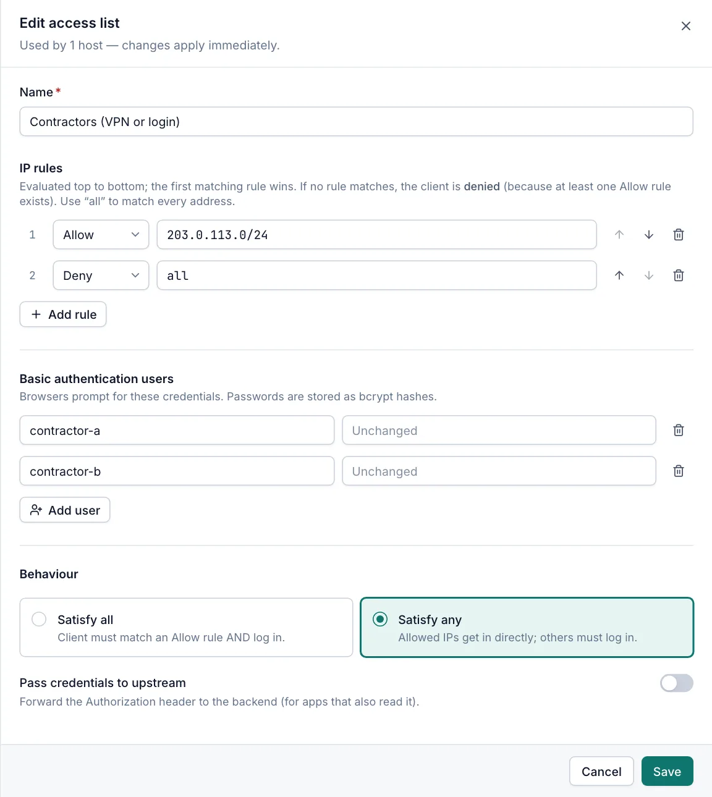
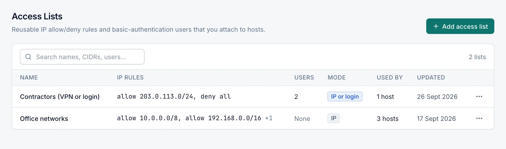

# Access lists

An access list restricts who can reach a host: by client IP address, by user name and password (basic
authentication), or both. You create a list once on the **Access Lists** page and attach it to any number of hosts.
Every role can view access lists; creating, editing and deleting them needs the Operator role.

## How access lists work

An access list has IP rules, basic authentication users, or both.

**IP rules** are checked from top to bottom, and the first rule that matches the client's address decides. When no
rule matches:

- the client is **denied** if the list has at least one Allow rule;
- the client is **allowed** if the list has only Deny rules.

**Users** make the browser ask for a user name and password. Passwords are stored as bcrypt hashes.

When a list has both, **Behaviour** decides how they combine:

| Setting | IP rules allow the client | IP rules deny the client |
|---|---|---|
| Satisfy all (default) | The client must also log in. | `403 Forbidden` |
| Satisfy any | The client gets in without logging in. | The client must log in. |

### What clients see

- A client denied by the IP rules gets `403 Forbidden` (plain text).
- A client that must log in gets the browser's login prompt. Wrong or missing credentials are refused with `401`.

## Create an access list

1. Open **Security › Access Lists** and select **Add access list**.
2. Enter a **Name**, for example `Office networks`.
3. Under **IP rules**, select **Add rule** for each rule, choose **Allow** or **Deny**, and enter an address.
   Select **Private networks only** to start from the private address ranges.
4. Under **Basic authentication users**, select **Add user** for each user and enter a user name and password.
5. Under **Behaviour**, choose **Satisfy all** or **Satisfy any**, and whether to **Pass credentials to upstream**.
6. Select **Create**.

Add at least one IP rule or user: an empty list does not restrict anything, and the editor does not save it.

Then attach the list to hosts on their **Access** tab (see [Attach a list to a host](#attach-a-list-to-a-host)).

## Field reference

| Field | Default | Description |
|---|---|---|
| Name | — | Required, up to 100 characters. Shown in the host editor. |
| IP rules | None | Allow or Deny rules, evaluated top to bottom. Use the arrow buttons to change the order. |
| Basic authentication users | None | User names and passwords that the browser asks for. |
| Satisfy all | Selected | The client must match an Allow rule and log in. |
| Satisfy any | — | Allowed IPs get in directly; others must log in. |
| Pass credentials to upstream | Off | Forwards the `Authorization` header to the backend, for applications that also read it. When off and the list has users, the header is removed before the request is proxied. |

### IP rule addresses

Each rule takes one of:

- a single IPv4 or IPv6 address, for example `192.168.1.10`;
- a CIDR range, for example `10.0.0.0/8` or `2001:db8::/32`;
- `all`, which matches every IPv4 and IPv6 address.

**Private networks only** fills in these rules:

| Action | Address |
|---|---|
| Allow | `10.0.0.0/8` |
| Allow | `172.16.0.0/12` |
| Allow | `192.168.0.0/16` |
| Deny | `all` |

### User names and passwords

- User names cannot contain `:` and must be unique within the list.
- Passwords can be up to 72 characters.
- New users need a password. For existing users the password field shows **Unchanged**; leave it empty to keep the
  current password. If you rename a user, enter a password again.
- Passwords are never shown again after saving.

## Attach a list to a host

On the host's **Access** tab, choose the list in **Access list**, or **Public — no restriction** to remove it. The tab
summarises the chosen list: the number of IP rules and users, and whether it needs IP rules OR login, or IP rules AND
login. See [Host options](host-options.md#access-tab).

The list applies to requests over HTTPS, and over plain HTTP when the host serves HTTP (**Force HTTPS** off, or TLS mode
**None (HTTP only)**). Changes to a list apply immediately to all hosts that use it.

## The Access Lists page

| Column | What it shows |
|---|---|
| Name | The list's name. |
| IP rules | The first two rules, for example `allow 10.0.0.0/8, deny all`, and **+N** for more. Hover for all rules. |
| Users | The number of users, or **None**. |
| Mode | **IP or login** or **IP and login** when the list has rules and users; otherwise **IP** or **Login**. |
| Used by | The number of hosts that use the list, or **Not used**. |
| Updated | When the list was last changed. |

Select a row to open it. Viewers see the list read-only. The search box matches names, addresses and user names.

## Edit and delete

To edit a list, select its row or choose **Edit** in the row menu, change it, and select **Save**.

To delete a list, choose **Delete** in the row menu and confirm. A list that is used by a host cannot be deleted,
including by a disabled host: remove it from those hosts first. The message names how many hosts use it.

On a server managed by a cluster primary, access lists are replicated from the primary and are read-only. See
[Cluster](cluster.md).

## Client IP addresses behind a proxy

IP rules normally see the address that connects to Caddy. If Caddy is behind a load balancer, reverse proxy or CDN,
that address is the proxy's, and every client would match the same rule.

Add the proxies to **Trusted proxies** in **Settings › Caddy** (see [Caddy settings](caddy-settings.md#client-ips)).
IP rules then use the client address from the `X-Forwarded-For` header. The header is read from right to left, and the
client IP is the first address that is not a trusted proxy, so a client cannot fake its address by adding its own
entries. List every proxy in front of Caddy, or clients are seen as the last proxy.

## Limits and interactions

- Access lists apply to hosts only. Streams do not support them.
- A host whose access list no longer exists denies every request with `403 Forbidden` instead of serving the site
  openly.
- A proxy host that uses Windows authentication (NTLM/Negotiate) cannot use a list with users, because both use the
  `Authorization` header. Use a list with IP rules only; the host editor refuses the combination.
- With HTTP/3 turned on, early data (0-RTT) stays disabled, so clients of hosts with IP rules do not get `425 Too Early`.

## Related

- [Host options](host-options.md)
- [Caddy settings](caddy-settings.md)
- [Security](security.md)
- [Users](users.md)
