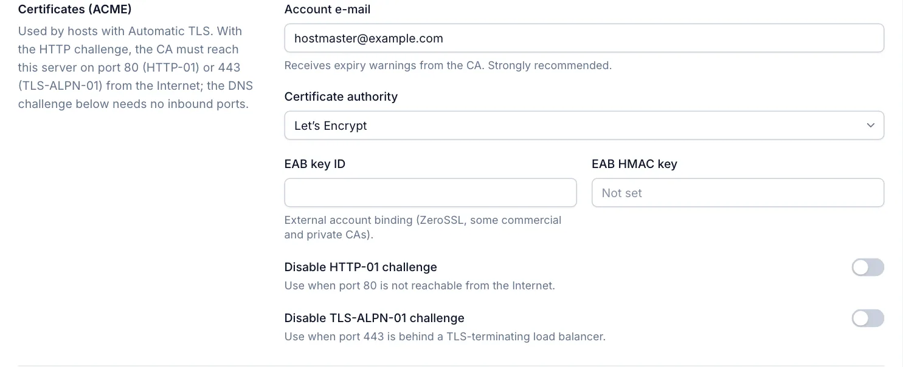
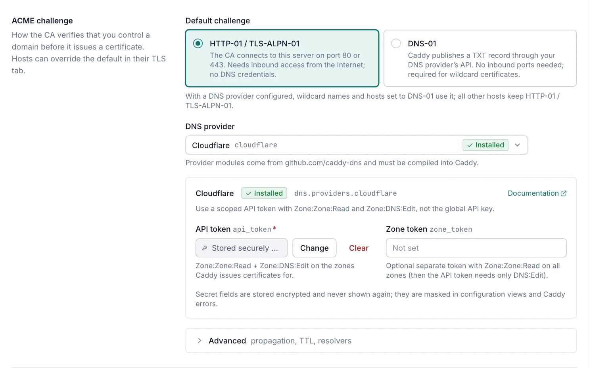

# ACME certificates

Hosts with the **Automatic (ACME)** TLS mode get their certificates from an ACME certificate authority such as
Let's Encrypt, ZeroSSL or your own private ACME CA. Caddy obtains and renews them by itself. This page covers the ACME
account, the challenge types and the DNS providers in **Settings › Caddy**. Every role can view these settings; only
Admins can change them.

## How validation works

Before a CA issues a certificate, it checks that you control the domain. This check is called a *challenge*. Caddy
Proxy Manager supports three:

| Challenge | How it works | Needs |
|---|---|---|
| HTTP-01 | The CA requests a file from the server over `http://` on port 80. | Inbound TCP 80 from the Internet. |
| TLS-ALPN-01 | The CA connects to the server over TLS on port 443. | Inbound TCP 443 from the Internet, not behind a TLS-terminating load balancer. |
| DNS-01 | Caddy creates a TXT record `_acme-challenge.<domain>` through your DNS provider's API, and the CA looks it up. | A supported DNS provider, its API credentials, and the provider's Caddy plugin. No inbound ports. |

HTTP-01 and TLS-ALPN-01 work together as one option in the manager. DNS-01 is the only challenge that can issue
**wildcard** certificates (`*.example.com`) from a public CA, and it works for servers that the Internet cannot reach.

The CA always connects to ports 80 and 443. If Caddy listens on other ports (**Settings › Caddy › Listeners**), forward
the public ports 80 and 443 to them, or use DNS-01.

## Configure the ACME account

Open **Settings › Caddy**. The **Certificates (ACME)** section applies to every host with Automatic (ACME) TLS. Select
**Save** at the bottom of the page to apply changes, or **Discard** to undo them.

| Field | Default | Description |
|---|---|---|
| Account e-mail | Empty | Receives expiry warnings from the CA. Strongly recommended. |
| Certificate authority | Let's Encrypt | The CA to use. See the table below. |
| ACME directory URL | — | Shown for **Custom ACME directory (internal CA)**. The CA's directory URL, for example `https://ca.corp.local/acme/acme/directory`. Required. |
| CA root certificate (path) | Empty | Shown for a custom CA. A PEM file used to trust the CA's HTTPS endpoint when it is not publicly trusted, for example `C:\ProgramData\pki\root.pem`. Must be an absolute path. |
| EAB key ID | Empty | External account binding, for ZeroSSL and some commercial and private CAs. |
| EAB HMAC key | Not set | The secret part of the external account binding. Write-only. |
| Disable HTTP-01 challenge | Off | Turn on when port 80 is not reachable from the Internet. |
| Disable TLS-ALPN-01 challenge | Off | Turn on when port 443 is behind a TLS-terminating load balancer. |

### Certificate authorities

| Option | Notes |
|---|---|
| Let's Encrypt | The default. If you also enter EAB credentials, ZeroSSL is used as a fallback CA with those credentials. |
| Let's Encrypt (staging — for testing, untrusted) | For testing. Browsers do not trust these certificates. |
| ZeroSSL | Needs an **Account e-mail** or EAB credentials. |
| Custom ACME directory (internal CA) | A private ACME CA, for example a step-ca or AD CS ACME server. Enter its **ACME directory URL**. |

External account binding needs both the **EAB key ID** and the **EAB HMAC key**.

You cannot disable both HTTP-01 and TLS-ALPN-01 unless DNS-01 is the default challenge with a DNS provider, or the
ACME issuer options configure a DNS challenge. Otherwise certificates could not be obtained.

> [!NOTE]
> On a server managed by a cluster primary, these settings are replicated from the primary. Only **CA root certificate
> (path)** stays editable, because it is a path on that server. See [Cluster](cluster.md).

## Choose the challenge

The **ACME challenge** section of **Settings › Caddy** sets the default for all ACME hosts:

- **HTTP-01 / TLS-ALPN-01** (default): the CA connects to this server on port 80 or 443.
- **DNS-01**: Caddy publishes a TXT record through your DNS provider. This needs a **DNS provider**.

Each host can override the default on its **TLS** tab with the **ACME challenge** field: **Default**,
**HTTP-01 / TLS-ALPN-01** or **DNS-01**. The DNS-01 option is available once a DNS provider is set up. See
[Host options](host-options.md#tls-tab).

With **HTTP-01 / TLS-ALPN-01** as the default and a DNS provider configured, wildcard names and hosts set to DNS-01 use
the provider; all other hosts keep HTTP-01 / TLS-ALPN-01.

IP addresses on an ACME host always use HTTP-01 / TLS-ALPN-01, because DNS-01 cannot validate IP addresses. For names
that use DNS-01, the HTTP-01 and TLS-ALPN-01 challenges are not used.

## DNS-01

### Set up a DNS provider

1. Open **Settings › Caddy** and scroll to **ACME challenge**.
2. In **DNS provider**, search for and select your provider. The list shows **Installed** or **Not installed** for each
   provider's Caddy plugin.
3. If the provider shows **Not installed**, select **Add plugin and rebuild Caddy** and confirm with **Add & rebuild**
   (see [Missing plugin](#missing-plugin)).
4. Fill in the provider's fields. Required fields are marked.
5. Optionally set **Default challenge** to **DNS-01** to use DNS for every ACME host.
6. Select **Save**.

Each provider panel shows the provider's module name, a **Documentation** link to the provider plugin, and notes about
the credentials it needs.

### Missing plugin

DNS providers are Caddy plugins from `github.com/caddy-dns`, and they must be built into Caddy. When the selected
provider is not in the installed Caddy, the panel says so. Until Caddy is rebuilt with it, certificates that use DNS-01
cannot be obtained, and the manager refuses to save settings or hosts that would use the provider.

As an Admin, select **Add plugin and rebuild Caddy** (or **Rebuild Caddy** when the plugin is already in the desired
plugin list). The manager downloads a custom Caddy build with the plugin from caddyserver.com, validates it against the
current configuration and swaps it in. Caddy restarts briefly, and the previous binary is restored if the new one fails.
Unsaved changes on the settings page are kept, so save them after the build. See [Plugins](plugins.md).

On a server managed by a cluster primary, plugins are managed on the primary and installed after the next sync.

### Credentials and secrets

Fields marked as secrets (tokens, keys, passwords) are write-only:

- After saving, a secret shows **Stored securely — not shown**. Select **Change** to enter a new value, **Clear** to
  remove it, or **Keep current** to cancel a change.
- Secrets are stored encrypted and the form never shows them again.
- The manager replaces them with `***` in Caddy's log as shown on the **Logs** page, in certificate events and
  notifications, and in Caddy start errors. Configuration views show them to Admins only (see
  [Configuration](configuration.md#secrets-in-configuration-views)).

When you switch to another provider, the previous provider's values and stored secrets are cleared, so a token never
carries over to a different provider.

### DNS providers

Secret fields are marked (secret). Fields not marked *required* are optional.

| Provider | Fields | Notes |
|---|---|---|
| Cloudflare | API token (secret, required); Zone token (secret) | Use one API token with the permissions Zone.Zone:Read and Zone.DNS:Edit. The zone token is only needed when zone read access is granted by a separate token. Use an API token, not the global API key. |
| Amazon Route 53 | Access key ID; Secret access key (secret); Session token (secret); Region; Profile; Hosted zone ID; Max retries; Max wait for Route 53 sync (seconds); Wait for Route 53 sync; Skip sync on delete; Debug logging | Credentials are optional: without them the AWS default credential chain is used (environment, shared profile, instance role). The hosted zone ID skips the zone lookup. |
| Azure DNS | Subscription ID (required); Resource group (required); Tenant ID; Client ID; Client secret (secret) | Leave tenant ID, client ID and client secret empty to use the server's managed identity. |
| DigitalOcean | API token (secret, required) | — |
| Google Cloud DNS | Project ID (required); Service-account JSON file | The file is the absolute path of the service-account key on the server. Without it, the server's Application Default Credentials are used. |
| OVHcloud | Endpoint (required, for example `ovh-eu`); Application key (required); Application secret (secret, required); Consumer key (secret, required) | — |
| GoDaddy | API token (secret, required) | The token has the form `<key>:<secret>`. |
| Porkbun | API key (secret, required); Secret API key (secret, required) | — |
| Namecheap | API key (secret, required); User name (required); API endpoint; Client IP | Namecheap only accepts API calls from allow-listed client IP addresses. |
| Gandi | Personal access token (secret, required) | — |
| Duck DNS | Token (secret, required); Override domain; Resolver | — |
| IONOS | API token (secret, required) | Format `prefix.secret`. |
| deSEC | Token (secret, required) | — |
| Linode (Akamai) | API token (secret, required); API URL; API version | — |
| Vultr | API token (secret, required) | — |
| Netlify | Personal access token (secret, required) | — |
| DNSimple | API access token (secret, required); Account ID; API URL | The account ID is required with a user token. |
| Bunny DNS | API access key (secret, required) | — |
| NameSilo | API key (secret, required) | — |
| Alibaba Cloud DNS | Access key ID (required); Access key secret (secret, required); Region ID; Security token (secret) | — |
| PowerDNS | Server URL (required, for example `https://pdns.example.com`); API key (secret, required); Server ID (for example `localhost`); Debug | — |
| ACME-DNS | User name (required); Password (secret, required); Subdomain (required); Server URL (required) | See [ACME-DNS](#acme-dns). |
| RFC 2136 (BIND, Knot, PowerDNS, ...) | Server (required, `host:port`, for example `10.0.0.53:53`); TSIG key name (required); TSIG algorithm (required, for example `hmac-sha256`); TSIG secret (base64) (secret, required) | See [RFC 2136 and Windows DNS](#rfc-2136-and-windows-dns). |

Hetzner is not in the list: the only Hetzner plugin that the Caddy download service builds uses the old Hetzner DNS API,
which Hetzner has shut down. Use the HTTP challenge, or host the zone at a supported provider.

### ACME-DNS

ACME-DNS ([acme-dns](https://github.com/joohoi/acme-dns)) is a small DNS server that only holds challenge records.
Register an account on your acme-dns server, enter its user name, password, subdomain and server URL in the provider
fields, and create a CNAME record `_acme-challenge.<domain>` that points at the full domain of the registration, once
for each domain.

### RFC 2136 and Windows DNS

RFC 2136 sends dynamic DNS updates signed with a TSIG key. It works with BIND, Knot, PowerDNS and other servers that
allow updates to the zone with that key.

> [!IMPORTANT]
> Windows DNS with Active Directory-integrated zones accepts only Kerberos-signed (GSS-TSIG) secure updates, which this
> provider cannot send. For a zone on Windows DNS, use the HTTP challenge, or host the zone on a TSIG-capable server or
> at a supported DNS provider.

### Propagation, TTL and resolvers

Open **Advanced** under the provider fields. While it is collapsed, it shows **Customised** when any value is set.

| Field | Default | Description |
|---|---|---|
| Propagation delay (s) | 0 | Wait this long before the first propagation check. 0 to 86400. |
| Propagation timeout (s) | 120 | How long to wait for the TXT record to appear. 1 to 86400. |
| TTL (s) | Provider default | TTL of the challenge record. 0 to 604800. |
| Skip the propagation check | Off | Caddy asks the CA to validate right after creating the record (after the delay). Use when the check cannot reach your authoritative DNS servers. |
| Resolvers | Empty | DNS servers Caddy queries to check propagation, as `host:port`, for example `1.1.1.1:53`. |

Set **Resolvers** behind split-horizon DNS, where the local DNS servers answer for the zone themselves and do not show
the public records. Always include the port.

## Wildcard certificates

Public CAs issue wildcard certificates only over DNS-01. Once a DNS provider is configured, wildcard names on an ACME
host always use DNS-01, even when the host's challenge is HTTP-01 / TLS-ALPN-01. The other names of that host keep
their challenge.

Without a DNS provider, the host's **TLS** tab warns that wildcard certificates cannot be obtained, and the
configuration result warns that issuance is expected to fail. Use a DNS provider, or use Internal CA or a custom
certificate for wildcards (see [Certificates](certificates.md)).

A wildcard covers exactly one extra label: `*.example.com` covers `app.example.com` but not `example.com` or
`a.b.example.com`. If a host has an exact name that another host's wildcard covers, the exact name gets its own
certificate when the wildcard cannot be issued or the two hosts use different TLS modes.

## ACME issuer options

**Settings › Caddy › Plugins & advanced** has an **ACME issuer options (secret JSON object)** field for Caddy issuer
options that the form does not cover. It is merged into every ACME issuer. Configure DNS providers in the
**ACME challenge** section instead: saving is refused while the JSON sets `challenges.dns.provider` and a provider is
also selected. See [Caddy settings](caddy-settings.md).

## Troubleshooting issuance

- When a domain of an ACME host still has no certificate 10 minutes after the host was changed, the manager raises the
  warning **No certificate has been issued for** the domain, with the last certificate errors from Caddy's log. See
  [Certificates](certificates.md#expiry-and-missing-certificate-alerts).
- Caddy's log is on **Server › Logs** (see [Logs](logs.md)).
- On the **Certificates** page, an ACME certificate with 7 days or less left is marked **renewal overdue**.
- **Server › Readiness** checks outbound HTTPS to Let's Encrypt, the server clock and the firewall rules for Caddy's
  HTTP and HTTPS ports (see [Readiness](readiness.md)).
- Behind a corporate proxy, Caddy needs **Send Caddy's own traffic through the proxy** in **Settings › Updates** to
  reach the CA and DNS provider APIs (see [Updates](updates.md)).

## Related

- [Certificates](certificates.md)
- [Host options](host-options.md)
- [Caddy settings](caddy-settings.md)
- [Plugins](plugins.md)
- [Troubleshooting](troubleshooting.md)
