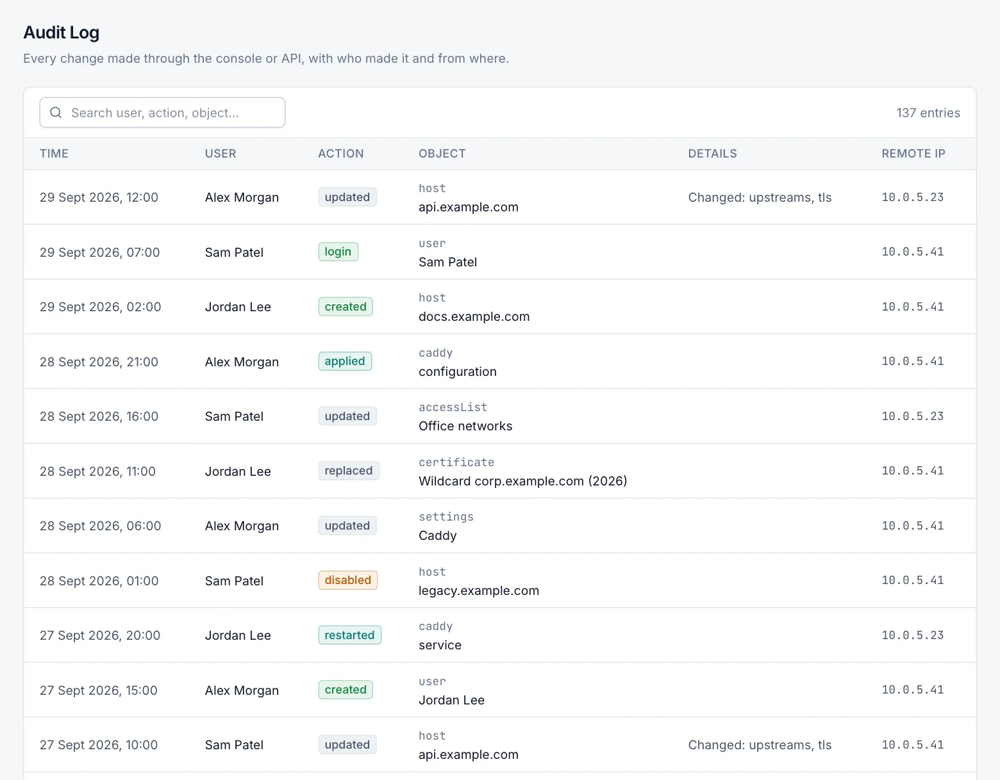

# Audit log

The audit log records who changed what in Caddy Proxy Manager, when, and from which address. It also records
sign-ins, sign-outs and failed sign-ins. Only admins can open **Administration › Audit Log**.

## Open the audit log

Role: Admin.

1. Open **Administration › Audit Log**.
2. Type in the search box to filter the entries. The count of matching entries is shown on the right.
3. Use the page controls at the bottom to move through older entries.

Entries are listed newest first, 50 per page.

## Columns

| Column | Description |
|---|---|
| Time | When the action happened, in your browser's time zone. |
| User | Who did it (see below). |
| Action | What was done, for example `created`, `updated`, `deleted`, `login` or `loginFailed`. |
| Object | The type of object (for example `host`, `user`, `settings`) and its name. Hover to see its ID. |
| Details | Extra information, such as the changes to a user or the reason a sign-in failed. Hover to see the full text. |
| Remote IP | The client address of the request. |

### Who appears in the User column

| Value | Meaning |
|---|---|
| An e-mail address | The signed-in user who made the change. |
| `anonymous` | A request without a session, such as a failed sign-in. The typed user name is in the Object column. |
| `system` | Background work by the manager, such as scheduled backups or an automatic Caddy restart. |
| `cli:<Windows user>` | A password reset with `CaddyManager.exe reset-password`, or a cluster join or leave with `CaddyManager.exe cluster`. |
| `<DOMAIN\user> (Windows)` | Caddy started, stopped or restarted from the tray icon or with `CaddyManager.exe caddy`. The Remote IP is `local`. |

When the console is published through Caddy on the same server, the Remote IP is the real client address that Caddy
reports. See [Management UI settings](management-ui.md#publish-the-console-through-caddy).

## Search

The search box matches text anywhere in the action, object type, object name, object ID, user, details or remote IP.
It is not case-sensitive. The characters `%` and `_` are ignored.

There are no separate filters by date, user or action, and the page has no export.

## What is recorded

- **Sign-in**: successful sign-ins (`login`, with the directory DN and role for directory users), failed sign-ins
  (`loginFailed`, with the reason), sign-outs (`logout`), first-run setup (`setup`), password changes and resets.
- **Users**: accounts created, updated (role, e-mail, name, enabled or disabled, password reset) and deleted.
- **Sites and certificates**: hosts, streams, access lists and certificates created, updated, enabled, disabled,
  replaced, synced and deleted, and configuration applied.
- **Settings**: changes to Caddy, update, notification, directory (LDAP), management UI and backup settings. Changed secrets
  are noted (for example "bind password changed") but never their values. Notification and directory tests are also
  recorded.
- **Caddy**: start, stop, restart and automatic restarts; binary checks, installs, uploads and rollbacks; plugin
  changes.
- **System**: management service restarts, backups (scheduled, manual, failed, downloaded), restores, readiness fixes,
  and manager update checks.
- **Cluster**: joining or leaving a cluster, and servers added, edited, removed, synced, restarted or updated.

Running readiness checks is not recorded. Viewing pages is not recorded.

Every entry is also written to the manager log, except the `cli:` entries (password resets and cluster joins or leaves
from the command line).

## Retention

Entries older than 365 days are deleted automatically by a daily clean-up. The retention period cannot be changed.
Deleting a user does not remove their entries.

## Related

- [Users and roles](users.md)
- [Directory sign-in](directory-sign-in.md)
- [Events](events.md)
- [Logs](logs.md)
