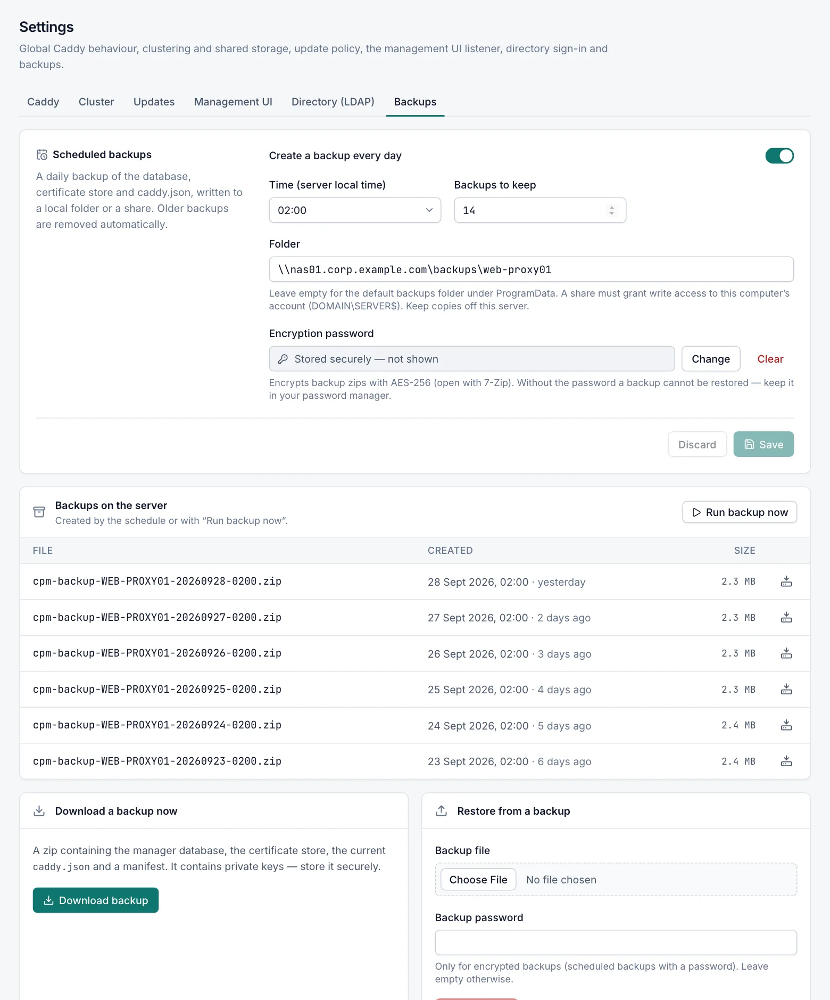

# Backup and restore

A backup is a zip file that holds everything you need to rebuild a server's configuration: the manager database, the certificate store, Caddy's storage and the current Caddy configuration. You manage backups on **Settings › Backups**, which only **Admin** users can see.

> [!CAUTION]
> A backup contains private keys, including the private key of Caddy's internal CA. Treat every backup file like a password.

## What a backup contains

| Part | What it holds |
|---|---|
| Manager database | Hosts, streams, access lists, certificate details, users, all settings, the audit log and events. |
| Certificate store | The certificate and key files the manager keeps. If you set **Certificate store path** on **Settings › Caddy**, that folder is backed up. |
| Caddy storage | Certificates Caddy obtained through ACME, the ACME account and Caddy's internal CA with its private key. Only Caddy's local data folder is backed up: a shared folder, Redis or custom storage module (see [Clustering](cluster.md#shared-caddy-storage)) is not. |
| `caddy.json` | The last configuration Caddy accepted. |
| Manifest | The server name, creation time, manager version and a list of any files that could not be read. |

A file that cannot be read while the backup runs is skipped, and the backup still completes. The manifest lists every skipped file.

A backup does **not** contain:

- traffic statistics
- the key that keeps users signed in, so everyone signs in again after a restore on another server
- log files
- the Caddy program itself
- a PFX file for the management UI that is referenced by path
- earlier backups

## The Backups tab

**Settings › Backups** has four cards:



- **Scheduled backups**: a daily backup written to a folder or a share.
- **Backups on the server**: the backups in that folder, with **Run backup now**.
- **Download a backup now**: a backup downloaded straight to your browser.
- **Restore from a backup**: upload a backup and apply it.

## Scheduled backups

Turn on **Create a backup every day**, choose the time and the folder, and click **Save**.

| Field | Default | Description |
|---|---|---|
| Create a backup every day | Off | Turns the daily backup on. |
| Time (server local time) | `02:00` | The hour at which the backup runs, in the server's time zone. |
| Backups to keep | `14` | How many of this server's backups to keep in the folder, from 1 to 365. Older ones are deleted after each successful backup. |
| Folder | `C:\ProgramData\CaddyProxyManager\backups` | A local folder such as `D:\Backups\caddy` or a share such as `\\nas01\backups\web-proxy01`. Leave the default or clear the field to use the default folder. |
| Encryption password | None | Encrypts scheduled backups with AES-256. It must be at least 12 characters. |

### When the backup runs

The backup runs once a day, shortly after the chosen hour. If the service was stopped at that time, the backup runs when the service starts again, as long as it is still the same day. If the chosen hour does not exist on a daylight-saving change day, the backup runs one hour later.

Each file is named `caddy-proxy-manager-<SERVER>-<yyyyMMdd-HHmmss>.zip`.

### Choosing a folder

- The folder must be an absolute path or a UNC share. Mapped drive letters do not work.
- It cannot be inside `C:\ProgramData\CaddyProxyManager`, except in the default `backups` folder. Otherwise each backup would include the previous ones.
- When you change the folder, the manager writes and deletes a test file there. If that fails, the folder is not saved and the error tells you why.
- Keep copies off the server. A backup on the same disk does not help if the server is lost.

On a local folder outside `C:\ProgramData\CaddyProxyManager`, each backup file is restricted to SYSTEM and Administrators. Files written to a share keep the share's permissions.

### Backing up to a network share

The service runs as LocalSystem, so it reaches a share as the server's **computer account**, for example `CORP\WEB01$`. To use a share:

1. Grant the computer account **Modify** on the share and on the folder.
2. Enter the UNC path, for example `\\nas01\backups\web-proxy01`, in **Folder**.
3. Click **Save**. The manager checks that it can write there.

A server that is not joined to a domain has no computer account that another server can grant access to.

If writing fails, the error names the exact account to grant, for example "grant that account Modify on both the share and the folder".

> [!IMPORTANT]
> Set an **Encryption password** when you back up to a share. The manager cannot restrict the permissions of files on a share, and the backups contain your private keys.

Several servers can share one folder. Each server deletes only its own old backups. **Backups on the server** lists the backups of every server in the folder.

### Encryption password

- Only scheduled backups and **Run backup now** are encrypted. **Download backup** is never encrypted (see [Downloading a backup](#downloading-a-backup)).
- Every file inside the zip is encrypted, including the manifest.
- Keep the password in your password manager. A backup cannot be restored without it, and it cannot be recovered from the backup.
- Windows Explorer cannot open these zips. Use 7-Zip, WinZip or WinRAR, or restore through the console with the password.

If the schedule is on without a password, the tab warns that anyone who can read the backup folder can read the private keys.

### Alerts when a scheduled backup fails

A failed scheduled backup raises an **Error** event, "Scheduled backup failed", on the **Events** page, with the reason. The next successful backup raises a **Recovered** event. In the Windows Application log these events use IDs 1702 (error) and 1703 (recovered).

E-mail and webhook alerts for failed backups follow the **Configuration rejected** switch on the **Notifications** page. A failed **Run backup now** shows the error on screen but raises no event.

## Backups on the server

This card lists the backups in the backup folder, newest first, with **File**, **Created** and **Size**. Click the download icon on a row to download that file.

**Run backup now** creates a backup immediately in the backup folder. It uses the encryption password if one is set and applies the **Backups to keep** limit, as a scheduled backup does.

If the folder cannot be read, the card shows "Could not list backups" with the reason.

## Downloading a backup

**Download a backup now › Download backup** creates a backup and saves it in your browser's download folder. Nothing is written to the backup folder.

> [!WARNING]
> A downloaded backup is **never encrypted**, even when you set an encryption password for scheduled backups. Store it somewhere only administrators can read.

## Restoring a backup

A restore replaces the database, the certificates and the Caddy configuration. It takes effect when the management service restarts. Changes made since the backup are lost.

1. Open **Settings › Backups**.
2. In **Restore from a backup**, choose the `.zip` file in **Backup file**.
3. If the backup is encrypted, enter its password in **Backup password**. Leave it empty otherwise.
4. Click **Restore…**, read the warning and click **Stage restore**.
5. When "Backup staged" appears, click **Restart now** in the **Restart required** panel, then confirm with **Restart now**.

The console is unavailable for a few seconds. Caddy keeps serving sites while the manager restarts.

The **Restart required** panel only appears in the browser tab where you staged the restore. If you close that tab, restart the service another way, for example with `Restart-Service CaddyProxyManager` from an elevated PowerShell.

### Checks before a restore is staged

The manager checks the upload before it accepts it. The restore stops with a message when:

| Message | Meaning |
|---|---|
| This backup is encrypted. Enter the backup password. | The zip is encrypted and no password was given. |
| The backup password is incorrect. | The password does not match. |
| The uploaded file is not a valid ZIP archive. | The file is not a zip, or it is damaged. |
| The archive has no manifest.json — it is not a Caddy Proxy Manager backup. | The zip was not created by Caddy Proxy Manager. |
| The backup format version … is newer than this version … supports. Update the manager first. | The backup comes from a newer version. Upgrade this server first. |
| The database in the backup has no enabled administrator account; restoring it would lock everyone out. | Restoring would leave nobody able to sign in. |

Uploads are limited to 512 MB, and the backup may unpack to at most 2 GB.

### What happens at the restart

When the service starts, it applies the staged backup before it opens the database:

1. It moves the current database to `C:\ProgramData\CaddyProxyManager\backups\pre-restore-<yyyyMMdd-HHmmss>` and puts the restored database in place.
2. It copies the current `caddy.json` to the same folder and puts the restored one in place.
3. It copies the certificate files into the certificate store.
4. It copies Caddy's storage files into Caddy's data folder.

The result is recorded in the audit log and in the manager log.

The `pre-restore-…` folder keeps only the previous database and `caddy.json`. Certificate files and Caddy storage files are overwritten in place without a copy. Files that exist on the server but not in the backup are left where they are. If you may need the current certificates back, download a backup before you restore.

### If the restore fails

If applying the restore fails, the manager puts the previous database back, starts with it, and logs "Backup restore FAILED and the previous database was kept". The staged files move to `C:\ProgramData\CaddyProxyManager\restore-failed-<yyyyMMdd-HHmmss>` so the restore is not retried at every start.

If a restore is staged but the service cannot apply it, the manager log shows a warning saying so. To apply the staged restore by hand, run these commands from an elevated PowerShell:

```powershell
Stop-Service CaddyProxyManager
& 'C:\Program Files\Caddy Proxy Manager\CaddyManager.exe' apply-restore
Start-Service CaddyProxyManager
```

`apply-restore` prints the result. It reports "No staged restore found" when there is nothing to apply.

## Moving to another server

To move a configuration to a new server, restore a backup of the old server on it. Hosts, certificates, Caddy's internal CA, users and settings move with the backup.

Stored secrets do not move. They are encrypted with a key that belongs to the original Windows machine and cannot be decrypted anywhere else. Enter them again on the new server:

| Secret | Where to enter it again |
|---|---|
| SMTP password and Microsoft 365 client secret | **Notifications** |
| ACME EAB HMAC key | **Settings › Caddy** |
| DNS provider credentials and **ACME issuer options** | **Settings › Caddy** |
| Redis password, Redis encryption key and custom storage JSON | **Settings › Cluster** |
| LDAP bind password | **Settings › Directory (LDAP)** |
| Management UI PFX password | **Settings › Management UI** |
| Backup encryption password | **Settings › Backups** |
| PFX passwords of certificates | Point each certificate at its PFX file again, with the password, on **Certificates** |

Until you do, the manager shows messages such as "The stored EAB MAC key could not be decrypted (was the database restored from another server?)".

Also note:

- Traffic statistics are not part of the backup, so they start again from zero.
- Every user signs in again.
- The backup folder setting comes back from the backup. Check that the folder still makes sense on the new server.
- In a cluster, a restored primary or node cannot use its stored cluster keys. Rotate each node's key on the primary and join the nodes again. See [Clustering](cluster.md#moving-or-restoring-a-primary).

## Related

- [Clustering](cluster.md)
- [Security](security.md)
- [Events](events.md)
- [Notifications](notifications.md)
- [Command line](cli.md)
- [Troubleshooting](troubleshooting.md#restore-problems)
