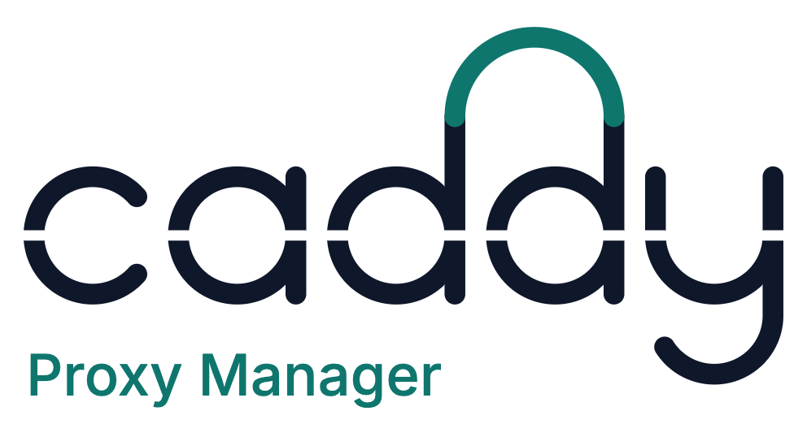

# Logo

<p align="center">
  <picture>
    <source media="(prefers-color-scheme: dark)" srcset="logo-dark.png">
    
  </picture>
</p>

The lowercase **caddy** is drawn from geometry, not set in a font. The two d's share one teal **handle**, and a single
**cut** runs through every letter. **Proxy Manager** is set in Inter (the UI font) in the app's teal, tucked under the word.

## What it means

- **The handle.** A caddy is a small carrier with a handle, like a tool caddy: one thing you pick up that holds lots of
  little things. One app carries all your sites, certificates and routes. The handle turns the word into the object it
  names. It also *handles* things (traffic, HTTPS, configuration), and it bridges the two d's the way a proxy sits
  between a visitor and the service behind it.
- **The cut.** The clear path traffic takes straight through.

In short, the handle means it carries everything, and the cut is how traffic passes through it.

## Colours

| | Light | Dark |
|---|---|---|
| "caddy" | `#0f172a` | `#e5e9f0` |
| Handle | `#0f766e` (`--accent`) | `#14b8a6` (`--accent`) |
| "Proxy Manager" | `#0f766e` (`--accent-text`) | `#2dd4bf` (`--accent-text`) |

The square mark (favicon, exe and installer icon, collapsed sidebar) is the "dd" with the handle on an ink tile. At
16 and 20 px it drops the cut and uses a heavier stroke so it stays crisp.

## Regenerating

Every logo image is rendered by code as a raster image (no SVG). The source is
[`logo-concepts/typographic.js`](logo-concepts/typographic.js).

```sh
node docs/brand/logo-concepts/generate.ts assets   # Node 24, Google Chrome
```

This writes:

| File | Used by |
|---|---|
| `web/src/assets/brand/logo-{light,dark}.png`, `mark.png` | sidebar, sign-in page (`web/src/components/layout/Logo.tsx`) |
| `web/src/assets/brand/favicon.ico`, `apple-touch-icon.png` | `web/index.html` |
| `src/CaddyManager/app.ico` | the exe's icon (`ApplicationIcon`, embedded when built on Windows) and the Add/Remove Programs icon |
| `installer/assets/dialog.bmp`, `banner.bmp` | the MSI wizard (welcome/finish background, top banner) |
| `docs/brand/logo-{light,dark}.png` | the README |

`generate.ts type|combo|compact|teal` re-renders the design rounds that led here into `logo-concepts/out/`
(git-ignored).
