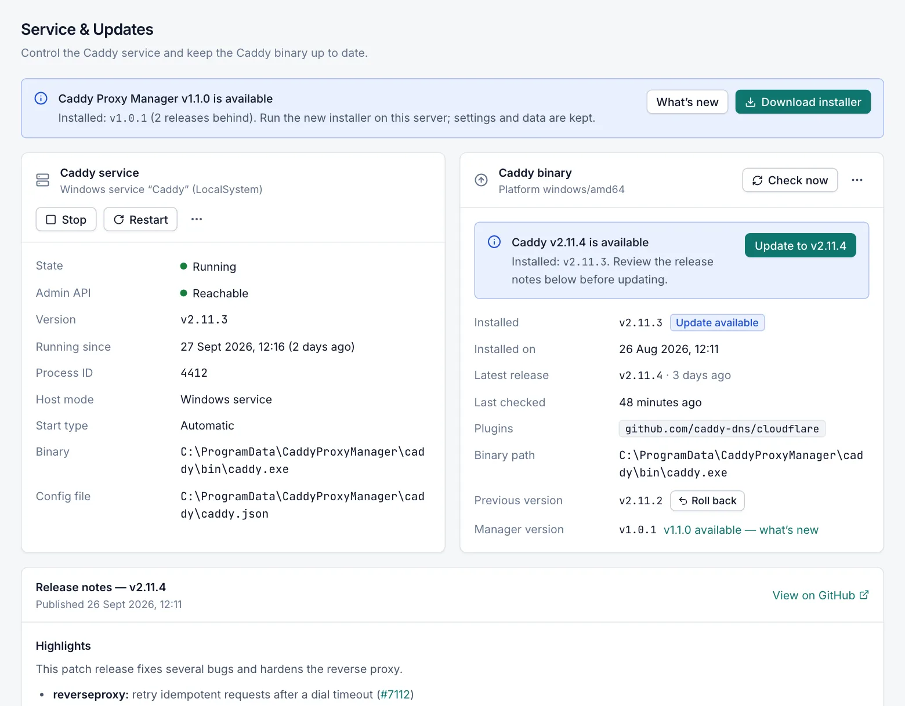

# Caddy service and updates

The **Caddy › Service & Updates** page controls the Caddy web server that serves your sites and keeps the Caddy program up to date. Every role can open the page. Starting, stopping and restarting Caddy needs the **Operator** role; installing, updating, uploading and rolling back Caddy needs the **Admin** role.

## What the page shows

The page has these parts:

- A notice when a new version of Caddy Proxy Manager itself is available. See [Updates](updates.md#manager-updates).
- The **Caddy service** card: whether Caddy runs, with the buttons to start, stop and restart it.
- The **Caddy binary** card: the installed Caddy version, the latest release and the update actions.
- **Release notes**, followed by the version: the notes of the latest Caddy release, with a **View on GitHub** link. It appears when the release has notes.
- **Upstream health**: the live state of the backends of your proxy hosts.

The Caddy status in the top bar of every page shows the same state. Select it to open this page.

## Caddy states

| State | Meaning |
|---|---|
| Running | Caddy runs and its admin API answers. |
| Running · admin API unreachable | The Caddy service runs, but the manager cannot reach Caddy's admin API, so it cannot apply configuration. |
| Starting | The service is starting. |
| Stopping | The service is stopping. |
| Stopped | Caddy is installed but not running. No site is served. |
| Service not installed | The Caddy program is present, but the Windows service `Caddy` is not registered. |
| Not installed | The Caddy program is not installed. |
| Unknown | The service is in an unexpected state, for example stuck in *Starting* for more than 2 minutes without its admin API answering. The **Last error** box explains what to do. |
| Status unavailable | The console could not read the status from the manager. |

## Start, stop and restart Caddy

Caddy runs as the Windows service `Caddy` (display name *Caddy (managed by Caddy Proxy Manager)*) under the LocalSystem account. It starts automatically with Windows, and Windows restarts it after a failure (after 5 s, 5 s and 30 s). Because Caddy is a separate service, it keeps serving your sites while the manager itself is stopped or updated.

The buttons are on the **Caddy service** card. They need the **Operator** role and appear only when the Caddy program is installed.

- **Start** starts Caddy. It is unavailable while the Windows service is not registered; register it with **Install service** first (see [Service actions](#service-actions)).
- **Stop** stops Caddy after you confirm. All sites, redirects and streams on this server go offline until Caddy is started again.
- **Restart** stops and starts the Caddy service. Expect a few seconds without service.

There is no separate reload button. To make Caddy load the current configuration again, use **Apply now** on the [Configuration](configuration.md) page.

When you stop Caddy on purpose, the manager does not treat it as a failure: it raises no *Caddy down* alert and does not restart Caddy until someone starts it again.

Local Windows administrators can also start, stop and restart Caddy from the tray icon or with `CaddyManager.exe caddy start|stop|restart`. See [Command line and tray icon](cli.md).

### Service actions

Admins find two more actions in the **More service actions** menu (the **…** button):

- **Install service** registers the Windows service `Caddy`. When the service already exists, the item is called **Repair service**. It fixes the service path, start type, recovery actions and environment.
- **Uninstall service** stops Caddy and removes the Windows service registration after you confirm. The Caddy program and the configuration are kept.

When the program is installed but the service is not registered, the card shows **The Caddy service is not registered**, with an **Install service** button for admins. Caddy must run as a Windows service so that it starts with the server.

### Details on the card

| Field | Description |
|---|---|
| State | The Caddy state (see [Caddy states](#caddy-states)). |
| Admin API | **Reachable** or **Unreachable**. The manager applies configuration through this local endpoint. |
| Version | The version of the running Caddy program. |
| Running since | When the Caddy process started. Shown while Caddy runs. |
| Process ID | The Windows process ID of Caddy. |
| Host mode | **Windows service**. |
| Start type | The start type of the Windows service, normally automatic. |
| Binary | The path of `caddy.exe`, normally `C:\ProgramData\CaddyProxyManager\caddy\bin\caddy.exe`. |
| Config file | The path of `caddy.json`, the last configuration that was applied successfully. Caddy loads it when it starts. |

A **Last error** box shows the most recent problem, for example why Caddy failed to start, with the last lines of the Caddy log.

### When Caddy is down

The manager checks Caddy every 30 seconds. After two failed checks in a row it raises a *Caddy down* event. If **Restart Caddy automatically** is on in [Notifications](notifications.md) (it is on by default), the manager then tries to start Caddy, at most 3 times in 10 minutes. It does not interfere while an install or update job is running.

## The Caddy binary card

The **Caddy binary** card shows the platform (for example `windows/amd64`) and these details:

| Field | Description |
|---|---|
| Installed | The installed Caddy version, with **Update available** or **Latest**. |
| Installed on | When this Caddy program was installed. |
| Latest release | The newest Caddy release on GitHub and when it was published. *Unknown (not checked yet or GitHub unreachable)* when the manager has no answer yet. |
| Last checked | When the manager last asked GitHub. |
| Plugins | The plugins in the installed program, or **Standard build**. |
| Binary path | Where `caddy.exe` is installed. |
| Previous version | The version kept for rollback, with a **Roll back** button for admins. Shown only when a previous version exists. |
| Manager version | The version of Caddy Proxy Manager. A link opens the manager update details when a newer version exists. |

The card also shows these notices when they apply:

- A notice that a new Caddy version is available, with an **Update to** button (followed by the version) for admins.
- **No Caddy binary installed**, with an **Install Caddy** button for admins.
- **Plugins out of sync**: the installed program does not contain exactly the plugins on the [Plugins](plugins.md) page. Select **Review** to go there and rebuild.

When Caddy is up to date, admins see a **Reinstall** button to install the latest release again.

## Check for a new Caddy version

The manager checks GitHub for new Caddy releases in the background (see [Updates](updates.md)). To check now, select **Check now** on the **Caddy binary** card. This needs the **Operator** role. A message tells you whether a newer release exists.

A release counts as an update when its version is newer than the installed one. The manager offers every newer Caddy release. It does not hold releases back. Read the release notes on this page before you update.

> [!NOTE]
> Each Caddy Proxy Manager release is verified against one Caddy release, currently Caddy `v2.11.7`. Newer Caddy releases are offered as updates all the same. To stay on a version, use [Install a specific version](#install-a-specific-version) and leave **Install updates automatically** off in [Updates](updates.md).

The manager asks GitHub without signing in, which GitHub limits to 60 requests per hour per public IP address. If several servers share one public address and the limit is reached, set the environment variable `CM_GITHUB_TOKEN` to a GitHub token for the Caddy Proxy Manager service.

## Update Caddy

You need the **Admin** role.

1. Open **Caddy › Service & Updates**.
2. Read the release notes of the new version.
3. Select **Update to** (followed by the new version) on the **Caddy binary** card.
4. Select **Update** to confirm.
5. Follow the progress in the job window. You can select **Hide (keeps running)** and come back later.

Caddy is unavailable for a few seconds while the new program starts. If you have selected plugins on the [Plugins](plugins.md) page, the update is a custom build of the latest Caddy with those plugins.

### What happens during an install or update

Every install, update, upload and rollback goes through the same checked steps. Only one of them can run at a time.

1. The new program is obtained:
   - Without plugins, the manager downloads the official release archive for Windows from GitHub, together with the release's `caddy_<version>_checksums.txt`, and checks the archive's SHA-512 checksum. If it does not match, the job stops and nothing is changed.
   - With plugins, the manager asks the caddyserver.com build server for a custom build. The build server compiles it on demand, which can take a few minutes. It publishes no checksum, so the manager checks the program by running it instead.
2. The manager runs the new program to read its version and modules. A custom build must contain every requested plugin.
3. The new program validates the current configuration. If it rejects the configuration, the job stops and nothing is changed.
4. Caddy is stopped.
5. The current program is kept as `caddy.exe.previous` for rollback, and the new program takes its place.
6. Caddy is started and the manager waits up to 30 seconds for its admin API.
7. If the new version does not start, the previous program is put back and started again, and an event reports the failed update.
8. The manager checks the Windows service registration and applies the current configuration.

If Caddy was stopped before the job, it stays stopped.

> [!IMPORTANT]
> After a failed update is undone automatically, the failed program is discarded. There is then no previous version to roll back to until the next successful update.

### Install a specific version

Use this to go back to an older release or to stay on one version. You need the **Admin** role.

1. On the **Caddy binary** card, open the **More binary actions** menu (the **…** button).
2. Select **Install specific version…**.
3. Enter the GitHub release tag of Caddy in **Version**, for example `v2.11.7`.
4. Select **Install**.

Plugins are only available for the latest version. When plugins are selected, the manager ignores the requested version and builds the latest Caddy with your plugins.

## Upload a Caddy binary (offline)

Use this on servers without Internet access, or to install a custom build that you downloaded yourself. You need the **Admin** role.

1. On another computer, download one of these:
   - the official archive `caddy_<version>_windows_amd64.zip` from https://github.com/caddyserver/caddy/releases, and the release's `caddy_<version>_checksums.txt`, or
   - a custom `caddy.exe` with your plugins from https://caddyserver.com/download.
2. Open **Caddy › Service & Updates** and the **More binary actions** menu (the **…** button).
3. Select **Upload binary (offline)…**.
4. In **Binary or release archive**, choose `caddy.exe` or the `.zip` archive.
5. Optionally paste the file's SHA-512 value in **SHA-512 checksum**: the line for your file in `caddy_<version>_checksums.txt`, or the output of `Get-FileHash -Algorithm SHA512`.
6. Select **Upload and install**.

The file can be up to 200 MB. The manager recognises the file by its content, not its name:

- A `.zip` release archive: `caddy.exe` is taken from it.
- A Windows executable: it must be built for this server's processor (for example `windows/amd64`). A program for another platform is rejected with a message that names the right archive.
- A `.tar.gz` archive is rejected: Caddy publishes those for Linux and macOS.

If you entered a checksum and the file does not match it, the upload is rejected and nothing is changed. Without a checksum, the job log shows the file's SHA-512 so that you can compare it yourself. The upload then goes through the same steps as an online update, including the automatic rollback. When the uploaded program's plugins differ from your plugin list, the [Plugins](plugins.md) page shows them as out of sync.

## Roll back to the previous version

After each successful install or update, the program that was replaced is kept as the previous version. You need the **Admin** role.

1. Select **Roll back** next to **Previous version**, or **Roll back to** (followed by the previous version) in the **More binary actions** menu.
2. Confirm with **Roll back**.

The previous program is validated against the current configuration and swapped in, and Caddy restarts. The version you roll back from becomes the new previous version, so you can undo a rollback the same way. The plugins in the previous program may differ from your plugin list.

## Follow a job

Install, update, upload and rollback run as background jobs. The job window shows the live log, and **Running**, **Succeeded** or **Failed**. Use **Copy log** to copy the log. **Hide (keeps running)** closes the window without stopping the job.

Jobs are kept in memory only. If the manager restarts while you watch a job, the window shows **Could not read the job status**; check [Events](events.md) for the result.

## Upstream health

The **Upstream health** card lists the backends (upstreams) of your proxy hosts as Caddy reports them. It refreshes every 30 seconds.

| Column | Description |
|---|---|
| Address | The upstream address. |
| Health | **Healthy**, **Unhealthy** or **Not monitored**. |
| Active requests | Requests in progress to this upstream. |
| Recent failures | Recent failed requests. |

Caddy knows an upstream's health only when the host's active health check measures it; the manager does not configure passive health checks. **Not monitored** means that no check measures it, so Caddy would report it healthy even when it is down. Turn on the active health check on the host to monitor it (see [Proxy hosts](proxy-hosts.md)). Upstreams appear once proxy hosts have received traffic.

## Related

- [Plugins](plugins.md)
- [Configuration](configuration.md)
- [Updates](updates.md)
- [Installation](installation.md)
- [Troubleshooting](troubleshooting.md)
