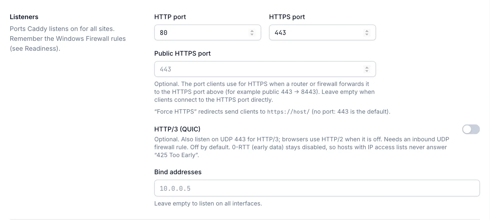
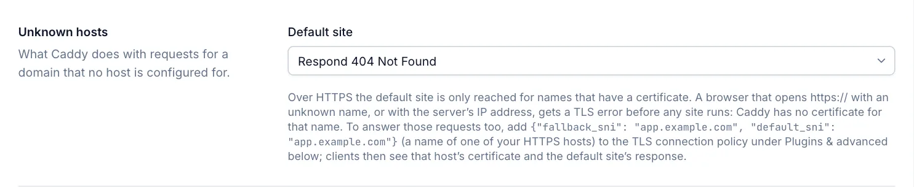
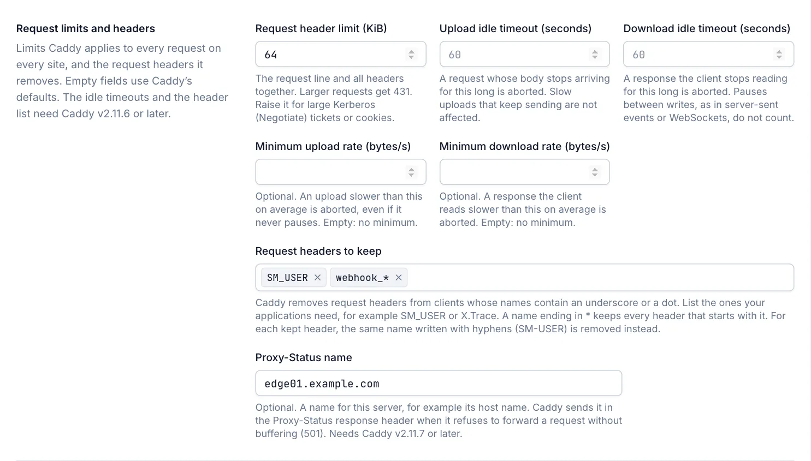

# Caddy settings

**Settings › Caddy** holds the global Caddy behaviour: listener ports, what happens to unknown host names, client IPs behind a proxy, logging, plugin configuration and the admin API address. Every role can open the tab; only the **Admin** role can change it. The ACME sections at the top of the tab are described in [ACME settings](acme.md).

## Save and apply

1. Open **Settings** and the **Caddy** tab.
2. Change the fields. **Unsaved changes** appears next to the buttons.
3. Select **Save**. **Discard** returns to the stored values.

Saving applies the new configuration to Caddy at once; no restart of Caddy or the manager is needed. You see **Settings saved and applied**. If Caddy rejects the result, the settings are not saved, the previous configuration keeps running, and a window shows Caddy's error. If Caddy is not running, the settings are saved and used when Caddy starts. See [How configuration is applied](configuration.md#how-configuration-is-applied).

Operators and viewers see the values read-only and **Only administrators can change these settings.** The fields **Server options (JSON)** and **Extra apps (JSON object)** are hidden from them, because they can contain credentials.

### On a cluster node

On a server managed by a cluster primary, most Caddy settings come from the primary, and the tab shows **Read-only on this node**, with the name of the primary. These fields belong to each server and stay editable: **HTTP port**, **HTTPS port**, **Public HTTPS port**, **Bind addresses**, **Admin API listen address**, **Certificate store path** and the custom CA's **CA root certificate (path)**. See [Cluster](cluster.md).

## Certificates and ACME challenge

The **Certificates (ACME)** and **ACME challenge** sections set the ACME account e-mail, the certificate authority, external account binding, the challenge types and DNS providers. See [ACME settings](acme.md).

## Listeners

The ports Caddy listens on for all sites. Remember to allow them in Windows Firewall; the [Readiness](readiness.md) checks tell you which rules are missing.



| Field | Default | Description |
|---|---|---|
| HTTP port | `80` | Port for plain HTTP, the HTTP-01 challenge and redirects to HTTPS. 1–65535. |
| HTTPS port | `443` | Port for HTTPS and the TLS-ALPN-01 challenge. Must differ from the HTTP port. |
| Public HTTPS port | empty | The port clients use for HTTPS when a router or firewall forwards a different port to the HTTPS port, for example public `443` to `8443`. Leave empty when clients connect to the HTTPS port directly. |
| HTTP/3 (QUIC) | off | Also listen on UDP on the HTTPS port for HTTP/3. Needs an inbound UDP firewall rule. |
| Bind addresses | empty | IP addresses of this server that Caddy listens on. Empty means all interfaces. |

The HTTP and HTTPS ports cannot be ports that the management console or Caddy's admin API already use.

### Public HTTPS port

**Public HTTPS port** only changes where **Force HTTPS** redirects send clients. It does not change what Caddy listens on or the firewall rules. Below the field, the tab shows the resulting target, for example `https://host/` (no port, because 443 is the default) or `https://host:8443/`. Certificates from a public CA still need public ports 80 or 443 forwarded to this server, or the DNS challenge. See [Installation](installation.md).

### HTTP/3

HTTP/3 is off by default. It is optional: browsers use HTTP/2 when it is off. When you turn it on:

- Caddy also listens on UDP on the HTTPS port. Allow that port in the firewall.
- QUIC 0-RTT (early data) stays disabled. Early data can be replayed, and it arrives before the client's address is confirmed, so hosts with an IP access list would answer it with `425 Too Early`.
- Caddy buffers the first 4 KB of each request body it passes to a backend. This lets requests without a body reach HTTP/2 backends correctly.
- Because of that buffering, a request with a body that asks to be forwarded without buffering (request header `Incremental: ?1`) is answered with `501 Not Implemented`. This applies to requests over every HTTP version while HTTP/3 is on, with Caddy `v2.11.7` or later.

## Unknown hosts

What Caddy does with a request for a host name that no host is configured for.



| Field | Default | Description |
|---|---|---|
| Default site | Respond 404 Not Found | **Respond 404 Not Found**, **Close the connection**, **Redirect to a URL** or **Show the Caddy welcome text**. |
| Redirect URL | empty | Shown for **Redirect to a URL**. An absolute `http://` or `https://` URL. Clients get a 302 redirect to it. |

**Show the Caddy welcome text** answers with the text *Caddy works! This server is managed by Caddy Proxy Manager, but no site is configured for this host name.*

Over HTTPS the default site is only reached for names that have a certificate. A browser that opens `https://` with an unknown name, or with the server's IP address, gets a TLS error first, because Caddy has no certificate for that name. To answer those requests too, add this to **TLS connection policy (JSON object)** under [Plugins & advanced](#plugins--advanced), with the name of one of your HTTPS hosts:

```json
{ "fallback_sni": "app.example.com", "default_sni": "app.example.com" }
```

Clients then see that host's certificate and the default site's response. The example button **Answer HTTPS for unknown names and IPs** fills this in.

## Client IPs

When Caddy is behind a load balancer, reverse proxy or CDN, every request seems to come from that proxy. List the proxies in **Trusted proxies** so that Caddy takes the real client IP from the `X-Forwarded-For` header. Access lists, IP-hash load balancing and logs then use the real client IP.

| Field | Default | Description |
|---|---|---|
| Trusted proxies | empty | IP addresses or CIDR ranges of the proxies in front of Caddy, for example `10.0.0.0/8`. `all` is not accepted. |

Caddy reads the header strictly from right to left: the client IP is the first address, from the right, that is not a trusted proxy. Addresses a client writes at the left of the header itself are ignored, so a client cannot fake its address. List every proxy in front of Caddy, including all ranges of a CDN, or real clients are seen as the last proxy.

## Request limits and headers

Limits that Caddy applies to every request on every site, and the request headers it removes. An empty field uses Caddy's default.



| Field | Default | Description |
|---|---|---|
| Request header limit (KiB) | empty (16) | The largest request line and headers together that Caddy accepts. `4` to `1024`. |
| Upload idle timeout (seconds) | empty (60) | How long a request body may stop arriving before Caddy aborts the request. `1` to `3600`. |
| Download idle timeout (seconds) | empty (60) | How long a client may stop reading a response before Caddy aborts it. `1` to `3600`. |
| Minimum upload rate (bytes/s) | empty | An upload that is slower than this on average is aborted. Empty means no minimum. |
| Minimum download rate (bytes/s) | empty | A response that the client reads slower than this on average is aborted. Empty means no minimum. |
| Request headers to keep | empty | Request headers with an underscore or a dot in their name that Caddy passes on instead of removing. |
| Proxy-Status name | empty | A name for this server in the `Proxy-Status` response header. See [Proxy-Status name](#proxy-status-name). |

The defaults are those of Caddy `v2.11.6` and later. Older Caddy versions accept request headers up to 1 MiB, have no idle timeouts and remove only headers with an underscore. The idle timeouts, the minimum rates and **Request headers to keep** need Caddy `v2.11.6` or later: with an older Caddy they are not applied, and saving shows a warning.

### Request header size

A request whose request line and headers are larger than the limit gets `431 Request Header Fields Too Large`. Caddy allows about 4 KiB on top of the value you enter. Raise the limit when clients send large headers, for example Kerberos (Negotiate) tickets of users in many groups, or large cookies. Windows applications that had `MaxFieldLength` raised in IIS usually need the same here.

### Idle timeouts

- **Upload idle timeout** applies while Caddy reads a request body. An upload that sends nothing at all for this long is aborted, and the request is logged with status `499`. A slow upload that keeps sending is not affected.
- **Download idle timeout** applies while Caddy writes a response. A client that accepts no data for this long is disconnected. Pauses between writes do not count, so server-sent events, long polling and WebSocket connections that are quiet for longer stay open.
- The timeouts apply to every host that does not set its own. A host can have its own idle timeouts on the **Advanced** tab of the host editor. See [Host options](host-options.md#idle-timeouts).

### Minimum transfer rates

An idle timeout does not stop a client that sends or reads a few bytes just often enough never to be idle. **Minimum upload rate (bytes/s)** and **Minimum download rate (bytes/s)** close that gap: the transfer must keep up with the rate on average, counted from its start, with the idle timeout as a head start. For example, with an upload idle timeout of 60 seconds and a minimum upload rate of `1000`, an upload of 1 MB must finish within about 60 + 1,000 seconds. An upload that falls behind is aborted and logged with status `499`. Leave the fields empty unless slow clients are tying up your backends; a rate that is too high cuts off users on slow connections.

### Request headers to keep

Caddy removes request headers from clients whose names contain an underscore or a dot, such as `SM_USER` or `X.Trace`, before any host sees them. Some application servers read such a name and its hyphenated form as the same header, so a client could use one to overwrite a header that an authentication step sets. List the headers your applications need:

- Enter the exact name, for example `SM_USER`. Upper and lower case do not matter.
- A name ending in `*` keeps every header that starts with it, for example `webhook_*`. The part before the `*` must contain an underscore or a dot. A header with both an underscore and a dot in its name needs its exact name.
- For every header you keep, Caddy removes the same name written with hyphens instead (`SM-USER` for `SM_USER`), so the two can never arrive together.
- A kept header that a client sends more than once is removed.

Headers that a host adds itself under **Request headers** in the host editor are always sent. See [Host options](host-options.md#headers-tab).

### Proxy-Status name

When Caddy refuses to forward a request without buffering, it answers `501 Not Implemented` (see [HTTP/3](#http3)). With a **Proxy-Status name**, that response carries a `Proxy-Status` header with the name and the reason, so that a client or a proxy in front of Caddy can tell which server refused the request. Enter a name that identifies this server, for example its host name. Up to 255 letters, digits and punctuation characters, without quotes or backslashes. It needs Caddy `v2.11.7` or later: with an older Caddy it is not applied, and saving shows a warning.

## Logging & storage

| Field | Default | Description |
|---|---|---|
| Caddy log level | Info | **Debug (verbose)**, **Info**, **Warning** or **Error**. Applies to the Caddy log. |
| Certificate store path | empty | Where uploaded certificates are written. Empty means `C:\ProgramData\CaddyProxyManager\certificates`. Use an absolute path or a UNC share. |
| Rotate access logs every (days) | empty | Starts a new file for each per-host access log after this many days. `1` to `365`. See [Access logs](#access-logs). |
| Cookies hashed in access logs | empty | Cookie names whose values per-host access logs show as a short hash. See [Access logs](#access-logs). |
| Traffic statistics | on | Writes one line per request to a local log for the Traffic page. See [Traffic statistics](#traffic-statistics). |

The Caddy log is `C:\ProgramData\CaddyProxyManager\logs\caddy\caddy.log`. It is rotated at 20 MB and 10 files are kept. Messages about the manager's own calls to Caddy's admin API are logged only from **Warning** up, so the manager's regular checks do not fill the log. You read the log on [Logs](logs.md).

A UNC share for the certificate store must be readable by the computer account of this server, because the services run as LocalSystem. The certificate store must not be inside a folder that an enabled static site serves; the manager refuses such a path. See [Certificates](certificates.md).

### Access logs

These two fields apply to the access logs that you turn on per host on the **Advanced** tab of the host editor. See [Host options](host-options.md#access-log).

- **Rotate access logs every (days)**: access log files always roll over at 20 MB, and the last 10 are kept. With a number of days, a new file is also started after that time, so that one file never covers more than that period. It needs Caddy `v2.11.0` or later.
- **Cookies hashed in access logs**: Caddy does not write cookies to access logs. It replaces the `Cookie` and `Set-Cookie` headers with `REDACTED`. If you turned credential logging on with `"logs": { "should_log_credentials": true }` in **Server options (JSON)**, all cookie values are written in full. List the names of the cookies that must stay secret, such as a session cookie: the logs then show the first 8 hexadecimal digits of the SHA-256 hash of each value. The same value always gives the same hash, so you can still follow one session through the log. Other cookies and the attributes of `Set-Cookie` are written unchanged. Hashing in the `Set-Cookie` header needs Caddy `v2.11.6` or later; with an older Caddy only the `Cookie` header is hashed, and saving shows a warning.

### Traffic statistics

When **Traffic statistics** is on, Caddy writes one line per HTTP request to a local log: client IP, host, method, URI, status, bytes and duration, but no headers. The manager reads it for the [Traffic statistics](traffic-statistics.md) page. The log is rotated at 10 MB and 5 files are kept. It works in Managed mode only. Per-host access logs, which you turn on for each host, are not affected.

## Plugins & advanced

Configuration for Caddy plugins that the manager does not model with its own fields. It is used in Managed mode only. Install the plugin first on the [Plugins](plugins.md) page. If Caddy rejects the result when you save, the change is not kept and the error is shown.

| Field | Default | Description |
|---|---|---|
| ACME issuer options (secret JSON object) | empty | JSON merged into every ACME issuer, for issuer options the manager does not model. Stored encrypted; the form never shows it again, and configuration views show it to Admins only. |
| TLS connection policy (JSON object) | empty | JSON merged into every TLS connection policy, so it applies to all HTTPS sites: minimum TLS version, curves, cipher suites or client certificates (mTLS). |
| Extra apps (JSON object) | empty | Top-level Caddy apps that plugins add, keyed by app name, for example `dynamic_dns` or `crowdsec`. Not encrypted. |

Admins see **Examples** buttons under each field. An example replaces the field's text; when the field already has a value, you confirm first. Fill in the example's placeholders before you save. Examples that need a plugin name it in their tooltip.

| Field | Examples |
|---|---|
| ACME issuer options | Cloudflare DNS challenge, Azure DNS challenge, DNS challenge with public resolvers (split-horizon DNS) |
| TLS connection policy | TLS 1.3 only, TLS 1.2+ with modern curves, Answer HTTPS for unknown names and IPs, Require client certificates (mTLS) |
| Extra apps | Dynamic DNS, CrowdSec bouncer |

Rules and hints:

- For DNS providers, prefer the **ACME challenge** section (see [ACME settings](acme.md)). The ACME issuer field cannot set `module`.
- The TLS connection policy cannot set `match` or `certificate_selection`; the manager controls them.
- **Extra apps** cannot contain `http`, `tls`, `pki` or `layer4`; the manager generates those. Use the host, stream and certificate pages instead. Because this field is not encrypted, keep DNS credentials for certificates in the ACME fields.
- When the installed Caddy lacks the module that a DNS provider or an extra app needs, a warning appears with a link to the [Plugins](plugins.md) page. Without the plugin, Caddy rejects the configuration.
- Client-certificate authentication in the TLS connection policy applies to every HTTPS site on this server, including sites that browsers without a client certificate use. The CA file must be readable by LocalSystem.

## Advanced

| Field | Default | Description |
|---|---|---|
| Configuration mode | Managed | Shows **Managed** or **Caddyfile**. Change it on the [Configuration](configuration.md#caddyfile-mode) page. |
| Admin API listen address | `127.0.0.1:2019` | The address of Caddy's admin API, which the manager uses to control Caddy. Must be a loopback address with a port. |
| Server options (JSON) | empty | A JSON object merged into every Caddy HTTP server, for example `read_header_timeout` or `keepalive_interval`. Leave empty unless you need it. |

### Admin API listen address

Caddy's admin API has no authentication, so anyone who can reach it can reconfigure Caddy. The manager therefore accepts only a loopback address: `127.0.0.1`, `::1` (written `[::1]:port`) or `localhost`, with a port. The port must not be the HTTP or HTTPS port or a port of the management console. Change it only if another program already uses port 2019. See [Security](security.md).

### Server options

**Server options (JSON)** is merged into both of Caddy's HTTP servers (the HTTP and the HTTPS listener). For example:

```json
{
  "read_header_timeout": "10s"
}
```

- A key you set here replaces the value the manager generates for it, including the fields under [Request limits and headers](#request-limits-and-headers).
- `listen` and `routes` are managed by the manager and ignored, with a warning.
- `logs` is merged with the generated logging settings: per-host access logs and traffic statistics keep working.
- The value must be a JSON object.

See the Caddy documentation for the available options: https://caddyserver.com/docs/json/apps/http/servers/

## Related

- [ACME settings](acme.md)
- [Configuration](configuration.md)
- [Plugins](plugins.md)
- [Cluster](cluster.md)
- [Readiness](readiness.md)
- [Security](security.md)
