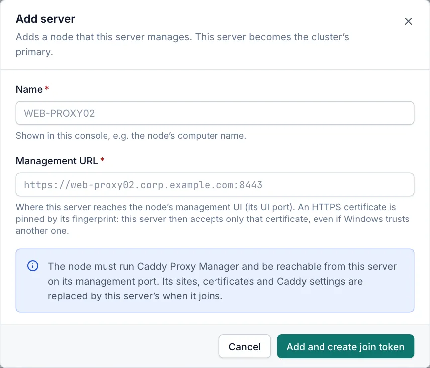
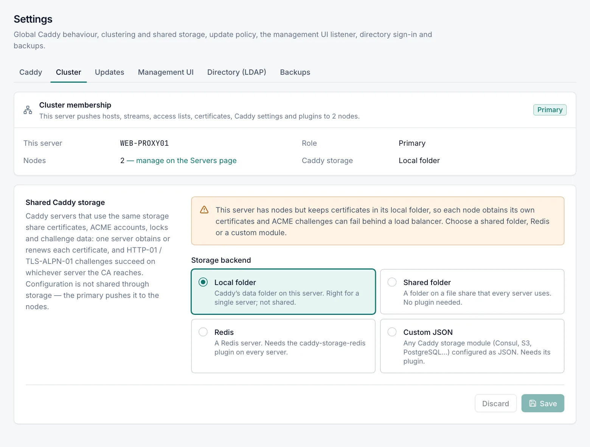

# Clustering

A cluster lets you manage several servers as one. You configure hosts, certificates and Caddy settings on one server, the **primary**, and it pushes that configuration to the other servers, the **nodes**. Put the servers behind a load balancer, DNS round robin or a shared virtual IP address, and they serve the same sites.

Adding and removing servers, joining and leaving a cluster, rotating keys and changing shared storage need the **Admin** role. **Sync now** and restarting Caddy on a node need **Operator**. Every role can view the **Servers** page and **Settings › Cluster**.

## Roles

| Role | Meaning |
|---|---|
| Standalone | The default: a single server that manages its own configuration. |
| Primary | A server that manages at least one node. It becomes a primary when you add the first server on the **Servers** page, and becomes standalone again when you remove the last one. |
| Node | A server that joined a primary with a join token. Its sites, certificates and Caddy settings come from the primary and are read-only on the node. |

A node cannot manage other servers. A primary cannot join another cluster until you remove all its servers.

## What the primary replicates

The primary sends each node one bundle with:

- proxy hosts, redirects, static sites, custom responses, streams and access lists
- certificates, including their private keys. A node stores each one as an uploaded certificate under the same ID, whatever its source on the primary (file path, PFX or Windows certificate store).
- Caddy settings, except these node-local ones: **HTTP port**, **HTTPS port**, **Public HTTPS port**, **Bind addresses**, **Admin API listen address**, **Certificate store path** and the ACME **CA root certificate (path)**
- the secrets inside those Caddy settings (ACME EAB key, ACME issuer options, DNS provider credentials, Redis password and encryption key, custom storage JSON). They travel inside the encrypted channel and each node stores them encrypted with its own key.
- the desired Caddy plugins
- with a custom ACME CA, the content of its root certificate. Each node writes it to `C:\ProgramData\CaddyProxyManager\caddy\cluster-acme-root.pem`.

These stay local on every server: users, directory sign-in, notifications, the management UI settings, backups, the node-local Caddy settings above, events, the audit log, logs and traffic statistics.

Each bundle has a **revision**, a fingerprint of its content. The **Configuration sync** card on a node's details page compares the revision a node should run (**Desired revision**) with the one it runs (**Applied revision**).

## Before you start

- Install Caddy Proxy Manager on every server and run the same version on all of them. The **Servers** page marks a version that differs from the primary's.
- The primary must reach each node's management UI port: `81` by default, or the UI HTTPS port (default `8443`) if you use HTTPS. Allow that port on the node only from the primary and your admin network.
- Keep the clocks of all servers within 5 minutes of each other. Domain time sync is enough.
- Take a backup of any server that already serves sites. Its sites and settings are replaced when it joins.
- Open a node's console directly on its own address. Do not publish a node's console through a proxy host on that node: the node's proxy hosts are replaced by the primary's.

## Adding a node

On the primary:



1. Open **Servers** and click **Add server**.
2. Enter a **Name**, for example the node's computer name.
3. Enter the node's **Management URL**, for example `https://web-proxy02.corp.example.com:8443` or `http://web-proxy02:81`. Use only the scheme, host and port.
4. Click **Add and create join token**.
5. Copy the join token. It is shown only once.

The dialog also shows the join commands and, for an `https` URL, the **Pinned HTTPS certificate** fingerprint. From then on the primary talks to the node only while it presents that certificate. See [Replacing a node's HTTPS certificate](#replacing-a-nodes-https-certificate). The new server appears on the **Servers** page as **Waiting to join**.

On the node, join with the token in one of two ways.

In the console (Admin):

1. Open **Settings › Cluster**.
2. Paste the token in **Join a cluster**.
3. Click **Join cluster**, then confirm with **Join cluster**.

From an elevated PowerShell:

```powershell
net stop CaddyProxyManager
& 'C:\Program Files\Caddy Proxy Manager\CaddyManager.exe' cluster join '<token>'
net start CaddyProxyManager
```

Within one heartbeat (15 seconds) the primary pushes its configuration. The node then shows **Online** and **In sync** on the primary's **Servers** page. The node shows the **Managed by** banner.

After that, every change on the primary reaches the nodes about 2 seconds after it is applied, and at the latest at the next heartbeat.

> [!WARNING]
> Anyone who holds a join token can join a server to your cluster as that node, until the node has joined. Keep tokens like passwords.

## Managing nodes on the Servers page

The **Servers** page lists this server (marked **This server**) and its nodes, with **Name**, **Status**, **Host**, **Versions**, **Load** and **Sync**.

| Status | Meaning |
|---|---|
| Online | The node answers and runs the current configuration. |
| Waiting to join | The node has not joined with its token yet, or has not used a new token issued for it. It raises no alerts. |
| Error | The node answers but reported a problem, for example a failed sync. |
| Offline | Three heartbeats in a row failed. The node keeps serving its last configuration. |

The **Sync** column shows **In sync**, **Out of date**, **Sync failed** or **Not joined**.

Each node has an actions menu:

| Action | Role | What it does |
|---|---|---|
| Open | Viewer | Opens the server's details, charts, Caddy state and **Configuration sync** card. |
| Sync now | Operator | Pushes the current configuration immediately. Also retries a failed Caddy rebuild. |
| Rotate key (new join token) | Admin | Gives a joined node a new key and a new token. For a node that is still waiting to join, the item is **Regenerate join token**. |
| Edit | Admin | Changes the name or URL, and can re-pin the node's HTTPS certificate. |
| Remove | Admin | Stops managing the node and tells it to leave the cluster. |

On a node's details page, **Restart** restarts Caddy on the node (Operator) and **Update Caddy** installs a Caddy version there (Admin).

### Rotating a node's key

**Rotate key (new join token)** creates a new key and sends it to the node over the encrypted channel. The node switches at once, and the old key and token stop working.

If the node cannot be reached, the rotation stays pending and the server shows **Key rotation pending**. Until the primary reaches it, the node still accepts its previous key. The primary retries at every heartbeat.

You need the new token only to join the node again, for example after it left the cluster or its stored key became unusable.

### Replacing a node's HTTPS certificate

For an `https` URL, the primary pins the SHA-256 fingerprint of the node's certificate when you add the node or change its URL. If the node cannot be reached at that moment, the primary pins the certificate at its first contact with the node.

From then on the primary accepts only the pinned certificate. It refuses any other certificate, even one that Windows trusts and that is issued to the node's name, and it never replaces the pin by itself. Windows trust is checked only while no fingerprint is pinned.

So every certificate change on the node needs a re-pin on the primary: a new PFX, a certificate renewed by your PKI, or the console's self-signed certificate, which is replaced when the node's management service starts with less than 30 days left. Until you re-pin, the node's error on the **Servers** page reads "its HTTPS certificate does not match the pinned fingerprint (it presents …)". After three failed heartbeats the node shows **Offline** and the primary records the event "Server '…' is offline". The node keeps serving its last configuration.

After you replace or renew the certificate on the node:

1. Check that the fingerprint in the error is the one of the new certificate.
2. On the primary, open the node's menu and choose **Edit**.
3. Select **Trust the node’s current HTTPS certificate (re-pin)**.
4. Click **Save**.

The primary pins the certificate that the node presents when you save, or at the next contact if the node cannot be reached. The node's details page shows it as **Pinned certificate**, and the audit log records it. Whatever answers at the node's address at that moment is trusted from then on, so re-pin only over a network path you trust.

A changed URL is always pinned again.

### Removing a node

**Remove** asks the node to leave the cluster. The node becomes standalone and keeps its last configuration, which becomes editable there.

If the node cannot be reached, it is removed on the primary anyway, but it still trusts its cluster key. The primary records a warning event, "Server '…' was removed but could not be told to leave". Run `cluster leave` on the node with the service stopped, or use **Leave cluster** in its console.

## What a node looks like

On a node, every page shows a banner: "Managed by *primary* — changes to sites, certificates, access lists, streams and Caddy settings are made on the primary." It also shows the time of the last contact and a **Cluster settings** link.

- Pages with replicated data show **Read-only on this node**.
- Saving a replicated item fails with "Managed by the cluster primary".
- A node can still change its node-local Caddy settings (ports, bind addresses, admin API address, certificate store path, CA root certificate path).
- The **Plugins** page says the plugins are managed by the primary.
- The **Servers** page has no **Add server** button.
- If the primary is unreachable, the node keeps serving its last applied configuration.

## Settings › Cluster

This tab has two cards: **Cluster membership** and **Shared Caddy storage**. Every role can open it. Changes need **Admin**.



### Cluster membership

The card shows **This server**, the **Role** and the **Caddy storage** backend. On a node it also shows **Primary**, **Last contact** and **Applied revision**. On a primary it shows the number of **Nodes**.

- On a standalone server, an admin can paste a token in **Join a cluster**.
- On a node, an admin can click **Leave cluster**, or open **Join again with a new token** to join the same primary with a new token. A token from another primary is refused there: leave the current cluster first.

A node shows warnings here when the primary has not contacted it yet, has not contacted it for a while, or when the last sync failed.

### Leaving a cluster

1. On the node, open **Settings › Cluster**.
2. Click **Leave cluster**, then confirm with **Leave cluster**.
3. On the primary, remove the server on the **Servers** page. Otherwise the primary reports it offline.

The node keeps the hosts, streams, access lists, certificates and Caddy settings it applied last, and they become editable. Caddy keeps running.

### Shared Caddy storage

Pushing the configuration makes the servers serve the same sites. Certificates are a separate matter. Caddy servers that use the same storage share certificates, the ACME account, locks and challenge data. One server obtains or renews each certificate, and an HTTP-01 or TLS-ALPN-01 challenge succeeds on whichever server the CA reaches.

With the default **Local folder**, every server obtains its own certificates. That works with the DNS challenge, but HTTP-01 and TLS-ALPN-01 fail when the load balancer sends the CA to a server other than the one that asked. Each server also has its own internal CA. A primary that uses **Local folder** shows a warning on this card.

Configure storage on the primary. It is a replicated setting, so every node uses it too and must be able to reach it.

| Backend | Use when | Notes |
|---|---|---|
| Local folder | Single server | Caddy's data folder on this server. Not shared. |
| Shared folder | A Windows file share, or a path every server can reach | No plugin needed. When you switch from **Local folder**, the existing `certificates`, `acme`, `pki` and `ocsp` folders are copied to the new folder if they are not there yet, so issued certificates and the internal CA are kept. |
| Redis | You run a standalone Redis server | Needs the plugin `github.com/pberkel/caddy-storage-redis`. Enter one `host:port`: Redis Cluster and Sentinel are not supported. Optional TLS and value encryption. |
| Custom JSON | Consul, S3, PostgreSQL or another Caddy storage module | Paste the storage JSON, for example `{"module": "consul", ...}`. It is stored encrypted. Needs the module's plugin. |

For Redis and Custom JSON, add the plugin on the primary's **Plugins** page and rebuild Caddy **before** you save. The primary refuses the setting while its Caddy lacks the module. Nodes then rebuild Caddy with the replicated plugin list.

#### Using a Windows file share

The services run as LocalSystem, which reaches a share as each server's computer account (`DOMAIN\SERVER$`).

1. Create an Active Directory group, for example `Caddy Servers`, and add the computer accounts of all cluster servers.
2. Create the share and give the group **Change** on the share and **Modify** on the folder. Remove access for *Everyone* and *Users*: the folder holds private keys.
3. Make the new group membership effective on each server: restart the server, or run `klist -li 0x3e7 purge` from an elevated prompt and restart both services.
4. In **Folder**, enter the UNC path, for example `\\fs01\caddy$\storage`. Mapped drive letters are not visible to services.
5. Click **Save**. The manager writes a test file and refuses a folder it cannot write to.

All servers must use the same folder directly. Do not replicate the storage folder with DFS Replication, because two writable copies break Caddy's locks. Keep the file server highly available: Caddy needs the storage to obtain and renew certificates.

## How synchronisation works

- The primary sends a heartbeat to every node every 15 seconds and pushes the configuration when a node runs another revision.
- The primary builds bundles only from configuration that its own Caddy accepted. A change that Caddy rejects on the primary never reaches the nodes.
- A node applies a bundle completely or not at all. If its Caddy rejects the configuration, the node restores its previous data and keeps running the previous configuration.
- If a bundle needs plugins the node's Caddy lacks, the node rebuilds Caddy first and applies the configuration afterwards. If the rebuild fails, the node keeps its previous configuration and retries after 10 minutes, then 30 minutes, then 1.5 hours and so on, at most every 6 hours. **Sync now** retries at once.
- A revision a node could not apply is not pushed again automatically for 5 minutes. A new change or **Sync now** is pushed at once.
- If a certificate's files cannot be read on the primary during a push, nodes keep their copy instead of deleting it. The node's **Configuration sync** card shows a warning.

## Security model

- **Join token**: a token starting with `cpmj1.` that contains the primary's name, the node's ID and a 32-byte random key. Both servers store the key encrypted with Windows DPAPI.
- **Encrypted channel**: every request from the primary is sent to the node's management port as `POST /api/cluster/rpc`, encrypted with AES-256-GCM. The key is derived from the shared key with HKDF-SHA256. Configuration, private keys and secrets are encrypted end to end, even over `http://`, and the primary rejects any answer that is not sealed with the node's key. Use an `https` URL anyway, so the connection itself is protected too.
- **Certificate pinning**: with an `https` URL, the primary accepts only the node certificate whose fingerprint it pinned, even if Windows trusts another certificate for that address. A connection that presents any other certificate is closed before a request is sent. See [Replacing a node's HTTPS certificate](#replacing-a-nodes-https-certificate).
- **Replay protection**: a node rejects requests with a timestamp more than 5 minutes away from its clock, reused requests, and requests signed before the node's manager started.
- **Rejections**: a node answers unauthorised requests without detail and logs "Rejected cluster RPC from …", at most once per address and minute. After 30 rejections from one address within a minute, that address is refused for the rest of the minute.
- **Size limit**: a request larger than 64 MB is refused.
- **One primary instance**: a node obeys only the primary instance it first talked to after joining. A copy of the primary (a cloned virtual machine or a restored backup) that runs alongside the original is refused.
- **No proxy**: node URLs never use the outbound proxy.
- **Node administrators**: they cannot change replicated items, but they remain administrators of their server and can leave the cluster. Only join servers managed by the same team.
- **Audit**: every cluster action is recorded in the audit log. Command-line actions are recorded as `cli:<Windows user>`.

### Moving or restoring a primary

A primary's database that starts on a machine with another name becomes a new primary instance, and its stored keys cannot be decrypted there. After you restore a primary on new hardware:

1. On the new primary, choose **Rotate key (new join token)** for each node.
2. Join each node again with its new token, from **Join again with a new token** on the node or with `cluster join`.

## Alerts and events

| Event | When | Alert switch on Notifications |
|---|---|---|
| Server '…' is offline | Three heartbeats in a row failed. A **Recovered** event follows when the node answers again. | **Server offline** |
| Configuration sync to server '…' failed | The node could not apply the configuration, a Caddy rebuild failed, the node refused a bundle as too large, or the node obeys another primary instance. A **Recovered** event follows when the node runs the current configuration. | **Configuration rejected** |
| Server '…' was removed but could not be told to leave | A removed node still trusts its cluster key. | None (Events page only) |

A node that is waiting to join raises no alerts.

## Command line

Three commands manage cluster membership. Each one opens the database directly, so stop the `CaddyProxyManager` service first:

- `CaddyManager.exe cluster join <token>` makes the server a node, or joins its own primary again with a new token.
- `CaddyManager.exe cluster leave` leaves the cluster and keeps the last applied configuration.
- `CaddyManager.exe cluster status` shows the role, the storage backend, and the node details or node list.

See [Command line](cli.md) for details.

## Cluster problems

| Message or symptom | Cause and fix |
|---|---|
| The server at … is not a cluster node | The node has not joined yet or has left. Join it with its token, or create a new one with **Regenerate join token**. |
| The node rejected the request (authentication failed) | The node joined with another token, cannot decrypt its stored key (for example after a restore on another machine), or its clock differs by more than 5 minutes. Rotate the key and join the node again. The node's manager log shows "Rejected cluster RPC from …" with the reason. |
| Key rotation pending | The node was not reachable when you rotated its key. It completes at the next successful heartbeat or when the node joins with the new token. If the node will not be reachable, remove it and run `cluster leave` on it. |
| This server obeys another instance of the primary … | A copy of the primary is running alongside the original. Shut the copy down. To move the node to this instance, rotate its key here and join the node again. |
| The stored cluster key of this server cannot be decrypted here | The primary's database was restored on another machine. See [Moving or restoring a primary](#moving-or-restoring-a-primary). |
| Its HTTPS certificate does not match the pinned fingerprint (it presents …) | The node's certificate was replaced or renewed, or something else answers at the node's address. Check that the fingerprint in the message is the one of the node's new certificate, then re-pin it with **Edit**. See [Replacing a node's HTTPS certificate](#replacing-a-nodes-https-certificate). |
| The node redirects to https://… | The node redirects its console to HTTPS. Change the server's URL to the `https` address. |
| The node refused the request because it is too large (HTTP 413) | The configuration exceeds 64 MB, usually because of thousands of certificates. Remove unused certificates or hosts. |
| The node is temporarily refusing requests from this address (HTTP 429) | Many rejected requests came from the primary's address. It clears after a minute. Check the node's manager log. |
| Node **Offline** | Check the firewall, port and DNS between the primary and the node, and that the node's `CaddyProxyManager` service runs. The node keeps serving. |
| Configuration sync to server … failed | Caddy on the node rejected the configuration, for example because a node-local port is already in use, or Caddy could not be rebuilt with the primary's plugins. The node keeps its previous configuration. |
| Every server requests its own certificates, or HTTP-01 fails behind the load balancer | The storage backend is **Local folder**. Configure [shared storage](#shared-caddy-storage). |
| Caddy log shows `access is denied` under the storage path | The computer account lacks **Modify** on the share or folder, or its group membership is not effective yet. |
| `cluster join` says "Stop the CaddyProxyManager service first" | Run `net stop CaddyProxyManager`, the command, then `net start CaddyProxyManager`. |

## Related

- [Servers](servers.md)
- [Plugins](plugins.md)
- [Caddy settings](caddy-settings.md)
- [Backup and restore](backup-restore.md)
- [Notifications](notifications.md)
- [Command line](cli.md)
- [Troubleshooting](troubleshooting.md)
