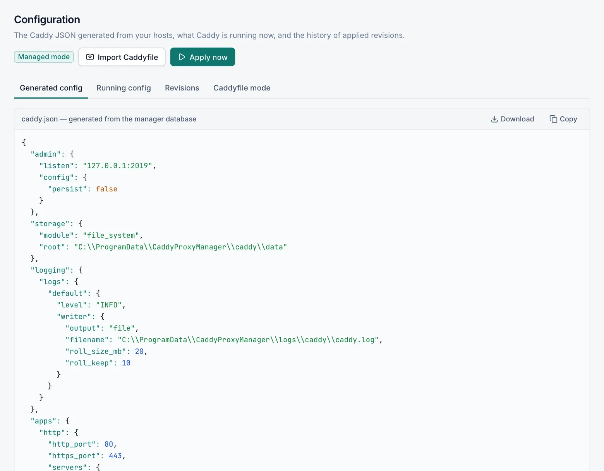
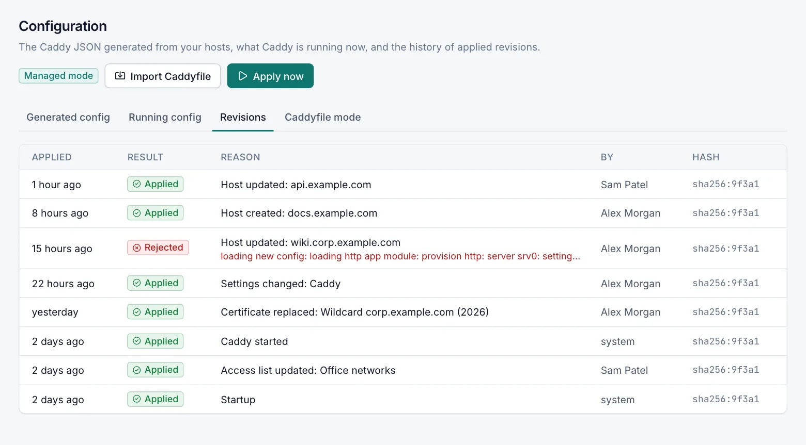
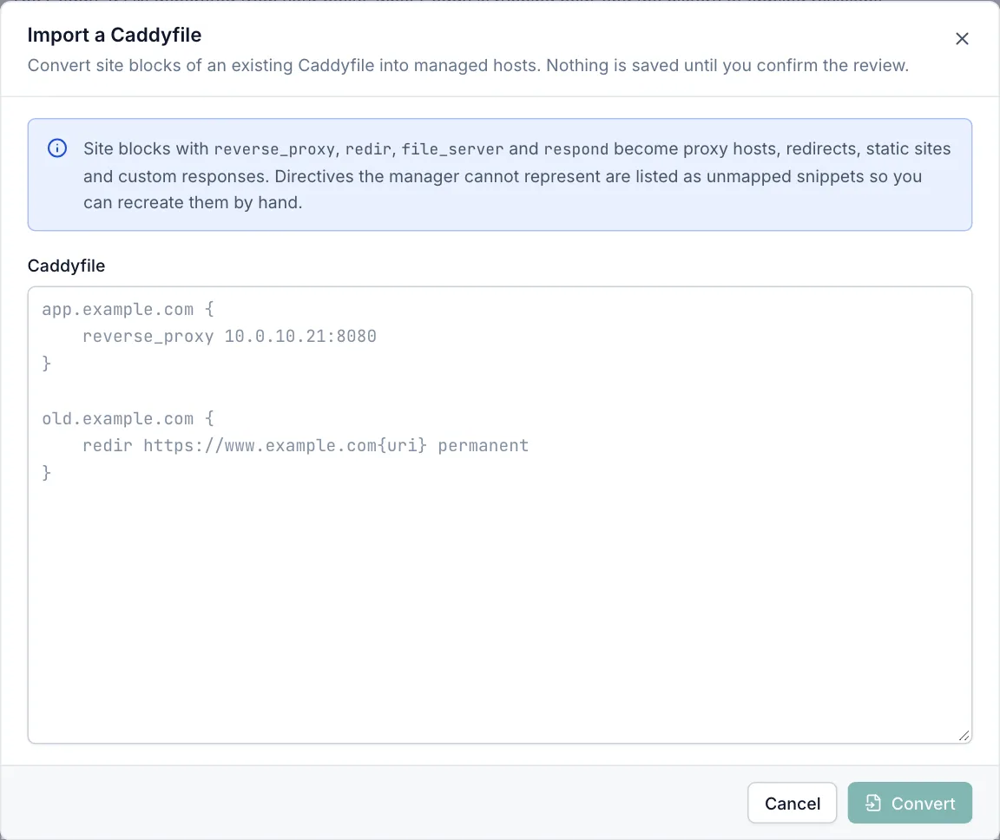

# Configuration

The **Caddy › Configuration** page shows the Caddy configuration that the manager generates from your hosts and settings, the configuration Caddy runs now, and the history of every apply. It also holds Caddyfile mode and the Caddyfile import. Every role can view the page; **Apply now** needs the **Operator** role, and Caddyfile mode and the import need the **Admin** role.

## How configuration is applied

You do not edit Caddy's configuration directly. The manager builds it in Caddy's JSON format from your hosts, streams, access lists, certificates and settings, and loads it into Caddy through Caddy's local admin API. This happens every time you save a change, and when the manager starts.

When you save a change:

1. The manager stores the change and generates the new configuration.
2. It loads the configuration into Caddy.
3. If Caddy rejects the configuration, the manager undoes your change and shows Caddy's error. The previous configuration keeps running.
4. On success, the configuration is written to `C:\ProgramData\CaddyProxyManager\caddy\caddy.json`. Caddy loads this file when it starts, so it always holds the last configuration that worked.

If Caddy is not running, the manager checks the configuration with the Caddy program instead and saves it. It takes effect when Caddy starts, and you see **Saved — Caddy is not running**. If the Caddy program is not installed, the configuration is saved without a check.

Every attempt, successful or not, is recorded as a revision (see [Revisions](#revisions)). A rejected configuration also raises an event, and a *recovered* event follows when an apply works again.

## Apply now

**Apply now** in the page header generates the configuration and loads it into Caddy again. You need the **Operator** role. Use it when the **Running config** tab reports a difference, for example after Caddy was stopped, or to make Caddy read certificate files from disk again. The result appears as a message; if Caddy rejects the configuration, a **Configuration not applied** window shows Caddy's error.

## Generated config

The **Generated config** tab shows the configuration an apply would load now, generated from the manager's database. In Caddyfile mode the tab is called **Adapted config** and shows your Caddyfile converted to JSON. Warnings from the generation, for example about skipped streams, appear above it.

Use **Copy** or **Download** to save it (`caddy.generated.json`).

## Running config

The **Running config** tab shows the configuration Caddy runs right now, read from Caddy's admin API. The page compares it with the generated configuration:

- **Caddy is running exactly the configuration generated by the manager.**: both are the same.
- **Running configuration differs from the generated one**: a change has not been applied yet, for example because Caddy was stopped, or someone changed Caddy's configuration directly through its admin API. Select **Apply now** to load the generated configuration.

The comparison only tells you whether the two are equal. It does not list the differences. When Caddy is stopped or its admin API does not answer, the tab shows **Caddy’s admin API is not reachable**; start Caddy on [Service & Updates](caddy-service.md).

## Revisions

The **Revisions** tab lists the last 50 applies, newest first. The manager keeps the last 100.

| Column | Description |
|---|---|
| Applied | When the apply happened. |
| Result | **Applied** or **Rejected**. |
| Reason | What triggered it, for example *Caddy settings updated*, *Manual apply* or *startup*, and Caddy's error for rejected ones. |
| By | The user, or *system* for automatic applies. |
| Hash | The start of the configuration's fingerprint. Identical configurations have the same hash. |

Select a row to open the revision with its full configuration and, for a rejected one, **Caddy error**. You can copy or download the configuration. Revisions are a record: there is no button to apply an old revision again.

## Secrets in configuration views

Administrators see the configuration as it is. For every other role the **Generated config**, **Running config** and revision views replace secrets with `***`: passwords, tokens, API keys, EAB keys, DNS provider credentials, private keys and the values of custom storage settings.

## Caddyfile mode

Caddyfile mode is an escape hatch: Caddy runs a Caddyfile you write by hand instead of the generated configuration. The **Caddyfile mode** tab has two choices:

- **Managed (recommended)**: the configuration is generated from the hosts, certificates and settings in the console. This is the default.
- **Caddyfile**: Caddy runs only your Caddyfile. Proxy hosts, redirects, static sites, streams and access lists in the manager are ignored until you switch back.

Only admins can see and edit the Caddyfile, because it can contain credentials. Other roles see **Only administrators can view the Caddyfile**.

### Switch to Caddyfile mode

1. Open **Caddy › Configuration** and the **Caddyfile mode** tab.
2. Select **Caddyfile**.
3. Write or paste your Caddyfile in the editor. The Tab key inserts a tab; Shift+Tab leaves the editor.
4. Select **Adapt & validate** to let Caddy check it. You see **The Caddyfile is valid** or **Adapted with warnings**, and the adapted JSON.
5. Select **Save & apply**, then **Switch and apply**.

The Caddyfile cannot be empty in Caddyfile mode. To go back, select **Managed (recommended)** and **Save**.

### What the manager adds to a Caddyfile

In Caddyfile mode the manager still needs to control Caddy, so it adds these parts when your Caddyfile does not set them: the admin API address from **Settings › Caddy**, the certificate storage and the Caddy log. If your Caddyfile sets a different admin address, a warning says that the manager cannot control Caddy until both match.

Changes you make to hosts or other objects while Caddyfile mode is active are saved but not used, and you see a warning saying so.

## Import a Caddyfile

The import turns the site blocks of an existing Caddyfile into managed hosts, for example when you move from a hand-written Caddy setup to Caddy Proxy Manager. You need the **Admin** role. Nothing is saved until you confirm the review.

1. Open **Caddy › Configuration** and select **Import Caddyfile**. In Caddyfile mode you can also use **Import as hosts…** above the editor; your Caddyfile is then filled in.
2. Paste the Caddyfile.
3. Select **Convert**. Caddy converts the Caddyfile, and the manager maps it to host drafts. Caddy must be running or at least installed for this.
4. Review the drafts. Clear the check box of any draft you do not want.
5. Select **Create hosts**. The button shows the number of selected drafts.

The hosts are created together and applied. If any draft is invalid, or a domain would be served twice, nothing is created and the reason is shown. At most 500 hosts can be imported at once.

### What the import recognises

| Caddyfile | Becomes |
|---|---|
| `reverse_proxy` | A proxy host with its upstreams, load-balancing policy, active health check, request headers (including `Host`), HTTPS upstreams and `tls_insecure_skip_verify`, and NTLM transport. |
| `handle_path` or `handle` with a path and `reverse_proxy` | A location of the proxy host. |
| `redir` | A redirect with code 301, 302, 303, 307 or 308. A target ending in `{uri}` keeps the path. |
| `file_server` with `root`, `browse` | A static site. `try_files` for a single-page app becomes the SPA fallback. |
| `respond` | A custom response with status, body and content type. |
| `encode` | Compression on. |
| `header` (response headers) | Response header rules. |
| `log` | Access log on. |
| `tls internal` | Internal TLS. |

Sites served over HTTPS get ACME certificates. A site that is also served over plain HTTP becomes one host with **Force HTTPS** off.

### What the import does not recognise

- Global options, and apps other than HTTP and TLS. Configure those in **Settings › Caddy** (for plugin apps: **Extra apps**).
- Server options. Use **Server options (JSON)** in [Caddy settings](caddy-settings.md#advanced).
- Sites without a host name, for example `:8080 { … }`. The manager serves hosts by name.
- Sites on other ports: the imported host is served on the configured HTTP or HTTPS port instead.
- ACME settings (e-mail, CA, DNS challenge). Set them in [ACME settings](acme.md).
- Certificate files from `tls <cert> <key>`: the draft uses ACME, and its notes tell you to add the files under [Certificates](certificates.md) and switch the host to custom TLS.
- Options of `reverse_proxy`, `file_server` and health checks that have no field in the manager. They are ignored with a warning.

Other handlers of a site, and `basic_auth`, are kept as the draft's advanced routes (custom JSON routes that run before the host's main handler), so that a protected site stays protected. A warning asks you to review them; consider replacing `basic_auth` with an [access list](access-lists.md).

### The review

The review table shows for each draft: **Domains**, **Type**, **Target**, **TLS** (ACME, Internal, Custom or HTTP only) and **Notes**. The notes show the draft's warnings and, in red, domains that an existing enabled host already serves. Drafts with such conflicts are not selected at first.

**Unmapped snippets** lists, in Caddy's JSON form, every part of the Caddyfile that did not map to a host field, including the parts kept as advanced routes. Recreate the rest with host settings, custom routes on the host's **Advanced** tab, or global settings. **Back to Caddyfile** returns to the text.

## Related

- [Caddy service and updates](caddy-service.md)
- [Caddy settings](caddy-settings.md)
- [Host options](host-options.md)
- [Events](events.md)
- [Troubleshooting](troubleshooting.md)
