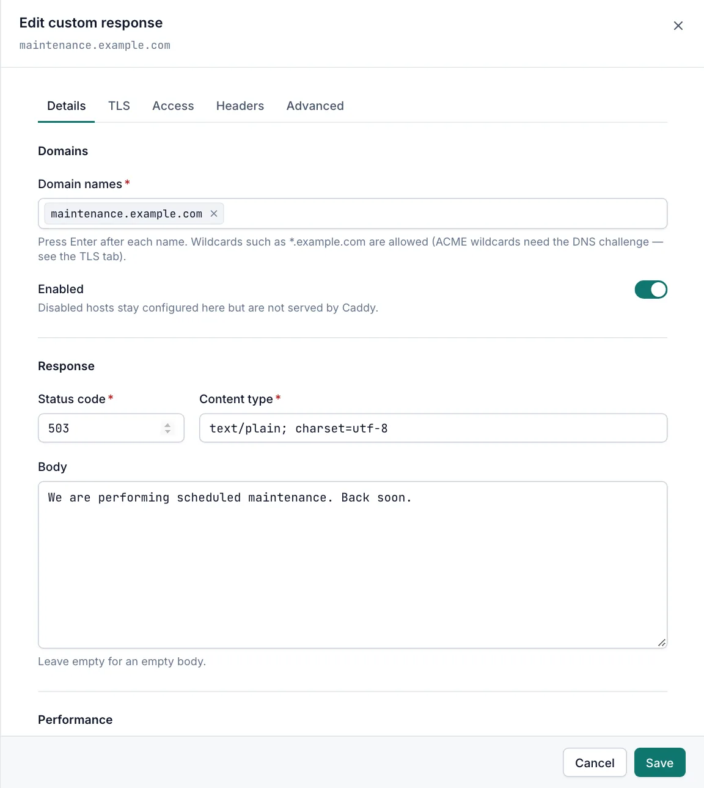

# Custom responses

A custom response host answers every request for its domains with a fixed status code and body, for example a maintenance page, a `410 Gone` for a retired domain or a simple health endpoint. Viewers can open custom responses read-only. Creating and changing them needs the Operator or Admin role.

## The Custom Responses page

Open **Sites › Custom Responses**. The page works like the [Proxy Hosts page](proxy-hosts.md#the-proxy-hosts-page). The **Response** column shows the status code (highlighted from 400 upwards) and the content type.

## Add a custom response

1. Open **Sites › Custom Responses** and select **Add custom response**.
2. On the **Details** tab, add the names in **Domain names**. See [Domain names](proxy-hosts.md#domain-names).
3. Set the **Status code**, **Content type** and **Body**.
4. Select **Create**.

A new custom response starts as a maintenance notice: status `503` with the body "This site is temporarily down for maintenance."

## Response settings



| Field | Default | Description |
|---|---|---|
| Status code | `503` | Required, 200–599. Informational 1xx codes are not allowed. |
| Content type | `text/plain; charset=utf-8` | Required. Sent as the `Content-Type` header. The field suggests `text/plain; charset=utf-8`, `text/html; charset=utf-8` and `application/json`. |
| Body | "This site is temporarily down for maintenance." | The response body. Leave it empty for an empty body. |
| Compression | on | Compresses responses with zstd or gzip when the client supports it. |

Caddy placeholders in the body, such as `{http.request.host}`, are replaced with their values. Other text in braces, such as JSON, is sent unchanged.

## Examples

A maintenance page in HTML: set **Status code** to `503`, **Content type** to `text/html; charset=utf-8` and paste the page into **Body**.

A retired domain: set **Status code** to `410` and **Body** to a short explanation.

A health endpoint for a load balancer: set **Status code** to `200`, **Content type** to `application/json` and **Body** to:

```json
{"status": "ok"}
```

## Maintenance mode for a proxy host

A domain can belong to only one enabled host. To show a maintenance page for a proxy host:

1. Create a custom response with the same domain names and leave **Enabled** off.
2. When maintenance starts, disable the proxy host and enable the custom response.
3. When it ends, disable the custom response and enable the proxy host again.

Use the **Status** switch on each list page for this. See [Row actions](host-options.md#row-actions).

## Related

- [Host options](host-options.md)
- [Redirects](redirects.md)
- [Caddy settings](caddy-settings.md#unknown-hosts)
