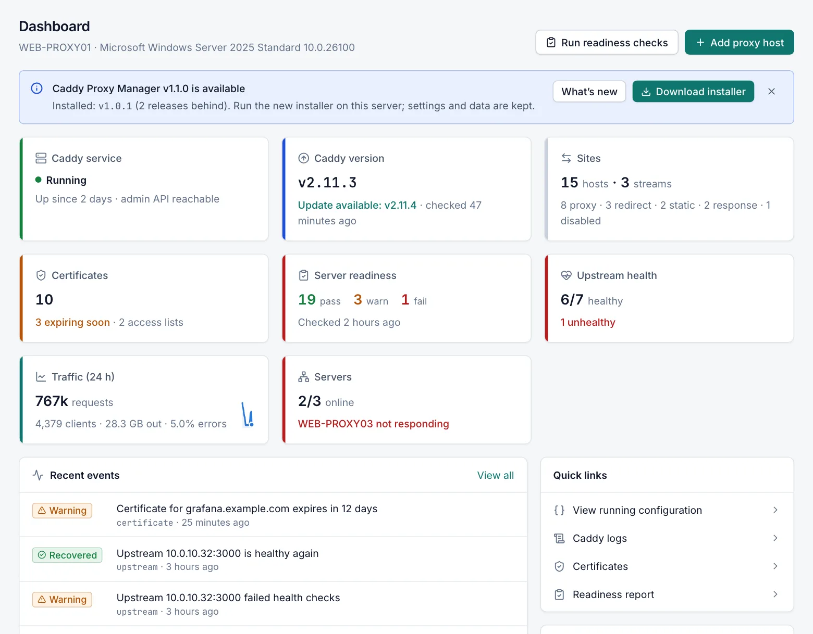

# Dashboard

The Dashboard is the first page after you sign in. It gives you an overview of this server: Caddy's state, your sites and certificates, readiness, upstream health, traffic and the cluster. It also shows recent events. Every role can open it. The buttons that change something need the **Operator** role.

## What the page shows

The page header shows the server's host name and operating system.

The Dashboard refreshes itself every 15 seconds. Each part of the page loads on its own. If one part cannot be loaded within 5 seconds, the rest of the page still appears. A **Some information could not be loaded** notice at the top then lists the parts that are missing.

Every card in the top grid is a link. Select it to open the page with the details.

## Actions

| Button | Role | What it does |
|---|---|---|
| Run readiness checks | Operator | Runs all readiness checks now. When they finish, a message shows how many failed and how many gave warnings. |
| Add proxy host | Operator | Opens the proxy host editor for a new host. It is hidden on a cluster node, because a node receives its hosts from the primary. |

## Notices

Some notices appear above the cards only when they apply:

- **Caddy is stopped — no sites are being served**. Caddy is installed but not running. The notice shows Caddy's last error when there is one. If you have the **Operator** role, select **Start Caddy** to start it.
- **Caddy is not installed yet**. The Caddy program has not been installed. Select **Install Caddy** to go to **Caddy › Service & Updates**.
- A notice about a new Caddy Proxy Manager version, when one is available. You can dismiss it.

## Cards

| Card | Shows | Opens |
|---|---|---|
| Caddy service | Whether Caddy is running. When it is running, how long it has been up. Also shows **admin API reachable** when the manager can reach Caddy's admin API. | **Caddy › Service & Updates** |
| Caddy version | The installed Caddy version, and whether an update is available, it is **Up to date**, or the latest version is unknown. Also shows when the manager last checked. | **Caddy › Service & Updates** |
| Sites | Total number of hosts, and streams when you have any. A second line breaks the hosts down by kind (proxy, redirect, static, response) and counts disabled hosts. | **Proxy Hosts** |
| Certificates | Number of certificates, how many are expiring soon, and the number of access lists. | **Certificates** |
| Server readiness | Pass, warn and fail counts of the last readiness run, and when it ran. **Not checked yet** until the checks have run once. | **Readiness** |
| Upstream health | How many health-checked backends are healthy, and how many are unhealthy. | **Caddy › Service & Updates** |
| Traffic (24 h) | Requests in the last 24 hours on this server, unique clients, data sent, the error rate, and a chart of requests per hour. | **Traffic** |
| Servers | This server's role in a cluster and whether its nodes are online and in sync. | **Servers** |

### Certificates card

The card counts every certificate except Caddy's internal root certificate.

*Expiring soon* counts custom and ACME certificates whose remaining days are at or below the warning threshold. The threshold is **Warn this many days before expiry** on the [Notifications](notifications.md) page (14 days by default).

### Upstream health card

The card counts only the backends that Caddy tracks with a health check:

- backends of a proxy host with an active health check
- backends of a `reverse_proxy` with passive health checks that an admin added in custom Caddy routes

Backends without a health check are not counted, whatever the number of upstreams.

It shows `0/0` and **No health-checked upstreams** when there are none, or when the manager cannot reach Caddy's admin API.

### Traffic (24 h) card

The coloured bar on the left of the card warns about errors:

- It turns red when 5xx responses are 5 % or more of the requests.
- It turns amber when 4xx and 5xx responses together are 10 % or more.

The card shows **Statistics disabled** when traffic statistics are turned off. It also shows this when the Caddy configuration is in Caddyfile mode, because statistics are not collected in that mode. The card refreshes every minute.

See [Traffic statistics](traffic-statistics.md) for what is counted.

### Servers card

The card shows one of the following:

- **Standalone** when this server manages no other servers.
- **Cluster node** when this server is managed by a primary. The card names the primary.
- The number of servers that are online, on a primary.

On a primary, the second line shows the first matching problem, in this order:

1. servers that are not responding
2. servers waiting to join
3. nodes out of sync
4. a pending key rotation

When there is no problem it shows **Primary with N nodes, all in sync**.

## Recent events

The **Recent events** card lists the 10 newest events with their severity, category and time. Select **View all** to open the [Events](events.md) page.

## Quick links

The **Quick links** card has shortcuts to:

- **View running configuration**
- **Caddy logs**
- **Certificates**
- **Readiness report**

## System card

| Field | Description |
|---|---|
| Server | The computer name. |
| OS | The Windows version. |
| Manager | The installed Caddy Proxy Manager version. When a newer version is available, select the link next to it to see the update. |
| Uptime | How long the Caddy Proxy Manager service has been running (not the Windows uptime). |
| Data folder | Where the manager keeps its database, certificates and logs. |

## Related

- [Servers](servers.md)
- [Traffic statistics](traffic-statistics.md)
- [Events](events.md)
- [Readiness](readiness.md)
- [Caddy service](caddy-service.md)
