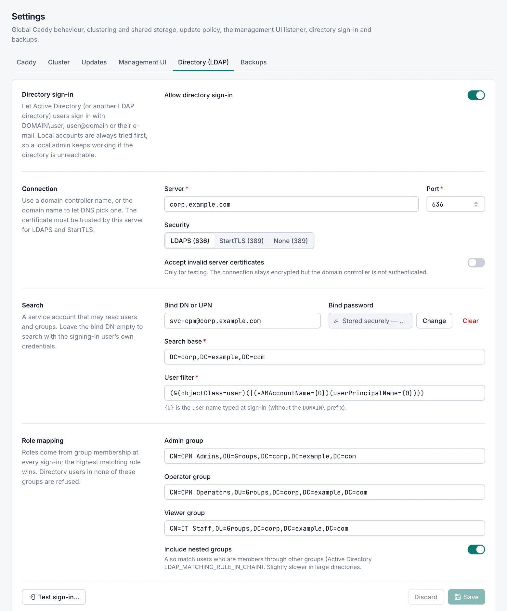

# Directory sign-in (Active Directory / LDAP)

Directory sign-in lets Active Directory (or other LDAP directory) users sign in to the console with their domain
account. Their role comes from the groups they belong to. Only admins can configure it, in
**Settings › Directory (LDAP)**.

## How directory sign-in works

1. The user types their user name and password on the sign-in page. Accepted forms are `DOMAIN\user`, a UPN such as
   `user@corp.example.com`, and plain `user` (plain `user` only when a bind account is set). With the default
   **User filter**, an e-mail address works only when it is the same as the user's UPN.
2. Caddy Proxy Manager first checks **local accounts**. A local admin can therefore always sign in, even when the
   directory is unreachable.
3. If the user name and password do not match a local account, the manager asks the directory:
   1. It binds with the bind account, or directly as the user when no bind account is set.
   2. It searches the **Search base** with the **User filter** and expects exactly one match.
   3. It verifies the password by binding as that user.
   4. It checks the **Admin group**, **Operator group** and **Viewer group**, in that order. The first match sets the
      role, so the highest matching role wins.
4. On success the user signs in. At the first sign-in a user account is created on the **Users** page with a
   **Directory** badge.

Accounts that are disabled in Active Directory, and empty passwords, are always refused.

## Set up directory sign-in

Role: Admin.

1. Open **Settings › Directory (LDAP)**.
2. Turn on **Allow directory sign-in**.
3. Under **Connection**, enter the **Server** and choose **Security** (LDAPS or StartTLS). The **Port** follows the
   security mode.
4. Under **Search**, enter the **Bind DN or UPN** and **Bind password** of a service account, and the **Search base**.
5. Under **Role mapping**, enter the distinguished name of at least one group.
6. Click **Save**.
7. Click **Test sign-in…** and test with a directory account from each group.

Keep at least one local admin account with a long password. It is your way in when the directory or the network is
unavailable, and the last enabled local admin cannot be removed.

## Field reference

### Directory sign-in section

| Field | Default | Description |
|---|---|---|
| Allow directory sign-in | Off | Turns directory sign-in on. The other fields are disabled while it is off. |

### Connection section

| Field | Default | Description |
|---|---|---|
| Server | – | Host name of a domain controller, or the domain name to let DNS choose one. Enter the name only, without `ldap://` or `ldaps://`. |
| Port | `389` | TCP port. LDAPS uses `636` (or `3269` for the global catalog); StartTLS and None use `389` (or `3268`). |
| Security | StartTLS (389) | **LDAPS (636)**, **StartTLS (389)** or **None (389)**. Choosing a mode switches a standard port to the matching one. |
| Accept invalid server certificates | Off | Skips validation of the domain controller's certificate. Only for testing: the connection stays encrypted, but the server is not authenticated. Not available with None. |

Use the domain controller's fully qualified name so that it matches its certificate. For LDAPS and StartTLS the
certificate must be trusted by this server.

> [!WARNING]
> With **None**, passwords cross the network in clear text, and Active Directory may reject simple binds when LDAP
> signing is required. Use LDAPS or StartTLS.

### Search section

| Field | Default | Description |
|---|---|---|
| Bind DN or UPN | Empty | A service account that can read users and groups: a distinguished name, a UPN (`svc-cpm@corp.example.com`) or `DOMAIN\user`. Leave empty to search with the signing-in user's own credentials. |
| Bind password | – | Password of the bind account. Required when a bind account is set. Stored encrypted and never shown again; use **Change** or **Clear**. |
| Search base | – | Where users are searched (whole subtree), for example `DC=corp,DC=example,DC=com`. |
| User filter | `(&(objectClass=user)(\|(sAMAccountName={0})(userPrincipalName={0})))` | LDAP filter. `{0}` is replaced with the user name typed at sign-in, without the `DOMAIN\` prefix. **Reset to default** restores the default. |

Without a bind account, users must sign in as `DOMAIN\user` or with their UPN, because the manager binds with that
name directly.

### Role mapping section

| Field | Default | Description |
|---|---|---|
| Admin group | Empty | Distinguished name of the group whose members get the Admin role, for example `CN=CPM Admins,OU=Groups,DC=corp,DC=example,DC=com`. |
| Operator group | Empty | Group for the Operator role. |
| Viewer group | Empty | Group for the Viewer role. |
| Include nested groups | On | Also matches users who are members through other groups (Active Directory `LDAP_MATCHING_RULE_IN_CHAIN`). Slightly slower in large directories. |

Map at least one group. Directory users who are in none of the mapped groups cannot sign in.

Do not map a role to the user's primary group (usually *Domain Users*): the directory does not report it as a group
membership, so it never matches.

## Test sign-in

Role: Admin.

**Test sign-in…** tries a sign-in against the **saved** settings and shows the role the user would get. No session is
created. The button is available after you have saved the settings with **Allow directory sign-in** turned on.

1. Click **Test sign-in…**.
2. Enter a **User name** and **Password**.
3. Click **Test**.

The result shows **Sign-in succeeded** or **Sign-in failed**, the reason for a failure, and:

- **Role**, or "None — not in a mapped group, sign-in would be refused";
- **Display name** and **E-mail**;
- **Groups**: the user's direct groups plus the mapped group that matched.

Each test is recorded in the audit log and counts towards the sign-in limit of 10 attempts per minute.

## Directory user accounts

- The account is created at the first successful sign-in. Its e-mail is the directory's `mail` attribute, else the
  `userPrincipalName`, else `sAMAccountName@<domain>`.
- The name, e-mail and role are updated at every sign-in. You cannot edit them on the Users page.
- Directory accounts have no local password. They cannot use **Change password** or the `reset-password` command.
- A directory account is never merged with a local account. If a local account already uses the same e-mail address,
  the directory user is refused with "Your directory account cannot be used here because its e-mail address belongs to
  another account. Ask an administrator."
- To block a directory user in the console, open the account on the **Users** page and turn on **Disabled**. This
  takes effect immediately, including open sessions.
- If you delete a directory account, it is created again at the user's next successful sign-in. Disable it instead to
  keep the user out.

### When group membership changes

Group membership is checked at sign-in. A user who is removed from all mapped groups is refused at the next sign-in,
and that attempt also ends their open sessions. Until they sign in again, an open session keeps working with the role
it had, and sessions are extended while they are in use. To remove access at once, disable the account on the
**Users** page.

## Troubleshooting directory sign-in

| Message on the sign-in page | Cause and fix |
|---|---|
| "Your directory account is valid but is not a member of a group that is allowed to use Caddy Proxy Manager. Ask an administrator." | The password is correct but the user is in none of the mapped groups. Check the group DNs, **Include nested groups**, and that you did not map the primary group. |
| "The directory server could not be used to verify your account. Try again later; local accounts can still sign in." | The directory could not be used: server unreachable, TLS or certificate problem, bind account rejected, wrong search base, or more than one entry matched. Use **Test sign-in…** to see the exact reason. |
| "The user name or password is incorrect." | Wrong password, unknown user, or an account that is disabled, locked out or expired in the directory. Without a bind account, also check that the user typed `DOMAIN\user` or a UPN. |
| "Your directory account cannot be used here because its e-mail address belongs to another account. Ask an administrator." | A local account or another (stale) directory account already uses this e-mail. Delete the stale account or change the local account's e-mail. |
| "Too many sign-in attempts. Wait a minute before trying again." | More than 10 attempts from this address in a minute. |

More causes that **Test sign-in…** reports:

- **Bind account rejected**: check **Bind DN or UPN** and **Bind password**.
- **Base DN does not exist**: check **Search base**.
- **More than one directory entry matches**: make the **User filter** more specific.
- **No mail or userPrincipalName attribute**: the account cannot be mapped to a user; add one of these attributes.
- **Stored bind password cannot be decrypted**: this happens after restoring a backup from another server, because
  secrets are encrypted per machine. Enter the bind password again and save.
- **Timeout**: each directory operation waits up to 10 seconds. Check that the server and port are reachable from
  this server.

The reason for every failed directory sign-in is recorded in the [audit log](audit-log.md), for example "wrong
password", "account locked out" or "password expired".

## Related

- [Users and roles](users.md)
- [Audit log](audit-log.md)
- [Security](security.md)
- [Backup and restore](backup-restore.md)
