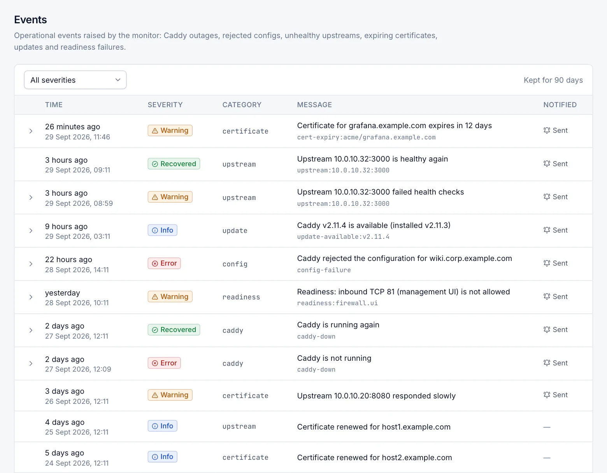

# Events

The **Events** page is the history of operational events: outages, rejected configurations, unhealthy backends, certificate problems, updates, readiness failures, cluster problems and failed backups. Every role can view it. The alert rules that decide which events also send notifications are on the [Notifications](notifications.md) page (Admin).

## Read the event list

Open **Server › Events**. The newest events are at the top, 50 per page, and the list refreshes every 30 seconds.

| Column | Description |
|---|---|
| Time | How long ago the event happened, with the exact date and time. |
| Severity | **Info**, **Warning**, **Error** or **Recovered**. |
| Category | The area the event belongs to, for example `caddy` or `certificate`. |
| Message | What happened. The line below it is the event's key. The key identifies the problem, so an event and its later recovery share the same key. |
| Notified | **Sent** when the notification was delivered through every enabled channel. |

Select a row with an arrow to show its details, for example the error text, the certificate's subjects or the steps to fix a readiness check.

Use the severity selector to show only **Errors**, **Warnings**, **Recovered** or **Info** events. Events are kept for 90 days and then deleted automatically. The list is read-only.

## Severities

| Severity | Meaning |
|---|---|
| Info | Something happened that needs no action, for example an update is available or Caddy was updated. |
| Warning | A problem that needs attention. |
| Error | A serious problem, for example Caddy is down or rejected a configuration. |
| Recovered | A problem reported earlier has cleared. It is recorded only when the matching problem is still open. |

## How repeated problems are handled

A problem that has a key is *open* from its first **Warning** or **Error** until its **Recovered** event.

- **Repeats are suppressed during the cooldown.** While the problem stays open, the same event is not recorded or sent again. The cooldown is **Cooldown (minutes)** on the [Notifications](notifications.md) page, 30 minutes by default.
- **Higher severity breaks through.** If the problem gets worse (a warning becomes an error), the new event is recorded and sent straight away.
- **After the cooldown, a persisting problem is recorded again,** the next time it is detected. Readiness failures and offline cluster servers are the exception: they are reported only once until they recover.
- **Open problems survive a restart.** They are remembered when the Caddy Proxy Manager service restarts, so a recovery is still reported afterwards.

## What is monitored

The monitor starts 60 seconds after the Caddy Proxy Manager service starts and then checks every 30 seconds:

- **Caddy.** Whether Caddy runs and its admin API answers. This is checked only when Caddy and its Windows service are installed.
- **Upstreams.** The health of backends that Caddy tracks with a health check, while Caddy's admin API is reachable.
- **Certificate expiry.** Certificates you added (uploaded, or taken from files, a PFX or the Windows certificate store) and ACME certificates, every 6 hours.
- **Missing certificates.** Hosts whose certificate has not been issued, every 5 minutes while Caddy is running.
- **Readiness.** The readiness checks, run automatically once every 24 hours. The results of a run started with **Run checks** on the Readiness page are evaluated too.

Other parts of the manager raise events when something happens:

- Caddy installation and start when the manager starts
- outbound proxy changes
- configuration changes
- Caddy updates and update checks
- certificate synchronisation
- scheduled backups
- cluster heartbeats and syncs
- traffic statistics
- notification delivery
- management UI start-up

The next section lists every event.

## Event reference

The **Alert rule** column names the switch in **Administration › Notifications › Alert rules** that decides whether the event is also sent by e-mail or webhook. Events marked "none" are recorded but never sent. Every event is written to the Windows Event Log when that is turned on; see [Notifications](notifications.md#windows-event-log).

### Caddy

| Event | Severity | When it is raised | When it recovers | Alert rule |
|---|---|---|---|---|
| Caddy is not running (state: …) / Caddy is running but its admin API is not reachable | Error | Two checks in a row, 30 seconds apart, find Caddy down while it should run. Not raised while Caddy is starting or stopping, during an update job, or after a user stopped Caddy. | **Caddy is running again** once it runs and answers. **Caddy is no longer expected to run** if the program or service was removed. | Caddy is down |
| Automatic restart of Caddy attempted (n/3) | Info | **Restart Caddy automatically** is on and the manager tries to start Caddy. | — | none |
| Automatic restart of Caddy failed (n/3) | Error | That attempt failed. | — | none |
| Automatic restart of Caddy gave up after 3 attempts in 10 minutes | Error | Three attempts within 10 minutes did not help. Start Caddy yourself after checking the Caddy log. | **Caddy is running again after automatic restarts gave up** | Caddy is down |
| Caddy is not installed and the automatic installation failed | Error | When the manager starts, Caddy is missing and could not be downloaded, for example on a server without internet access. | **Caddy is installed** | Caddy is down |
| Registering the Caddy Windows service failed | Error | The Caddy service could not be created. | — | Caddy is down |
| Caddy failed to start / Caddy failed to restart | Error | When the manager started, it could not start Caddy, or could not restart it to apply changed service settings. | With the Caddy-down event above. | Caddy is down |
| Updating the Caddy service environment (outbound proxy) failed | Warning | The outbound proxy settings could not be passed to the Caddy service. | — | Caddy is down |
| Caddy did not restart after its outbound proxy settings changed | Error | Caddy failed to restart after a proxy change. | With the Caddy-down event above. | Caddy is down |
| Caddy was restarted to apply its outbound proxy settings | Info | Caddy was restarted after a proxy change. | — | none |

### Configuration and backups

| Event | Severity | When it is raised | When it recovers | Alert rule |
|---|---|---|---|---|
| Caddy rejected the configuration. | Error | Caddy refused a configuration. The details show the reason and Caddy's error; the previous configuration keeps running. | **Caddy configuration applied successfully again.** | Configuration rejected |
| Scheduled backup failed | Error | A scheduled backup could not be written. Manual backups show their error on screen instead. | **Backups are written successfully again** | Configuration rejected |

### Upstreams

| Event | Severity | When it is raised | When it recovers | Alert rule |
|---|---|---|---|---|
| Upstream `<address>` is unhealthy | Warning | Caddy's health check marks the backend unhealthy. Only backends with an active health check (or passive health checks added in advanced routes) are tracked. | **Upstream … is healthy again**, or **Upstream … is no longer monitored** when its health check or host was removed. | Upstream unhealthy |

### Certificates

| Event | Severity | When it is raised | When it recovers | Alert rule |
|---|---|---|---|---|
| Certificate '…' expires in N day(s) | Warning | A certificate you added, or an ACME certificate, is within **Warn this many days before expiry** (14 by default). Checked every 6 hours. | **Certificate … is no longer expiring** after renewal or replacement. | Certificate expiring |
| Certificate '…' expired on … | Error | The certificate has expired. | Same as above. | Certificate expiring |
| Certificate '…' cannot be read | Warning | The certificate or key file cannot be read. | Same as above. | Certificate expiring |
| No certificate has been issued for `<domain>` | Warning | An enabled host with ACME or internal TLS has no certificate 10 minutes after it was last changed. The details include hints and Caddy's last certificate errors. Checked every 5 minutes while Caddy runs, in managed mode only. | **The certificate for … has been issued**, or the host no longer needs one. | Certificate expiring |
| Certificate '…' could not be synchronised with its source. | Warning | A certificate taken from a file, PFX or the Windows certificate store could not be updated from its source. | **Certificate '…' is synchronised with its source again.** | Certificate expiring |

### Updates

| Event | Severity | When it is raised | When it recovers | Alert rule |
|---|---|---|---|---|
| Caddy X is available (installed: Y) | Info | The update check finds a newer Caddy release. Raised once per version. | — | Caddy update available |
| Caddy Proxy Manager X is available (installed: Y) | Info | The update check finds a newer Caddy Proxy Manager release. Raised once per version. | — | Caddy update available |
| Caddy updated from X to Y / Caddy X installed / Caddy rolled back … | Info | A Caddy install, update or rollback finished. | — | none |
| Caddy update to X failed and was rolled back … / Installing Caddy failed … | Error | An install, update or rollback failed. The previous version was kept or restored. | — | Caddy update available |
| Caddy is down after a failed update and rollback | Error | Neither the new nor the previous Caddy version would start. | With the Caddy-down event above. | Caddy is down |

### Readiness

| Event | Severity | When it is raised | When it recovers | Alert rule |
|---|---|---|---|---|
| Readiness check failed: … | Warning | A readiness run (the daily automatic run or **Run checks**) finds a check that newly fails. A check that keeps failing is not reported again. The details include the remediation. | **Readiness check passes again: …** | Readiness check failures |

### Cluster

These events are raised only on a primary server. See [Cluster](cluster.md).

| Event | Severity | When it is raised | When it recovers | Alert rule |
|---|---|---|---|---|
| Server '…' is offline | Warning | Three heartbeats in a row to a node failed (about 45 seconds). The node keeps serving its last configuration. | **Server '…' is reachable again** | Server offline |
| Configuration sync to server '…' failed | Warning | A node could not apply the configuration. | **Configuration sync to server '…' works again**, or **Server '…' runs the current configuration again** | Configuration rejected |
| Server '…' was removed but could not be told to leave | Warning | You removed a node that could not be reached. Run `cluster leave` on it. | — | none |

### Traffic statistics, notifications and start-up

| Event | Severity | When it is raised | When it recovers | Alert rule |
|---|---|---|---|---|
| Traffic statistics cannot be saved | Warning | Saving the statistics failed three times in a row, for example because the disk is full. | **Traffic statistics are being saved again** | none |
| Some traffic statistics were lost | Warning | Caddy deleted a statistics log file before the manager read it. | — | none |
| Notification delivery failed | Warning | An e-mail or webhook could not be delivered. The details name the channel and the error. | — | none (never sent) |
| Management UI started with fallback settings | Warning | At start-up, the management UI settings could not be read or applied, or the data folder could not be restricted to SYSTEM and Administrators. The details explain why. | — | none |

## Windows Event Log IDs

When **Write to the Windows Event Log** is on (the default), every recorded event is also written to the Windows **Application** log. The source is **Caddy Proxy Manager**.

- The event type follows the severity. **Error** is written as Error, **Warning** as Warning, and **Info** and **Recovered** as Information.
- The event ID is the category's base number plus a severity offset.
- Offsets: Info +0, Warning +1, Error +2, Recovered +3.

| Category | Base ID | Example |
|---|---|---|
| caddy | 1000 | 1002 = Caddy error |
| config | 1100 | 1102 = configuration rejected |
| upstream | 1200 | 1201 = upstream unhealthy |
| certificate | 1300 | 1301 = certificate warning |
| update | 1400 | 1400 = update available |
| readiness | 1500 | 1501 = readiness failure |
| notification | 1600 | 1601 = notification delivery failed |
| backup | 1700 | 1702 = scheduled backup failed |
| cluster, traffic, system | 1900 | 1901 = server offline |

Use these IDs to filter or forward events with SCOM, Splunk, Microsoft Sentinel or Windows Event Forwarding.

## Related

- [Notifications](notifications.md)
- [Dashboard](dashboard.md)
- [Readiness](readiness.md)
- [Certificates](certificates.md)
- [Cluster](cluster.md)
- [Troubleshooting](troubleshooting.md)
