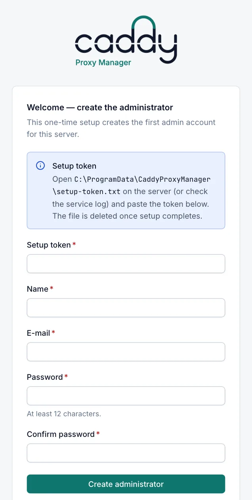
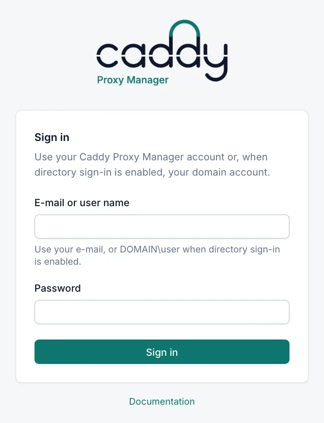
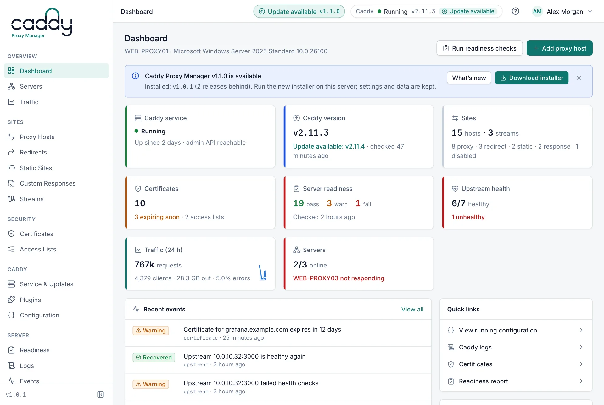

# Getting started

This page takes you from a fresh installation to your first published site: creating the first administrator, signing in, finding your way around the console and adding a proxy host. Creating the first administrator needs access to the server as a local administrator.

## Before you start

Install Caddy Proxy Manager on the server first. See [Installation](installation.md). The installer starts the manager service, and the manager downloads and starts Caddy in the background.

## Get the setup token

The first administrator account is protected by a one-time setup token. The manager creates it when it starts and no account exists yet, and stores it in `C:\ProgramData\CaddyProxyManager\setup-token.txt`. Only SYSTEM and Administrators can read that file, so anyone who can create the first account must already be an administrator of the server.

1. On the server, open PowerShell with **Run as administrator**.
2. Show the token:

```powershell
Get-Content "C:\ProgramData\CaddyProxyManager\setup-token.txt"
```

The token is also written to the manager log in `C:\ProgramData\CaddyProxyManager\logs\manager\`, in the same protected folder. Use it from there if the manager could not create `setup-token.txt`. The Windows Application log only gets a warning that says where the token is, never the token itself, because any user who signs in to the server can read that log. The token stays the same across service restarts until setup is complete. The manager deletes the file once the first administrator exists.

## Create the first administrator



1. Open the web UI: `http://<server>:81/` from any machine that can reach the server, or the **Caddy Proxy Manager** shortcut in the Start menu on the server. (Use your own port if you changed it during installation.)
2. The console opens the setup page, **Welcome — create the administrator**.
3. Fill in the form and select **Create administrator**.

| Field | Description |
|---|---|
| Setup token | The token from `setup-token.txt`. |
| Name | Your display name. |
| E-mail | Your e-mail address. You sign in with it. |
| Password | At least 12 characters, at most 256. It cannot be only spaces or the same as your e-mail address. |
| Confirm password | The same password again. |

You are signed in as an **Admin** straight away. If the page says "The setup token is not valid. Copy it from the setup-token.txt file shown on this page.", copy the token again without extra characters. After 10 attempts in one minute from the same address, further attempts are refused until the minute is over.

Once an administrator exists, the setup page is no longer available and opens the sign-in page instead. Create further accounts in **Administration › Users**. See [Users](users.md).

## Sign in

The sign-in page asks for **E-mail or user name** and **Password**.



- **Local accounts** sign in with their e-mail address.
- **Directory accounts**: when Active Directory sign-in is enabled, users sign in with `DOMAIN\user`, their user principal name, or plain `user` when a bind account is set. See [Directory sign-in](directory-sign-in.md).

The manager checks local accounts first, so a local administrator can still sign in when the directory is unreachable.

| Message | Meaning |
|---|---|
| The user name or password is incorrect. | Wrong credentials, the account does not exist, or an Admin disabled the account. |
| Your directory account is valid but is not a member of a group that is allowed to use Caddy Proxy Manager. Ask an administrator. | The directory account is in none of the groups mapped to a role. |
| The directory server could not be used to verify your account. Try again later; local accounts can still sign in. | Directory sign-in is enabled but the directory cannot be reached. |
| Too many sign-in attempts. Wait a minute before trying again. | More than 10 attempts in one minute from your address. |

The sign-in page also has a **Documentation** link. The documentation at `/docs` can be read without signing in.

### Sessions

A session lasts 12 hours by default and is extended while you use the console. An Admin can change the length in **Settings › Management UI** (**Session length (hours)**, 1 to 720). Signing out ends the session on the server. Changing or resetting a password, or disabling an account, signs out that account's other sessions. See [Users](users.md).

### Forgotten password

If you forget the last administrator password, reset it on the server. The manager service must be stopped while you do this, because the command opens the database directly:

```powershell
Stop-Service CaddyProxyManager
& 'C:\Program Files\Caddy Proxy Manager\CaddyManager.exe' reset-password --email admin@contoso.com
Start-Service CaddyProxyManager
```

A strong password is generated and printed. Caddy keeps serving sites while the manager is stopped. See [Command line](cli.md#reset-password).

## Tour of the console



### Sidebar

The sidebar groups the pages by task. Select **Collapse sidebar** to shrink it to icons.

| Group | Pages |
|---|---|
| Overview | **Dashboard**, **Servers**, **Traffic** |
| Sites | **Proxy Hosts**, **Redirects**, **Static Sites**, **Custom Responses**, **Streams** |
| Security | **Certificates**, **Access Lists** |
| Caddy | **Service & Updates**, **Plugins**, **Configuration** |
| Server | **Readiness**, **Logs**, **Events** |
| Administration | **Notifications**, **Settings**, **Users**, **Audit Log** |

**Notifications**, **Users** and **Audit Log** are shown to Admins only. What each role can do is described in [Users](users.md).

The **Dashboard** is the start page. See [Dashboard](dashboard.md).

### Top bar

From left to right:

- **Breadcrumb**: the group and page you are on.
- **Update available**: shown to every signed-in user when a newer Caddy Proxy Manager release exists. Select it to see what changed and to download the installer. See [Updates](updates.md).
- **Caddy status**: the state of Caddy, for example **Running** or **Stopped**. Select it to open **Caddy › Service & Updates**. See [Caddy service](caddy-service.md).
- **Help** (question-mark icon): opens the documentation page for the screen you are on, in a new tab.
- **User menu**: choose **System theme**, **Light theme** or **Dark theme**, **Change password**, or **Sign out**.

**Change password** is for local accounts. Directory accounts change their password in the directory.

### Settings tabs

**Administration › Settings** has these tabs:

| Tab | Who can open it | See |
|---|---|---|
| Caddy | Everyone (Admins can edit) | [Caddy settings](caddy-settings.md) |
| Cluster | Everyone (Admins can edit) | [Cluster](cluster.md) |
| Updates | Everyone (Admins can edit) | [Updates](updates.md) |
| Management UI | Admin | [Management UI](management-ui.md) |
| Directory (LDAP) | Admin | [Directory sign-in](directory-sign-in.md) |
| Backups | Admin | [Backup and restore](backup-restore.md) |

## Recommended first steps

1. Open **Server › Readiness** and select **Run checks**. Fix what is red or amber, in particular the firewall rules for ports 80 and 443, which the installer does not create. See [Readiness](readiness.md).
2. In **Settings › Caddy**, set the e-mail address for ACME certificates. See [ACME](acme.md).
3. In **Administration › Notifications**, set up e-mail or webhook alerts. See [Notifications](notifications.md).
4. Add your first proxy host (below).

## Add your first proxy host

A proxy host publishes a web application that runs on another server (the upstream) under your domain name. You need the **Operator** or **Admin** role.

Before you start, make sure the domain name resolves to this server (or to the router that forwards ports 80 and 443 to it), and that ports 80 and 443 are open. Readiness shows both.

1. Open **Sites › Proxy Hosts** and select **Add proxy host**.
2. On the **Details** tab, type the name under **Domain names**, for example `app.example.com`, and press Enter. Add more names the same way.
3. Under **Upstream servers**, choose the **Scheme** (`http` or `https`), and enter the **Host or IP** and **Port** of the application, for example `10.0.0.20` and `8080`. You can also paste a URL such as `http://10.0.0.20:8080` into the host field.
4. Open the **TLS** tab. **Automatic (ACME)** is selected by default: Caddy obtains a certificate from Let's Encrypt. **Force HTTPS** is on, so plain HTTP requests are redirected to HTTPS.
5. Select **Create**.

The manager saves the host and applies the new configuration to Caddy straight away. If Caddy rejects it, nothing changes and the dialog shows Caddy's error. After a few seconds, open `https://app.example.com/` in a browser.

For internal names that a public CA cannot validate, choose **Internal CA** on the **TLS** tab. For all options, see [Proxy hosts](proxy-hosts.md) and [Host options](host-options.md).

## Related

- [Installation](installation.md)
- [Dashboard](dashboard.md)
- [Readiness](readiness.md)
- [Proxy hosts](proxy-hosts.md)
- [Users](users.md)
- [Troubleshooting](troubleshooting.md)
