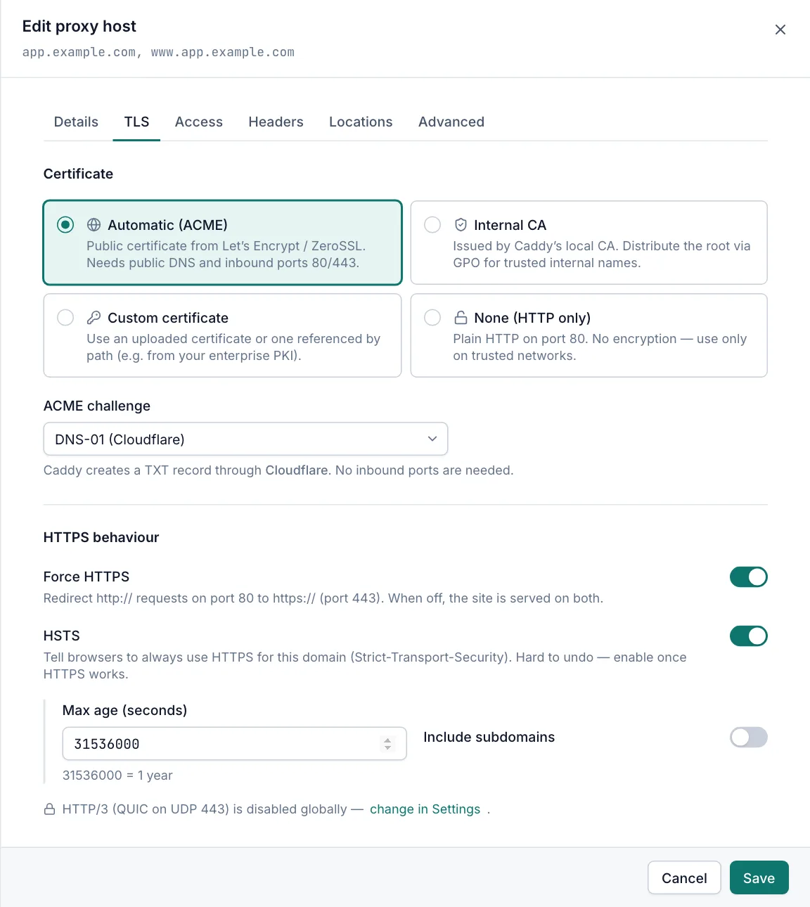
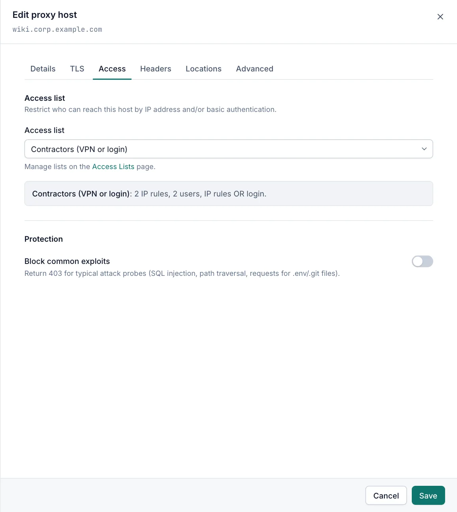
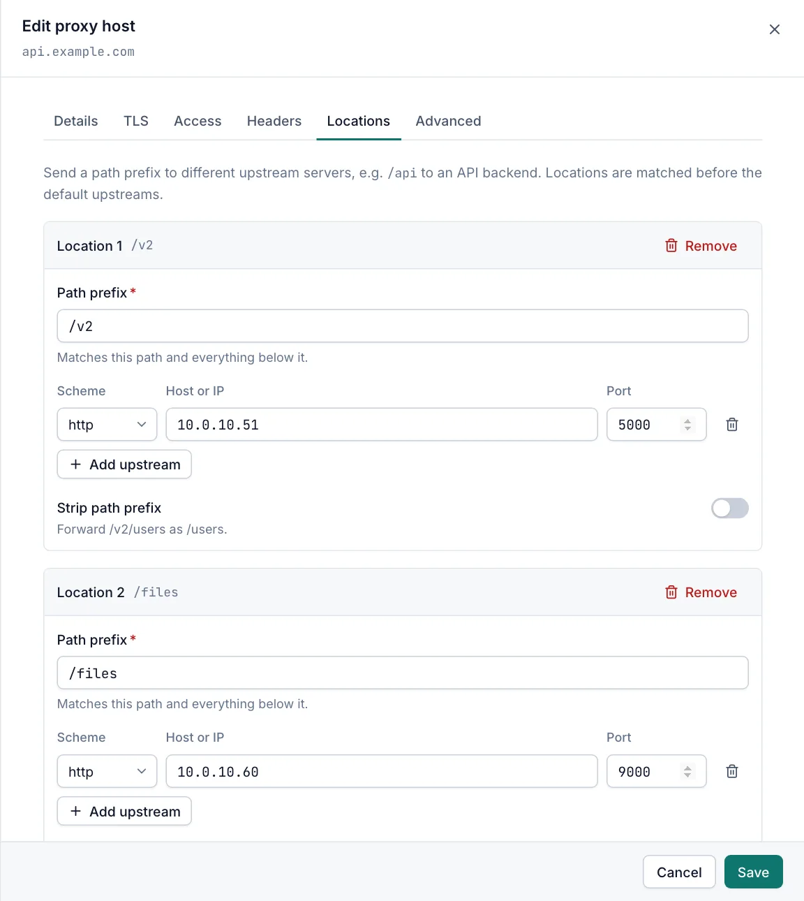
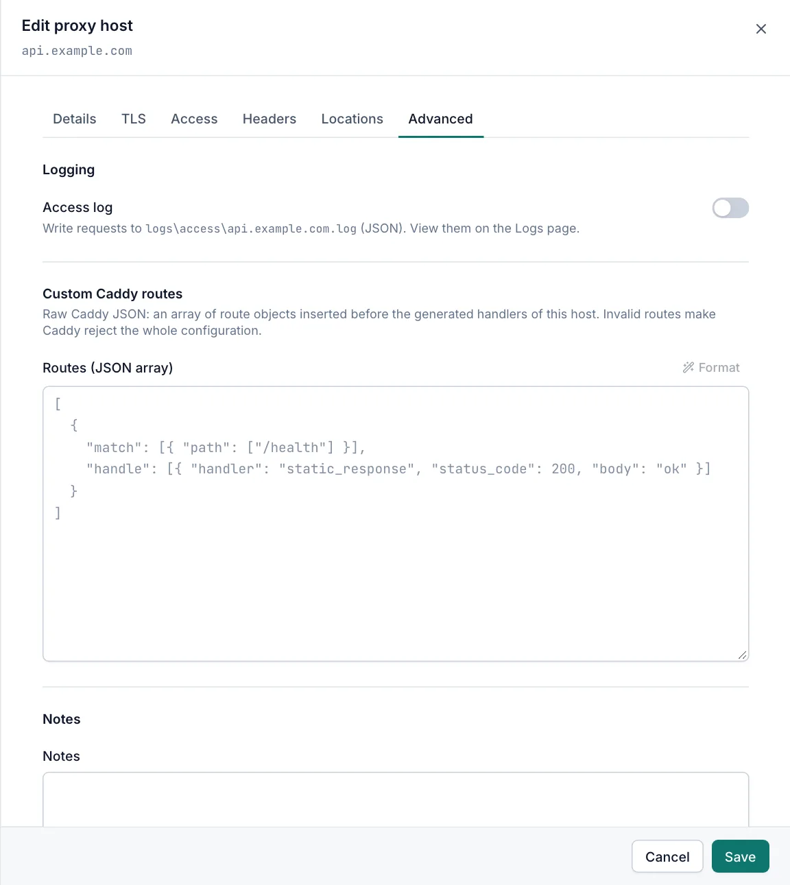

# Host options

Proxy hosts, redirects, static sites and custom responses share one editor. This page covers the tabs they have in common, the row actions on the list pages, and what happens when you save. Viewers can open hosts read-only. Changing hosts needs the Operator or Admin role; custom Caddy routes need the Admin role.

## Editor tabs

The editor opens from the right when you select **Add …**, click a row, or choose **Edit** in the row menu.

| Tab | Proxy host | Redirect | Static site | Custom response |
|---|---|---|---|---|
| Details | yes | yes | yes | yes |
| TLS | yes | yes | yes | yes |
| Access | yes | yes | yes | yes |
| Headers | request and response | response | response | response |
| Locations | yes | no | no | no |
| Advanced | yes | yes | yes | yes |

The **Details** tab depends on the kind. See [Proxy hosts](proxy-hosts.md), [Redirects](redirects.md), [Static sites](static-sites.md) and [Custom responses](custom-responses.md).

- When you save, the editor checks every tab. A tab with problems shows the number of errors, and the editor opens the first tab that has one.
- **Cancel** or closing the editor with unsaved changes asks **Discard changes?**.
- Users without the Operator role see **View …** and a **Close** button only.

## Row actions

Each row on a list page has a **…** menu. Operators and admins see all actions; viewers see **View** only.

### Enable and disable

Use the **Status** switch or **Disable** / **Enable** in the menu. The change is applied to Caddy straight away.

- A disabled host keeps all its settings, but Caddy does not serve it.
- Enabling fails when another enabled host already uses one of the domain names.

### Duplicate

**Duplicate** opens a new host with every setting copied, except the domain names, which you enter again. The copy is enabled. If you are not an admin, custom Caddy routes are not copied.

### Delete

**Delete** asks for confirmation. The host is removed and Caddy stops serving its names. This cannot be undone.

## TLS tab

The TLS tab chooses the certificate and how HTTP and HTTPS behave.



### Certificate

| Option | Description |
|---|---|
| Automatic (ACME) | The default. A public certificate from Let's Encrypt or ZeroSSL, obtained and renewed by Caddy. Needs public DNS, and ports 80/443 unless you use the DNS challenge. |
| Internal CA | A certificate from Caddy's own CA, for internal names. Distribute the root certificate to clients, for example with Group Policy. |
| Custom certificate | A certificate from the **Certificates** page. Choose it in **Certificate**. |
| None (HTTP only) | Plain HTTP on the HTTP port (80 by default). No encryption. Use it only on trusted networks. |

- With **Automatic (ACME)**, **ACME challenge** chooses how the CA checks that you control the names: **Default** (the challenge set in **Settings › Caddy**), **HTTP-01 / TLS-ALPN-01** or **DNS-01**. **DNS-01** is available once a DNS provider is set up. Wildcard names need DNS-01, because a public CA issues wildcards only over DNS. See [ACME](acme.md).
- With **Custom certificate**, the editor warns when the certificate does not cover every domain name, or has expired. See [Certificates](certificates.md).

### Force HTTPS

**Force HTTPS** is on by default. Caddy answers `http://` requests with a permanent redirect (308) to `https://` on the same name and path. The redirect uses the **Public HTTPS port** from **Settings › Caddy** when it is set, otherwise the HTTPS port; port 443 is left out of the address.

When **Force HTTPS** is off, the site is served over both HTTP and HTTPS. It is not available with **None (HTTP only)**.

### HSTS

**HSTS** is off by default. When on, HTTPS responses carry a `Strict-Transport-Security` header that tells browsers to use only HTTPS for this name.

| Field | Default | Description |
|---|---|---|
| Max age (seconds) | `31536000` | How long browsers remember the rule. `31536000` is one year. |
| Include subdomains | off | Applies the rule to every subdomain too. |

> [!WARNING]
> Browsers keep the HSTS rule for the whole max age, even if you turn it off. Turn it on only when HTTPS works for the name (and, with **Include subdomains**, for every subdomain).

The header is not sent over plain HTTP. It replaces any `Strict-Transport-Security` header from the **Headers** tab.

### HTTP/3

HTTP/3 is a global setting in **Settings › Caddy**. The TLS tab shows whether it is on. See [Caddy settings](caddy-settings.md).

## Access tab



### Access list

**Access list** restricts who can reach the host, by IP address and/or user name and password. The default is **Public — no restriction**. Below the list the editor summarises the chosen list, for example "2 IP rules, 1 user, IP rules OR login". Manage lists on the [Access lists](access-lists.md) page.

A list that a host uses cannot be deleted. If a host ever refers to a list that no longer exists, it answers every request with `403` until you choose another list. It is never served openly by mistake.

### Block common exploits

**Block common exploits** is off by default. When on, Caddy answers `403` to typical attack probes before they reach your site:

- paths with `..` traversal (also encoded), and requests for `/.git`, `/.svn`, `/.hg`, `/.env`, `/etc/passwd`, `/proc/self/environ` or `/wp-config.php`;
- query strings with SQL injection patterns (`union … select`, `concat(`), script tags, `base64_encode(` or `base64_decode(`, remote file inclusion (`=http://`), `../`, and a few known exploit parameters (`globals`, `_request`, `mosconfig_`);
- User-Agent headers of common scanners: sqlmap, nikto, masscan, wpscan, acunetix, netsparker, zgrab, dirbuster, havij, nessus and openvas.

The rules are chosen so that ordinary applications keep working (for example `?next=/path` is allowed). They are a basic filter, not a web application firewall.

## Headers tab

The **Headers** tab adds, replaces or removes HTTP headers.

- **Request headers** (proxy hosts only) are sent to the upstream. Caddy placeholders are allowed, for example `{http.request.remote.host}`.
- **Response headers** (all kinds) are sent to clients, for example security headers or removing `Server`. They also apply to error responses, such as `401`, `502`, `503` and `404`, and they also act on headers sent by the upstream.

| Field | Description |
|---|---|
| Action | **Set** replaces the header, **Add** adds another value, **Delete** removes it. |
| Name | The header name. Letters, digits and the symbols allowed in HTTP header names. `*` is not allowed. |
| Value | The value. Not used with **Delete**. Line breaks are not allowed. |

- Rows are applied from top to bottom. For example, **Delete** `X-Test` followed by **Add** `X-Test` gives one `X-Test` header with the new value, and **Set** then **Add** on the same name sends one header with both values separated by a comma.
- Caddy drops request headers from clients whose names contain an underscore, such as `SM_USER` or `X_Api_Key`. Headers you set here are still sent, even with underscores.
- Caddy adds `X-Forwarded-For`, `X-Forwarded-Proto` and `X-Forwarded-Host` for the upstream itself.
- If the host's access list has users and does not pass credentials to the upstream, the `Authorization` header is removed before the request reaches the upstream.

## Locations tab

The **Locations** tab (proxy hosts only) sends a path prefix to different upstreams, for example `/api` to an API backend.



1. Select **Add location**.
2. Enter the **Path prefix**, for example `/api`.
3. Enter the upstreams for this path.
4. Optionally turn on **Strip path prefix** or **Skip upstream certificate verification**.

| Field | Default | Description |
|---|---|---|
| Path prefix | `/` | Required. Must start with `/`, be unique on the host, and contain no `*` or spaces. A trailing `/` is ignored. |
| Upstreams | one `http` upstream on port 80 | Same rules as the host's upstreams. All must use the same scheme. |
| Strip path prefix | off | Removes the prefix before forwarding: `/api/users` reaches the upstream as `/users`. |
| Skip upstream certificate verification | off | Shown for `https` upstreams. Same as on the **Details** tab. |

- A location `/api` matches `/api` and everything below `/api/`, but not `/apiv2`.
- Locations are checked before the host's default upstreams, longest path first. A location `/` matches every request, so the default upstreams are never used.
- Locations use the host's load balancing, **Host header sent to upstream**, request headers and NTLM setting.
- Locations have no active health check.

## Advanced tab



### Access log

**Access log** is off by default. When on, Caddy writes each request for this host as JSON to `logs\access\<first domain>.log` in the Caddy Proxy Manager data folder. A wildcard name is written as `wildcard`, for example `wildcard.example.com.log`. Files roll over at 20 MB and the last 10 are kept. View them on the [Logs](logs.md) page.

### Custom Caddy routes

**Routes (JSON array)** holds raw Caddy JSON: an array of route objects that Caddy runs for this host. **Format** tidies the JSON.

> [!IMPORTANT]
> Only admins can add or change custom routes, because they can do anything Caddy can do and skip the manager's own checks. Other roles see them read-only, with secret values such as passwords and tokens shown as `***`.

- The routes run after the access list, **Block common exploits**, the response headers and compression, and before the host's own handler (proxy, redirect, files or fixed response). A route that answers the request ends it.
- Invalid routes make Caddy reject the whole configuration. The change is then not saved. See [When Caddy rejects the configuration](#when-caddy-rejects-the-configuration).
- A `reverse_proxy` in the routes may not target the Caddy admin API on this server.
- Caddy drops client request headers whose names contain an underscore, so a route that matches such a header never matches. Saving shows a warning.

Example: answer `/health` with `ok`.

```json
[
  {
    "match": [{ "path": ["/health"] }],
    "handle": [{ "handler": "static_response", "status_code": 200, "body": "ok" }]
  }
]
```

Caddy's JSON reference: https://caddyserver.com/docs/json/apps/http/servers/routes/

### Notes

**Notes** is free text for your team. It is not used in the configuration and is included in the list page search.

## Order of processing

For each request to a host, Caddy runs these steps in order:

1. Access log (if on).
2. Access list.
3. Block common exploits.
4. Response headers and HSTS.
5. Compression.
6. Custom Caddy routes.
7. The host's handler: proxy (locations first), redirect, static files or fixed response.

On plain HTTP with **Force HTTPS** on, Caddy only sends the redirect to HTTPS.

## Saving and applying changes

Every save, delete, enable and disable is applied to Caddy straight away:

1. The manager saves the change.
2. It builds the complete Caddy configuration from all hosts, streams and settings.
3. It loads the configuration into the running Caddy.
4. If Caddy rejects it, the manager undoes the change.

Only one change is applied at a time. What you see:

| Message | Meaning |
|---|---|
| **Saved and applied** (or **… created and applied**, **Deleted and applied**) | Caddy runs the new configuration. |
| **… with warnings** | Caddy runs the new configuration, but the manager skipped or adjusted something. Read the list, for example a missing plugin or an ignored upstream. |
| **Saved — Caddy is not running** | The change is saved and written to disk. When the Caddy program is installed, the configuration was validated first. It takes effect when Caddy starts. |
| **Please correct the highlighted fields** | The manager refused the change. The fields show why. |

If Caddyfile mode is active, changes to hosts are saved but not used until you switch back to managed mode. The message says so. See [Configuration](configuration.md).

### When Caddy rejects the configuration

A dialog **Caddy rejected the configuration** shows Caddy's error. The change was not saved, and the previous configuration is still active. Fix the setting named in the error and save again. A failed apply also creates an event. See [Events](events.md).

### Revisions

Every apply, successful or not, is recorded as a revision with the time, the reason (for example "Host created: app.example.com"), the user and the result. The manager keeps the last 100 revisions; **Caddy › Configuration** lists the 50 newest. See [Configuration](configuration.md).

## Related

- [Proxy hosts](proxy-hosts.md)
- [Certificates](certificates.md)
- [ACME](acme.md)
- [Access lists](access-lists.md)
- [Configuration](configuration.md)
- [Caddy settings](caddy-settings.md#unknown-hosts)
