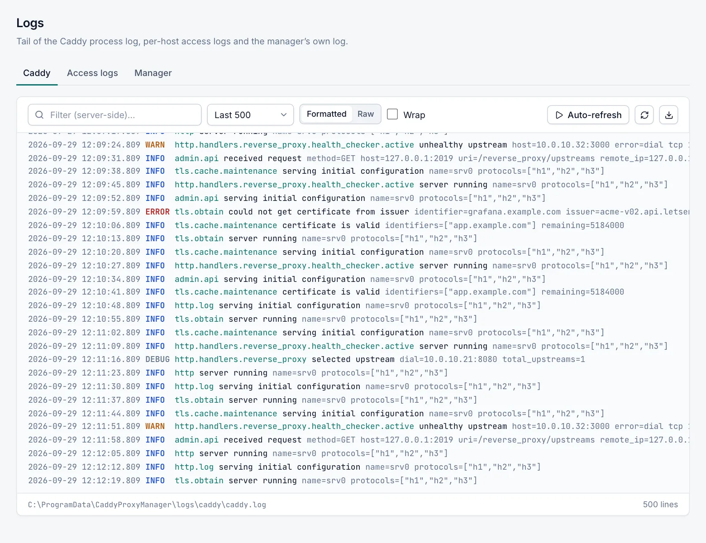

# Logs

The **Logs** page shows the end of three kinds of log: Caddy's process log, per-host access logs and Caddy Proxy Manager's own log. Every role can read the Caddy log and the access logs. Only the **Admin** role can see the **Manager** tab.

## Log sources

Open **Server › Logs** and choose a tab.

| Tab | File | Contents |
|---|---|---|
| Caddy | `C:\ProgramData\CaddyProxyManager\logs\caddy\caddy.log` | Caddy's own messages: start and stop, configuration loads, certificate requests and errors. |
| Access logs | `C:\ProgramData\CaddyProxyManager\logs\access\<domain>.log` | One JSON line per request, for hosts that have **Access log** turned on. |
| Manager | `C:\ProgramData\CaddyProxyManager\logs\manager\manager-yyyyMMdd.log` | Caddy Proxy Manager's own log. Admin only. |

### Caddy log

- **Level of detail.** The Caddy log follows **Caddy log level** in **Settings › Caddy**: **Debug (verbose)**, **Info**, **Warning** or **Error**.
  - Messages about Caddy's admin API are written only at warning level or higher, because the manager uses that API every few seconds.
  - Access log lines never go to this file.
- **Rotation.** Caddy starts a new file at 20 MB and keeps 10 old files.
- **Hidden secrets.** Before any line is shown, stored secrets such as DNS provider credentials are replaced. This matters because the Caddy log can quote them in error messages, and viewers can read it. See [Security](security.md).

### Access logs

- **Turning them on.** Access logs exist only for hosts where you turn on **Access log** on the host's **Advanced** tab. See [Host options](host-options.md).
  - Each host writes to a file named after its first domain.
  - Caddy starts a new file at 20 MB and keeps 10 old files.
- **Choosing a host.** Pick the host in the host selector.
- **No access logs yet.** If no host has an access log, the tab shows **No access logs yet**.
- **Not hidden.** Access log lines are shown as they are written; secrets are not replaced.

### Manager log

- **One file per day,** kept for 14 days.
- **What it records:** informational messages, warnings and errors.
- **Who can see it:** only administrators, and secrets are not hidden in it.

## Read a log

1. Open **Server › Logs**.
2. Select the **Caddy**, **Access logs** or **Manager** tab.
3. Choose how many lines to show: **Last 100**, **Last 500** (default), **Last 1000**, **Last 2000** or **Last 5000**.
4. Optionally type in the filter box to show only lines that contain the text.
5. Select **Auto-refresh** to reload the lines every 5 seconds. Select **Auto-refresh on** to stop.

The view stays at the newest line while you are scrolled to the bottom. The footer shows the file path and the number of lines shown.

## Toolbar reference

| Control | Description |
|---|---|
| Filter (server-side)… | Caddy and Manager tabs. Shows only lines that contain the text, ignoring case. The manager searches the current log file, up to the last 64 MB. |
| Filter… | Access logs tab. Filters only the lines already loaded in the page. To search further back, raise the number of lines first. |
| Last N | How many lines to load, counted from the end of the file. |
| Formatted / Raw | **Formatted** shows JSON lines in a readable form: local time, level, logger and message. Access lines show the client address, method, host, URI and a coloured status. **Raw** shows the lines exactly as written. |
| Wrap | Wraps long lines instead of scrolling sideways. |
| Auto-refresh | Reloads every 5 seconds. It is off each time you open the page. |
| Refresh now | Reloads once. |
| Download shown lines | Saves the lines currently shown to a text file on your computer. |

The page remembers your number of lines, **Formatted** or **Raw**, and **Wrap** in your browser.

## Limits

- **Only the current file is read.** Older, rotated files are not shown. Open them from the logs folder on the server.
- **Download shown lines** saves only what the page shows, not the whole file.
- **Very long lines** (over 64 KB) are shortened. The page keeps their end and starts them with "…".
- **Unreadable files.** If a file cannot be read, the page shows one line starting with `[Could not read`.

## Related

- [Events](events.md)
- [Traffic statistics](traffic-statistics.md)
- [Host options](host-options.md)
- [Troubleshooting](troubleshooting.md)
