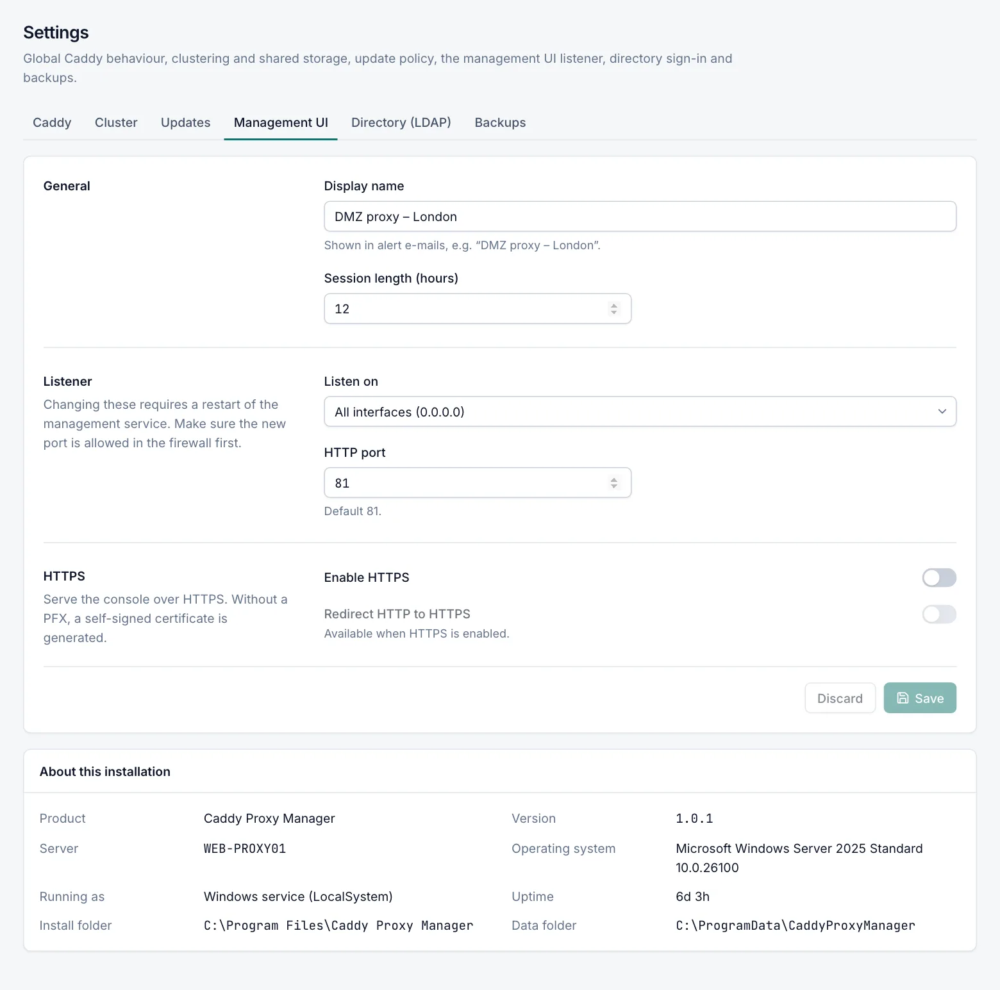

# Management UI settings

**Settings › Management UI** controls how the console itself is reached: its port, the addresses it listens on,
HTTPS, and how long sign-in sessions last. Only admins can see and change this tab. This page also explains how to
publish the console through Caddy and how to recover if you lock yourself out.

## Overview

By default the console listens on plain HTTP, port `81`, on all interfaces. You can:

- serve it over HTTPS, with your own certificate or a generated self-signed one;
- redirect plain HTTP to HTTPS so sign-in cookies never travel unencrypted;
- restrict it to this server only (`127.0.0.1`) and publish it through a Caddy proxy host instead.

Changes to the listener take effect after the management service restarts. Caddy keeps serving your sites while the
manager restarts.

## Field reference

Role: Admin.



### General section

| Field | Default | Description |
|---|---|---|
| Display name | Empty | A name for this server, shown in alert e-mails, for example "DMZ proxy – London". |
| Session length (hours) | `12` | How long a sign-in session lasts, 1–720 hours. Sessions are extended while in use. Applies to sign-ins after the change; no restart needed. |

### Listener section

| Field | Default | Description |
|---|---|---|
| Listen on | All interfaces (0.0.0.0) | **All interfaces (0.0.0.0)**, **This server only (127.0.0.1)**, or **Specific address…** with a box for one IP address of this server. |
| HTTP port | `81` | TCP port of the console, 1–65535. |

Make sure a new port is allowed in the Windows Firewall before you restart. **Server › Readiness** checks the firewall
rules for the console's ports (unless it listens on `127.0.0.1` only) and an admin can create a missing rule with
**Fix**. See [Readiness](readiness.md).

### HTTPS section

| Field | Default | Description |
|---|---|---|
| Enable HTTPS | Off | Adds an HTTPS listener for the console. Plain HTTP stays available unless you also turn on the redirect. |
| Redirect HTTP to HTTPS | Off | Redirects plain-HTTP requests to the HTTPS port. Available when HTTPS is enabled. |
| HTTPS port | `8443` | TCP port of the HTTPS listener. Must differ from the HTTP port. |
| PFX certificate path | Empty | Optional. A local path to a PFX file with a private key, readable by LocalSystem, for example `C:\ProgramData\CaddyProxyManager\ui.pfx`. |
| PFX password | – | Password of the PFX file. Stored encrypted and never shown again; use **Change** or **Clear**. |

When you save with HTTPS on and a PFX path set, the file is checked: it must exist, open with the password, and
contain a private key.

The HTTPS listener uses the same address as the HTTP listener.

### Self-signed certificate

Without a PFX file, the console generates a self-signed certificate and stores it in the data folder as
`ui-selfsigned.pfx`. It:

- is issued to this server's name, with `localhost`, the fully qualified name and `127.0.0.1` as alternative names;
- is valid for 2 years and is replaced with a new one when the management service starts and less than 30 days
  remain.

Browsers show a warning for a self-signed certificate. Use a certificate from your own PKI to avoid it.

On a cluster node with an `https` URL, the primary accepts only the certificate it pinned. After the node gets a new
certificate (a new PFX, a renewed one, or a replaced self-signed one), re-pin it on the primary. See
[Replacing a node's HTTPS certificate](cluster.md#replacing-a-nodes-https-certificate).

### Redirect to HTTPS

With **Redirect HTTP to HTTPS** on, every plain-HTTP request to the console gets a `307` redirect to
`https://<same host name>:<HTTPS port>/...`. Two exceptions:

- `GET /api/health` stays available over HTTP for load balancers and monitoring.
- The redirect is only active when the HTTPS listener actually started. If HTTPS cannot start, plain HTTP keeps
  working so you are not locked out.

### About this installation

Below the form, **About this installation** shows the product, version, server name, operating system, how the
manager runs, uptime, install folder and data folder.

## Save and restart

1. Change the fields and click **Save**.
2. If you changed a listener or HTTPS setting, a **Restart required** notice appears. It shows the new address of the
   console when it changes.
3. Click **Restart now** and confirm **Restart the management service?**.
4. Wait while "Restarting the management service…" is shown. If the address is unchanged, the page reloads by itself.
   If it changed, click the new address shown under **The management service restarted**.

If the service does not answer within 90 seconds, the notice says so. Check the Caddy Proxy Manager service and the
manager log on the server.

**Display name** and **Session length (hours)** do not need a restart.

## What happens when a setting does not work

A bad listener setting does not stop the manager from starting. At start-up:

- An invalid port is replaced by `81`; an invalid bind address by all interfaces.
- If the configured address or port cannot be used (address not on this server, or port in use), the console falls
  back to all interfaces on port `81`.
- If the HTTPS port is invalid, equal to the HTTP port or in use, HTTPS is off for this run.
- If the PFX file is missing, has no private key or cannot be opened, the self-signed certificate is used instead.

Each fallback is written to the manager log and shown on the [Events](events.md) page as "Management UI started with
fallback settings". Fix the setting and restart again.

> [!NOTE]
> The fallback to port `81` only works if port `81` itself is free. If another program uses it too, use the recovery
> procedure below.

## Recover access to the console

If you cannot reach the console after a change, reset the listener on the server. The command needs the service to be
stopped, because it writes to the manager's database. Run in an elevated PowerShell:

```powershell
Stop-Service CaddyProxyManager
& 'C:\Program Files\Caddy Proxy Manager\CaddyManager.exe' configure --reset-ui
Start-Service CaddyProxyManager
```

`--reset-ui` sets port `81`, all interfaces (`0.0.0.0`), HTTPS off and the HTTPS redirect off. It keeps the HTTPS
port, the PFX settings and the session length. Then browse to `http://<server>:81/`.

`configure` also accepts `--ui-port N`, `--bind ADDR` (`0.0.0.0`, a loopback address or an address of this server) and
`--ui-https on|off`. See [Command line](cli.md).

## Publish the console through Caddy

Role: Admin.

Instead of exposing the console's own port, you can publish it as a proxy host. Caddy then handles the certificate
(for example from ACME or your internal CA) and an access list can restrict who reaches it. Only admins can create a
proxy host that forwards to the console; for operators and viewers this target is refused.

Before you start, create an access list that allows only your admin networks. See [Access lists](access-lists.md).

1. Open **Proxy Hosts** and click **Add proxy host**.
2. In **Domain names**, enter the name for the console, for example `cpm.corp.example.com`.
3. Under **Upstream servers**, set **Scheme** `http`, **Host or IP** `127.0.0.1` and **Port** the console's HTTP port
   (`81` by default).
4. On the **TLS** tab, choose the certificate.
5. On the **Access** tab, choose your **Access list**.
6. Save the host and check that you can sign in at `https://cpm.corp.example.com/`.
7. Open **Settings › Management UI**, set **Listen on** to **This server only (127.0.0.1)**, click **Save**, then
   **Restart now**.
8. Continue at `https://cpm.corp.example.com/`. The address shown in the restart notice is no longer reachable from
   other computers.

### Why 127.0.0.1 and not the server's IP address

The console trusts the client address and scheme that a proxy reports (the `X-Forwarded-For` and
`X-Forwarded-Proto` headers) only when the proxy connects from the loopback address. With the upstream
`127.0.0.1`:

- the audit log shows each user's real address;
- the sign-in limit of 10 attempts per minute applies per user's address, not to everyone at once;
- the session cookie is marked secure, because the console knows the browser used HTTPS.

If the upstream is the server's LAN address, the console sees every request as coming from the server itself.

Binding the console to `127.0.0.1` makes sure nobody bypasses Caddy and the access list by connecting to port `81`
directly.

> [!IMPORTANT]
> Do not do this on a cluster node. The primary server reaches each node on the node's management UI port, and proxy
> hosts on a node are replaced by the primary's. Publish only the primary this way. See [Cluster](cluster.md).

Streams can never forward to the console's ports, for any role.

## Related

- [Security](security.md)
- [Users and roles](users.md)
- [Proxy hosts](proxy-hosts.md)
- [Access lists](access-lists.md)
- [Command line](cli.md)
- [Troubleshooting](troubleshooting.md)
