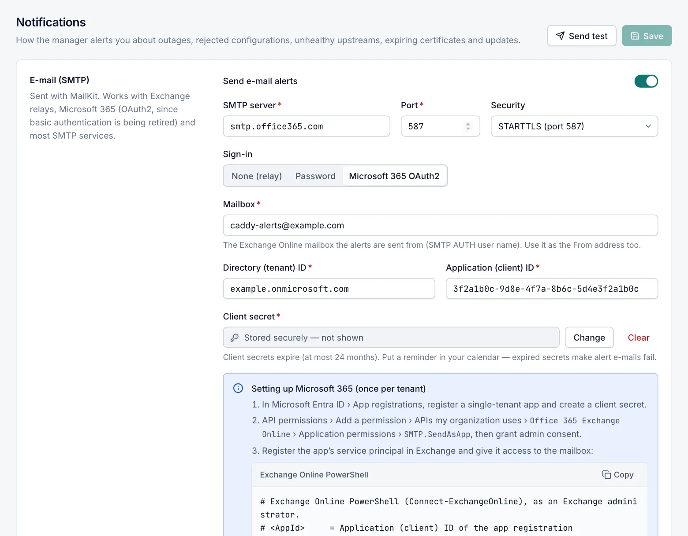

# Notifications

The **Notifications** page decides how Caddy Proxy Manager tells you about problems: by e-mail, by webhook to a chat channel or automation tool, and in the Windows Event Log. It also holds the alert rules, automatic Caddy restarts and the cooldown between repeated alerts. Only the **Admin** role can open this page.

Every event is recorded on the [Events](events.md) page, whatever you set here. This page only controls which events are also sent, and where.

## Set up notifications



1. Open **Administration › Notifications**.
2. Turn on **Send e-mail alerts** and fill in the e-mail fields, or turn on **Send webhook alerts** and enter the webhook URL, or both.
3. Check the **Alert rules** and **Behaviour** sections.
4. Select **Save**.
5. Select **Send test**, then check that the message arrived.

**Send test** always uses the saved settings. It is unavailable while you have unsaved changes. The test is sent through e-mail and the webhook only, and it is not written to the Windows Event Log. The result appears at the top of the page:

- **Test notification sent through all enabled channels** when every channel worked.
- **The test notification could not be delivered** with one error per failed channel.
  - If neither e-mail nor the webhook is turned on, the error is "No notification channel is enabled. Enable e-mail (SMTP) or a webhook and save first."

Saving and testing are recorded in the [Audit log](audit-log.md). A changed password or client secret is noted there, but its value never is.

## E-mail (SMTP)

E-mails are sent with MailKit. You can use an Exchange relay, Microsoft 365 or most SMTP services.

| Field | Default | Description |
|---|---|---|
| Send e-mail alerts | Off | Turns e-mail on. |
| SMTP server | — | Host name or IP address of the mail server, for example `smtp.office365.com`. Required. |
| Port | `587` | 1–65535. Required. |
| Security | STARTTLS (port 587) | How the connection is encrypted. See [Security options](#security-options). |
| Sign-in | Password | **None (relay)**, **Password** or **Microsoft 365 OAuth2**. |
| User name | — | Password sign-in only. The user name for SMTP authentication. If it is empty, the manager does not sign in. |
| Password | — | Password sign-in only. Stored encrypted and never shown again. |
| From address | — | The sender address. Required. |
| Recipients | — | One or more addresses. Press Enter after each one. Required. |
| Accept invalid server certificates | Off | Accepts a mail server certificate that is not trusted. Only for internal relays with self-signed certificates. |

### Security options

| Option | Behaviour |
|---|---|
| STARTTLS (port 587) | Connects in plain text, then switches to TLS. Fails if the server does not offer TLS. |
| SSL/TLS on connect (port 465) | Uses TLS from the start. |
| Automatic | Uses TLS when the server offers it. When a password or an OAuth2 token is sent, TLS is required: TLS on connect for port 465, STARTTLS for any other port. |
| None — unencrypted (port 25) | No encryption. Everything, including a password, is sent in plain text. Use it only for a relay on a trusted network. |

**Automatic without credentials.** With **Automatic** and no sign-in, the e-mail is sent unencrypted if the relay offers no TLS.

**Port changes with the security option.** When you choose a security option, the port changes to that option's usual port, but only if the port is currently one of the standard ones (587, 465 or 25).

### Sign-in options

- **None (relay)**. No authentication. Use it for an internal relay, such as an Exchange receive connector, that accepts mail from this server's IP address.
- **Password**. Classic SMTP authentication with a user name and password.
- **Microsoft 365 OAuth2**. Signs in to Exchange Online with an app registration in Microsoft Entra ID (client credentials). See the next section.

> [!WARNING]
> Microsoft disables password sign-in (Basic authentication) for SMTP in Exchange Online by default at the end of December 2026. Alert e-mails through Microsoft 365 then fail. When the server is `*.office365.com` or `*.outlook.com` and **Sign-in** is **Password**, the page shows a warning, and the [Readiness](readiness.md) report does too. Switch **Sign-in** to **Microsoft 365 OAuth2**.

Stored passwords and client secrets show **Stored securely — not shown**:

- Select **Change** to enter a new value.
- Select **Clear** to remove it when you save.
- Select **Undo** or **Keep current** to leave it as it is.

### Microsoft 365 with OAuth2

With **Microsoft 365 OAuth2**, these fields replace **User name** and **Password**:

| Field | Default | Description |
|---|---|---|
| Mailbox | — | The Exchange Online mailbox that sends the alerts. Use it as the **From address** too. Required. |
| Directory (tenant) ID | — | The tenant ID (a GUID) or a verified domain such as `contoso.onmicrosoft.com`. Required. |
| Application (client) ID | — | The app registration's client ID (a GUID). Required. |
| Client secret | — | A client secret of the app registration. Required. |

Set up Microsoft 365 once per tenant:

1. In Microsoft Entra ID, open **App registrations**, register a single-tenant app and create a client secret.
2. Open **API permissions** › **Add a permission** › **APIs my organization uses** › **Office 365 Exchange Online** › **Application permissions**. Add `SMTP.SendAsApp`, then grant admin consent.
3. In Exchange Online PowerShell, as an Exchange administrator, register the app's service principal and give it access to the mailbox. Use the **Object ID of the Enterprise application**, not the one shown on the app registration.

   ```powershell
   New-ServicePrincipal -AppId <AppId> -ObjectId <ObjectId> -DisplayName "Caddy Proxy Manager SMTP"
   Add-MailboxPermission -Identity caddy-alerts@example.com -User <ObjectId> -AccessRights FullAccess
   Set-CASMailbox -Identity caddy-alerts@example.com -SmtpClientAuthenticationDisabled $false
   ```

4. In Caddy Proxy Manager, set **SMTP server** to `smtp.office365.com`, **Port** to `587` and **Security** to **STARTTLS (port 587)**.
5. Choose **Microsoft 365 OAuth2** and fill in the mailbox, tenant ID, client ID and secret.
6. Select **Save**, then **Send test**.

How sign-in works:

- The manager requests a token from `login.microsoftonline.com` and reuses it until shortly before it expires.
- If the **From address** is not the mailbox itself, Exchange Online also needs SendAs permission for the app's service principal. When Exchange refuses the sender, the error message shows the `Add-RecipientPermission` command to run.

> [!IMPORTANT]
> Client secrets expire, at most 24 months after you create them. When the secret expires, alert e-mails fail. Put a reminder in your calendar to renew it.

### E-mail content

- **Subject:** `[<server>] <Severity>: <message>`.
- **Server name:** the **Display name** set in **Settings › Management UI**, or the computer name when that is empty.
- **Body:** has a plain-text and an HTML version. Both contain:
  - the message
  - the server, severity and category
  - the time in UTC and in the server's local time
  - the details
  - a link to open Caddy Proxy Manager

## Webhook

A webhook POSTs each alert as JSON to a chat channel or an automation endpoint.

| Field | Default | Description |
|---|---|---|
| Send webhook alerts | Off | Turns the webhook on. |
| Format | Generic JSON | **Generic JSON**, **Slack incoming webhook** or **Microsoft Teams (Workflows)**. |
| Webhook URL | — | An absolute `http://` or `https://` URL. |

### Webhook formats

- **Generic JSON** is for scripts, n8n, Power Automate HTTP triggers and similar tools. It contains `title`, `text`, `severity`, `category`, `server` and `time`:

  ```json
  {
    "title": "[WEB-PROXY01] Error: Caddy rejected the configuration.",
    "text": "*[WEB-PROXY01] Error: …*\n…",
    "severity": "error",
    "category": "config",
    "server": "WEB-PROXY01",
    "time": "2026-09-25T14:50:32.0000000Z"
  }
  ```

- **Slack incoming webhook** sends a formatted Slack message. The details appear in a code block, followed by a link to open Caddy Proxy Manager.
- **Microsoft Teams (Workflows)** sends an Adaptive Card for the Teams Workflows template "Post to a channel when a webhook request is received".
  - The card shows the title (coloured by severity), the message, severity, server, category and time, plus an **Open Caddy Proxy Manager** button.
  - The manager does not sign in to the flow, so the trigger must allow anyone to start it.
  - Microsoft has retired the older Office 365 connector URLs.

Details longer than 1,500 characters are shortened in webhook messages. A webhook call waits up to 30 seconds. Any reply other than a 2xx status counts as a failure, and the status and the start of the reply appear in the error.

## Proxies and network access

- **Webhooks and the Microsoft Entra ID token request** use the outbound proxy set in **Settings › Updates › Proxy URL**, when one is set.
  - Addresses listed in **Bypass the proxy for (NO_PROXY)**, and loopback addresses, are contacted directly.
  - The default bypass list is private address ranges, `localhost` and `.local`.
- **E-mail never goes through the HTTP proxy.** The server needs a direct outbound connection to the mail server on the chosen port.
  - Behind a proxy-only network, use a local relay, or open the port to your mail provider.

See [Updates](updates.md) for the proxy settings.

## Windows Event Log

| Field | Default | Description |
|---|---|---|
| Write to the Windows Event Log | On | Writes every recorded event to the Windows **Application** log, source **Caddy Proxy Manager**. |

This does not depend on the alert rules: every event is written, whether or not it is also sent. Tools such as SCOM or Splunk can collect the entries from there. The event IDs are listed on the [Events](events.md#windows-event-log-ids) page.

## Alert rules

The alert rules decide which events are sent by e-mail and webhook. All rules are on by default.

| Rule | Sends |
|---|---|
| Caddy is down | Caddy stopped or its admin API does not answer, automatic restarts gave up, Caddy could not be installed, registered or started, Caddy's outbound proxy settings could not be applied, or Caddy is down after a failed update. |
| Configuration rejected | Caddy refused a configuration, a cluster node could not apply the configuration, or a scheduled backup failed. |
| Upstream unhealthy | A proxy backend fails its health checks. |
| Certificate expiring | A certificate expires within **Warn this many days before expiry**, has expired or cannot be read, a certificate has not been issued for a host, or a certificate could not be synchronised with its source. |
| Caddy update available | A new Caddy or Caddy Proxy Manager version is available, or a Caddy install, update or rollback failed. |
| Readiness check failures | A readiness run (daily or started with **Run checks**) finds a new failure. |
| Server offline | A cluster node stopped answering the primary (3 missed heartbeats, about 45 seconds). Only a primary sends it. |

- **Certificate expiry threshold.** **Warn this many days before expiry** appears when **Certificate expiring** is on. It accepts 1–365 days and defaults to 14. The Dashboard uses the same number for **expiring soon**.
- **Not covered by any rule:** some events are recorded but never sent, for example traffic statistics problems and failed notifications. The [Events](events.md#event-reference) page lists the rule for every event.

## Behaviour

| Field | Default | Description |
|---|---|---|
| Restart Caddy automatically | On | When Caddy is down, the manager tries to start it, at most 3 times in 10 minutes. It does not restart Caddy after a user stopped it. |
| Send recovery notices | On | Sends a **Recovered** message when a problem clears. The problem's alert rule must also be on. |
| Cooldown (minutes) | `30` | Minimum time between repeated alerts for the same problem, 0–10080. During the cooldown the repeat is neither sent nor recorded, unless the problem gets worse. |

## When delivery fails

- **The event is still recorded.** Delivery failures never stop anything else.
- **A failure event is raised.** If a channel fails, the manager records the event **Notification delivery failed** with the channel and the error. That event is never sent itself.
- **Successful delivery is marked.** An event delivered through every enabled channel shows **Sent** in the **Notified** column on the Events page.
- **Timeouts.** Each channel waits up to 30 seconds.

## Related

- [Events](events.md)
- [Readiness](readiness.md)
- [Updates](updates.md)
- [Management UI](management-ui.md)
- [Cluster](cluster.md)
