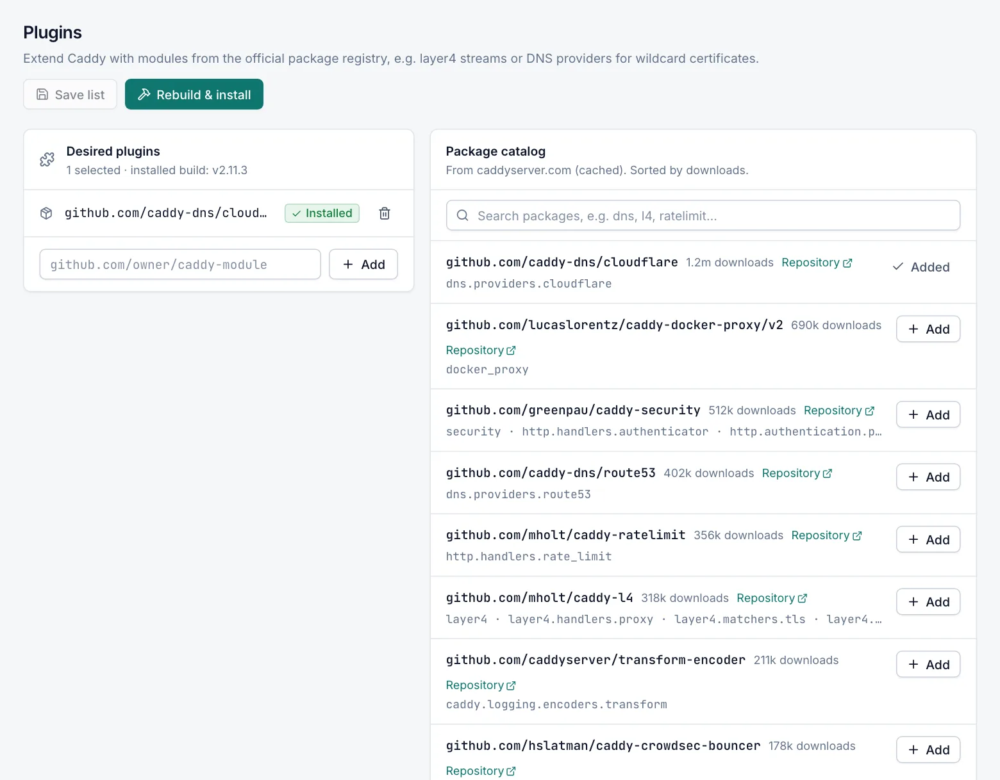

# Plugins

Plugins add modules to Caddy that the standard build does not contain, for example TCP/UDP streams (`github.com/mholt/caddy-l4`), DNS providers for the DNS challenge, or NTLM for Windows-authenticated backends. The **Caddy › Plugins** page manages which plugins your Caddy is built with. Every role can view it; changing the plugin list and rebuilding Caddy needs the **Admin** role.

## How plugins work

Caddy is a single program, so a plugin cannot be added to a running Caddy. Instead, the manager keeps a list of *desired plugins* and installs a custom Caddy build that contains exactly those plugins:

- Without plugins, the manager installs the official Caddy release from GitHub.
- With plugins, the manager downloads a custom build of the **latest** Caddy release from the caddyserver.com build server. That server compiles the build on demand, which can take a few minutes.

The custom build replaces `caddy.exe` through the same checked steps as a normal update: the new program is tested, validates your current configuration, and the previous program is restored automatically if Caddy does not start. See [What happens during an install or update](caddy-service.md#what-happens-during-an-install-or-update).

> [!NOTE]
> caddyserver.com publishes no checksum for custom builds. The manager checks a custom build by running it and confirming that it contains every requested plugin.

## Add plugins and rebuild Caddy

You need the **Admin** role.

1. Open **Caddy › Plugins**.
2. Find the package in the **Package catalog** and select **Add**, or type its Go package path in the field under **Desired plugins** and select **Add**.
3. Select **Rebuild & install**.
4. Confirm with **Rebuild & install**.
5. Follow the progress in the job window.

**Rebuild & install** saves the list first when you changed it. Caddy restarts briefly during the swap.

To change the list without rebuilding yet, select **Save list**. The message reminds you to rebuild. **Revert** discards unsaved changes to the list.

## Remove a plugin

1. Select the delete button next to the plugin under **Desired plugins**, or **Added** next to it in the catalog.
2. Select **Rebuild & install** and confirm.

The new build does not contain the plugin. Before you rebuild, the card lists the installed plugins that the next build will not contain under **Will be removed on rebuild**. Remove a plugin only when no host, stream or setting uses it. The new build validates your current configuration before it is swapped in; if it rejects the configuration, the rebuild stops and nothing is changed.

## Desired plugins

The **Desired plugins** card shows how many plugins are selected and the installed Caddy version. Each plugin shows:

- **Installed**: the installed Caddy contains it.
- **Pending rebuild**: it is on the list but not in the installed Caddy yet.

With no plugins selected, the card shows **Standard Caddy build**.

When the installed program does not contain exactly the desired plugins, the page shows **The installed binary does not match the desired plugins**. Select **Rebuild & install** to fix it. This happens, for example, after you upload a binary with other plugins or roll back to a build with a different plugin list.

A package path you type must look like `github.com/owner/caddy-module`. A leading `http://` or `https://` is removed.

## Package catalog

The **Package catalog** lists the packages of the official Caddy package registry at caddyserver.com, sorted by downloads. Each entry shows the package path, its download count, a **Repository** link and the first module names it provides.

- Type in the search box to filter, for example `dns`, `l4` or `ratelimit`. Every word must appear in the package path, the repository or a module name.
- At most 200 results are shown.
- The manager caches the catalog for 6 hours.

If the server has no Internet access, the catalog shows **Catalog unavailable**. You can still add a package path by hand.

## Rules for the plugin list

When you save, the manager checks the list:

- At most 50 plugins.
- Each entry must be a Go package path, for example `github.com/mholt/caddy-l4`.
- Caddy itself (`github.com/caddyserver/caddy/v2`) is not a plugin.
- When caddyserver.com is reachable, each package must be in its registry, because the build server can only build registered packages. When it is not reachable, any well-formed path is accepted.

## Plugins required by other pages

Some features need a plugin: streams, DNS providers for the DNS challenge, Redis or custom shared storage, and NTLM for proxy hosts. When the installed Caddy lacks the plugin, those pages show a warning.

For DNS providers and shared storage, the warning has **Add plugin and rebuild Caddy** (or **Rebuild Caddy** when the plugin is already on the list). This adds the plugin to the list and starts the rebuild without leaving the page. Unsaved changes on that page are kept; save them after the build. Operators and viewers see that an administrator must do this.

For streams and NTLM, the warning links to this page: add the plugin here and select **Rebuild & install**.

## Plugins on a cluster node

On a server that is managed by a cluster primary, the plugin list comes from the primary and cannot be changed here. The node installs the primary's plugin list automatically after a sync. Admins can still select **Rebuild & install** to build that list on this server now. See [Cluster](cluster.md).

## Offline servers

Without Internet access the manager cannot reach the build server. Download a custom `caddy.exe` with your plugins from https://caddyserver.com/download on another computer and install it with **Upload binary (offline)…**. See [Upload a Caddy binary](caddy-service.md#upload-a-caddy-binary-offline). Add the same plugins to the list so that the page does not report them as out of sync.

## Related

- [Caddy service and updates](caddy-service.md)
- [Streams](streams.md)
- [ACME and the DNS challenge](acme.md)
- [Caddy settings: Plugins & advanced](caddy-settings.md#plugins--advanced)
- [Cluster](cluster.md)
