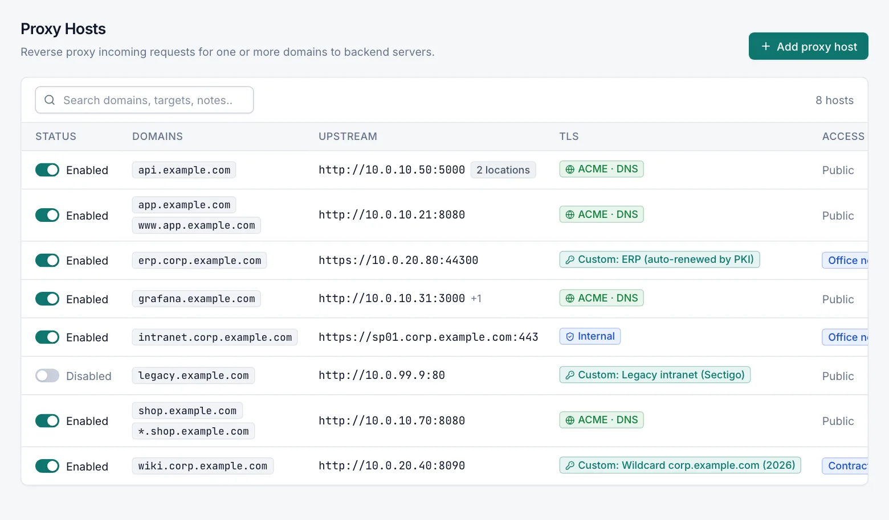
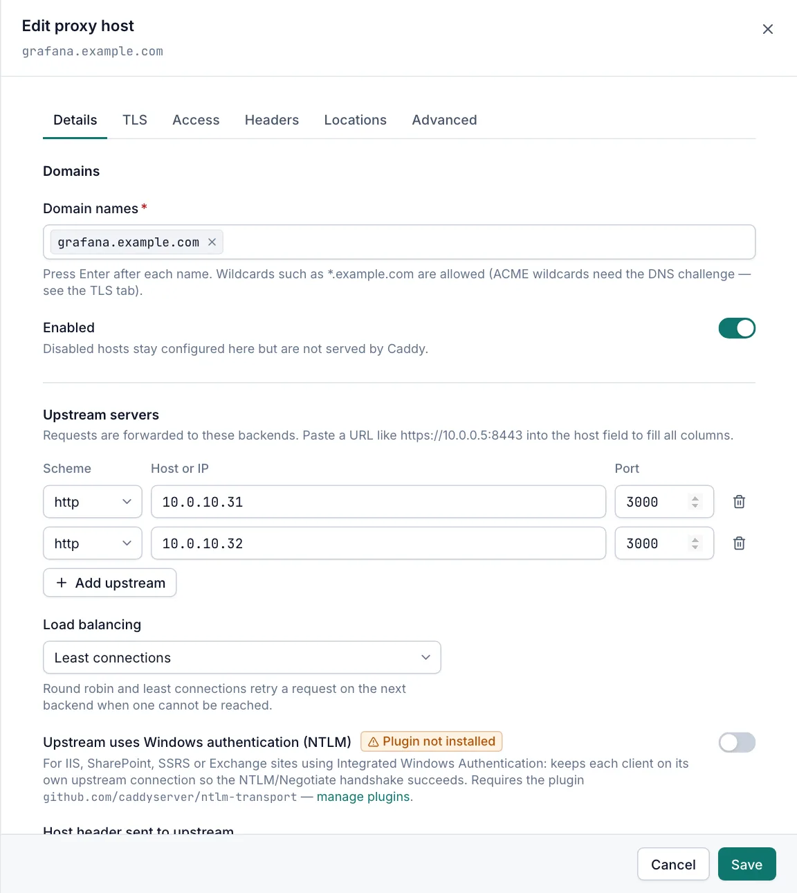

# Proxy hosts

A proxy host forwards requests for one or more domain names to one or more backend servers (upstreams), for example `app.example.com` to `http://10.0.0.20:8080`. Viewers can open proxy hosts read-only. Creating, changing, enabling, disabling and deleting them needs the Operator or Admin role.

## The Proxy Hosts page

Open **Sites › Proxy Hosts**. The page lists every proxy host, sorted by its first domain name.

| Column | What it shows |
|---|---|
| Status | A switch and **Enabled** or **Disabled**. Operators and admins can switch the host on or off here. |
| Domains | The first two domain names, then **+N more** (hover to see the rest). |
| Upstream | The first upstream as a URL, **+N** when there are more, and a **N locations** badge when the host has locations. **No upstream** when none is set. |
| TLS | **ACME** (or **ACME · DNS** when the host uses the DNS challenge), **Internal**, **Custom:** and the certificate name, or **HTTP only**. |
| Access | The access list name, or **Public**. |

- Use the search box (**Search domains, targets, notes…**) to filter by domain, notes or upstream (`host:port`). Upstreams of locations are not searched.
- Click a row to open the host. Users without the Operator role see it as **View proxy host** and cannot change anything.
- The **…** menu on each row has **Edit** (or **View**), **Disable** or **Enable**, **Duplicate** and **Delete**. See [Row actions](host-options.md#row-actions).
- The page has no bulk actions. Change hosts one at a time.

> [!NOTE]
> On a managed cluster node the page shows **Read-only on this node**. Make changes on the cluster primary. See [Cluster](cluster.md).

## Add a proxy host

1. Open **Sites › Proxy Hosts** and select **Add proxy host**.
2. On the **Details** tab, type each domain name in **Domain names** and press Enter after each one.
3. Under **Upstream servers**, choose the **Scheme**, and enter the **Host or IP** and **Port** of the backend. You can paste a URL such as `https://10.0.0.5:8443` into the host field to fill all three columns.
4. Select **Add upstream** to add more backends, if you have them.
5. Check the **TLS** tab. The default is **Automatic (ACME)**, which needs public DNS and reachable ports. See [TLS tab](host-options.md#tls-tab).
6. Select **Create**.

The manager saves the host, builds the new Caddy configuration and loads it into Caddy. A message confirms **Proxy host created and applied**. If Caddy rejects the configuration, nothing is saved. See [Saving and applying changes](host-options.md#saving-and-applying-changes).

## Domain names

**Domain names** is required on every host kind.

- Enter host names such as `app.example.com`, a wildcard such as `*.example.com`, or an IP address. A pasted `https://` prefix and any path are removed, and names are stored in lower case.
- A wildcard covers exactly one extra label: `*.example.com` matches `app.example.com` but not `example.com` or `a.b.example.com`.
- Exact names always win over wildcards. If `app.example.com` is on one host and `*.example.com` on another, requests for `app.example.com` go to the first host.
- A domain can belong to only one enabled host. Saving or enabling a host whose domain is already used by another enabled host fails with a message naming that host. Disabled hosts may share domains.
- Public certificates for wildcard names need the DNS challenge. See [ACME](acme.md).

The **Enabled** switch (on by default) controls whether Caddy serves the host. A disabled host keeps its settings but is left out of the Caddy configuration.

## Upstream servers

Requests are forwarded to the upstreams listed here.

| Field | Default | Description |
|---|---|---|
| Scheme | `http` | `http` or `https`. Switching the scheme changes port `80` to `443` and back. |
| Host or IP | empty | Host name or IP address of the backend, without scheme or port. |
| Port | `80` | 1–65535. |

- Add at least one upstream.
- All upstreams of a host must use the same scheme. Caddy uses one connection type per proxy.
- Caddy handles WebSocket connections automatically. There is no setting for it.
- Caddy adds the `X-Forwarded-For`, `X-Forwarded-Proto` and `X-Forwarded-Host` headers for the backend.

### Upstreams that are not allowed

To protect the server, some targets on this server are refused. "This server" means `localhost`, loopback addresses, any address of a local network adapter, and the server's own host name.

- Nobody can proxy to the Caddy admin API port on this server (`2019` by default). Anyone who reached the site could reconfigure Caddy.
- Operators cannot proxy to the ports of the manager web UI on this server. Admins can, for example to publish the management UI through Caddy. See [Management UI](management-ui.md).

### Load balancing

**Load balancing** appears when a host has more than one upstream.

| Option | Behaviour |
|---|---|
| Round robin | Each request goes to the next upstream in turn. This is the default. |
| Least connections | The upstream with the fewest open requests. |
| Random | A random upstream. |
| First available (failover) | Always the first upstream that is available. |
| Client IP hash (sticky) | The same client IP always reaches the same upstream. Behind a load balancer, set trusted proxies in [Caddy settings](caddy-settings.md) so the real client IP is used. |
| Cookie (sticky) | A cookie keeps each client on the same upstream. |
| URI hash | The same request path always reaches the same upstream. |

With more than one upstream, Caddy retries a request that cannot reach a backend on another upstream for up to 5 seconds.

Caddy does not mark an upstream as down because requests to it failed. Only the active health check takes a backend out of rotation. With **First available (failover)**, **Client IP hash (sticky)**, **Cookie (sticky)** or **URI hash**, a backend that is down keeps receiving its share of requests unless the active health check is on. Saving such a host shows a warning.

### Skip upstream certificate verification

This switch appears when an upstream uses `https`. Use it only for internal backends with self-signed certificates: traffic stays encrypted, but Caddy does not check the backend's certificate.

When the switch is on and **Host header sent to upstream** is **Keep client Host**, Caddy also sends the requested domain as the TLS server name (SNI). This helps IIS SNI bindings and name-based virtual hosts. Each domain then gets its own upstream connections. Wildcard domains send no server name to an IP upstream.

### Upstream uses Windows authentication (NTLM)

Turn this on for IIS, SharePoint, SSRS or Exchange sites that use Integrated Windows Authentication. Caddy keeps each client on its own upstream connection so the NTLM/Negotiate handshake succeeds.

- It needs the Caddy plugin `github.com/caddyserver/ntlm-transport`. The switch shows **Plugin not installed** when the installed Caddy does not include it. Add it on [Plugins](plugins.md) and rebuild Caddy.
- Without the plugin, the host is still saved and applied, but Caddy uses a normal connection and Windows logins fail. The save shows a warning.
- You cannot combine NTLM with an access list that has users (basic authentication). Both use the `Authorization` header. Use an access list with IP rules only.

### Host header sent to upstream

| Option | Header the backend receives |
|---|---|
| Keep client Host | The domain the client requested. This is the default, also for `https` upstreams. |
| Upstream host:port | The upstream's address, for example `10.0.0.20:8080`. |
| Custom | The value you type, for example `intranet.corp.local`. Caddy placeholders are allowed. An empty value means **Keep client Host**. |

## Active health check

Turn on **Enable health checks** to let Caddy request a path on each upstream on a schedule.

| Field | Default | Description |
|---|---|---|
| Path | `/` | Path Caddy requests. Must start with `/`. |
| Expected status | `0` | `0` = any 2xx, `1`–`5` = any status of that class (`3` = any redirect), or an exact code 100–599. A redirect counts as a failure unless you allow it here. |
| Interval (seconds) | `30` | Time between checks, 1–86400. |
| Timeout (seconds) | `5` | How long Caddy waits for an answer, 1–3600. |

- One failed check marks the upstream unhealthy. One passed check marks it healthy again.
- An unhealthy upstream gets no traffic. When every upstream is unhealthy, the host answers `503`. With a single upstream, the host answers `503` while its check fails, so choose a path that answers reliably.
- The check sends the host's first exact (non-wildcard) domain as the `Host` header, or your **Custom** value, so backends that route by host name answer it. With **Upstream host:port**, or a custom value that contains a placeholder, it sends the upstream's address.
- The check applies to the default upstreams only, not to locations.
- Without an active check an upstream is not monitored, whatever the number of upstreams, and never raises an *Upstream unhealthy* alert. See [Notifications](notifications.md).

## Compression

**Compression** is on by default. Caddy compresses responses with zstd or gzip when the client supports it.

## Other tabs

- **TLS**, **Access**, **Headers** and **Advanced** work the same for every host kind. See [Host options](host-options.md).
- **Locations** sends a path such as `/api` to different upstreams. See [Locations tab](host-options.md#locations-tab).

## Related

- [Host options](host-options.md)
- [Access lists](access-lists.md)
- [Certificates](certificates.md)
- [Plugins](plugins.md)
- [Troubleshooting](troubleshooting.md)
