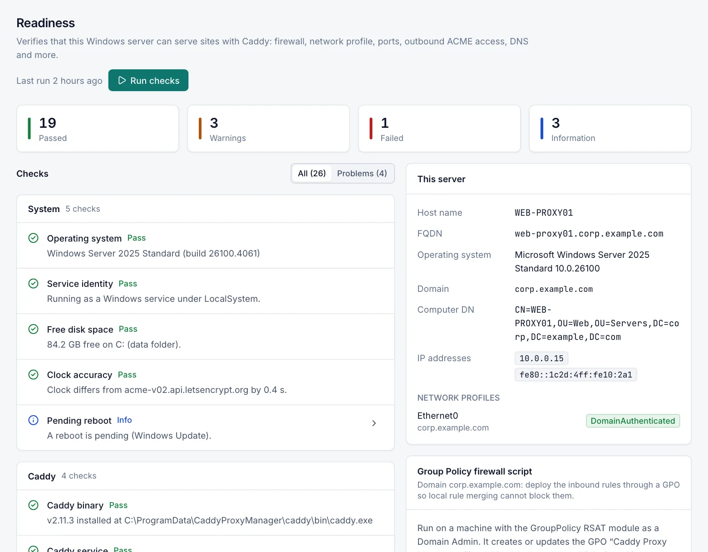

# Readiness

The **Readiness** page checks whether this Windows server can serve sites with Caddy: operating system, firewall, network profile, domain membership, ports, outbound connectivity, DNS and the Caddy service. Each finding explains what is wrong and how to fix it, and some can be fixed with one click. Every signed-in user can view the results; running the checks needs **Operator**, applying fixes needs **Admin**.

## Open the page

Open **Server › Readiness**. The page shows the last report and when it ran (**Last run**).

The manager runs the checks automatically about a minute after it starts when no report exists yet, and again whenever the last report is 24 hours old. Before the first run the page shows **Checks have not run yet**.

## Run the checks

Select **Run checks** (Operators and Admins). A run takes up to a minute, longer on servers with thousands of firewall rules. The report replaces the previous one.

## Read the results

- The summary tiles count **Passed**, **Warnings**, **Failed** and **Information** results. When nothing failed or warned, the page shows **This server looks ready**.
- Switch between **All** and **Problems** to hide passed and informational results.
- Checks are grouped by category: System, Caddy, Firewall, Network, Domain, Ports, Connectivity, DNS.
- Each check has a status: **Pass**, **Warning**, **Fail**, **Info** or **Skipped**.
- Select the arrow on a row to see **Details**, **Remediation**, a PowerShell script under **PowerShell (run as Administrator)** with a copy button, and the check's ID. Failed checks open by default.

The **This server** card shows the host name, FQDN, operating system, domain (or **Workgroup (not domain joined)**), computer DN, IP addresses and the category of each network connection.

## Apply a fix

Some checks have a **Fix** button. It appears for Admins on fixable checks that failed or warned.

1. Select **Fix** on the check.
2. Read the confirmation, which repeats the remediation, and select **Apply fix**.
3. The manager applies the fix on the server, records it in the audit log and runs all checks again.

If the fix fails, the page shows **The fix could not be applied** with the reason. The checks that can be fixed and what the fix does are listed in the reference below.

## Alerts

After each automatic or manual run, every check that newly fails raises a warning event **Readiness check failed:** followed by the check's title. When it passes again, a **Readiness check passes again** event follows. Notifications for these events are controlled by **Readiness check failures** on the **Notifications** page. See [Events](events.md) and [Notifications](notifications.md).

## Checks reference

Titles that contain a port number use the configured port; the tables below show the defaults.

### System

| Check | Passes when | Otherwise | Fix |
|---|---|---|---|
| Operating system | Windows build 17763 (Windows 10 1809 / Server 2019) or later | Warning: older, unsupported Windows | No |
| Manager account | The manager runs as the `CaddyProxyManager` service under LocalSystem | Warning when the service runs under another account; Info when the manager runs in a console | No |
| Free disk space | 5 GB or more free on the drive of the data folder | Warning below 5 GB, Fail below 1 GB | No |
| Data directory permissions | `C:\ProgramData\CaddyProxyManager` does not inherit permissions and no ordinary users (Users, Authenticated Users, Everyone, Guests, INTERACTIVE, ANONYMOUS LOGON) have access | Warning | Yes: restricts the folder to SYSTEM and Administrators and removes inherited permissions |
| Pending reboot | No reboot is pending | Info: Windows Update, component servicing or pending file renames need a reboot | No |
| System clock | The clock differs from Let's Encrypt's by 30 seconds or less | Warning above 30 seconds, Fail above 5 minutes; Info when Let's Encrypt cannot be reached | No |

A wrong clock breaks TLS and ACME. The remediation shows the `w32tm` commands to resynchronise it.

### Caddy

| Check | Passes when | Otherwise | Fix |
|---|---|---|---|
| Caddy binary | `caddy.exe` is installed | Fail | Yes: starts installing the latest Caddy release (follow the job on **Caddy › Service & Updates**) |
| Caddy Windows service | The `Caddy` service exists with Automatic start, LocalSystem, the expected program path and environment, and restart-on-failure recovery | Fail when not registered; Warning when its configuration differs | Yes: registers or repairs the service |
| Caddy running | Caddy is running | Fail | Yes, when Caddy is installed: starts Caddy |
| Caddy admin API | The admin API listens on loopback and answers | Fail when it listens on a non-loopback address; Warning when Caddy runs but the API does not answer; Skipped when Caddy is stopped | No |
| Who can reach the Caddy admin API | Always Info | Explains that the admin API has no authentication and any local process can use it | No |

See [Caddy service](caddy-service.md) and [Security](security.md).

### Firewall

These checks read the effective Windows Defender Firewall policy: local rules and rules from Group Policy, for the network profiles that are active on the server.

| Check | Passes when | Otherwise | Fix |
|---|---|---|---|
| Firewall service (mpssvc) | The Windows Defender Firewall service is running | Fail | No |
| Firewall profile: Domain / Private / Public | The profile is enabled | Warning when an active profile is disabled; Info when an inactive one is | No |
| Local firewall rules honoured | Group Policy does not disable local rules | Warning when **Apply local firewall rules** is set to **No** for an active profile: rules created on the server are ignored | No (use the GPO script) |
| Inbound TCP 80 — Caddy HTTP (ACME HTTP-01 challenges, HTTP to HTTPS redirects) | A rule allows Caddy's HTTP port on every active profile | See below | See below |
| Inbound TCP 443 — Caddy HTTPS | Same for Caddy's HTTPS port | See below | See below |
| Inbound UDP 443 — Caddy HTTP/3 (QUIC) | Same, only checked when HTTP/3 is on | Warning at most, because HTTP/3 is optional | See below |
| Inbound TCP 81 — Caddy Proxy Manager web UI | Same for the web UI port (and the UI HTTPS port when enabled); not checked when the UI listens on loopback only | See below | See below |
| Inbound TCP or UDP — Caddy stream | Same for every enabled stream port | See below | See below |

For the port checks:

- **Fail** when no active profile allows the port, **Warning** when some do and some do not.
- A matching block rule always wins over allow rules; the details name the blocking rule and whether it comes from Group Policy.
- A profile set to block all incoming connections ignores allow rules.
- Rules limited to another program or service do not count.
- **Fix** creates a local inbound allow rule in the group **Caddy Proxy Manager** for all profiles. It is offered only when the port is not blocked by a rule, local rules are honoured and no profile blocks all connections. Otherwise the remediation explains what to change, for example in the GPO.

The rule names are listed in [Installation](installation.md#firewall-rules).

### Network

| Check | Passes when | Otherwise | Fix |
|---|---|---|---|
| Network profile: *adapter name* (domain-joined server) | The connection is **DomainAuthenticated** | Warning: Network Location Awareness could not reach a domain controller, so domain firewall rules do not apply | No |
| Network profile: *adapter name* (workgroup server) | The connection is Private or Domain | Warning when it is Public, the most restrictive profile | Yes: sets the connection to Private |

On a domain-joined server, check that the adapter's DNS servers are the domain controllers, then restart Network Location Awareness. See [Group Policy](group-policy.md#network-profile-on-domain-joined-servers).

### Domain

| Check | Result |
|---|---|
| Active Directory domain | Info: workgroup name, or the domain and the computer account's distinguished name |
| Firewall rules via Group Policy | Info, domain-joined servers only: recommends deploying the rules with the GPO **Caddy Proxy Manager - Firewall**. The script is in the check's details and in the Group Policy card. |
| Internal CA root distribution | Info, when any enabled host uses the internal CA: distribute Caddy's root certificate to clients |

### Ports

| Check | Passes when | Otherwise |
|---|---|---|
| TCP 80 available for Caddy (and the other Caddy ports) | The port is free or used by Caddy (HTTP, HTTPS, and UDP HTTPS when HTTP/3 is on) | Fail when another program uses it. When the owner is `System` (PID 4), a Windows component registered the port through http.sys, typically IIS, WinRM, SQL Server Reporting Services, AD FS, WSUS or Windows Admin Center; the details list the registrations. Info when the port is free although Caddy runs. |
| Port available for a Caddy stream | Same for each enabled stream port | Same |
| IIS (W3SVC) | IIS is not installed | Warning when W3SVC is running (move its bindings off Caddy's ports or stop it); Info when installed but not running |

None of the port checks has an automatic fix: you decide which program keeps the port. You can change Caddy's ports in **Settings › Caddy**.

### Connectivity

| Check | Passes when | Otherwise |
|---|---|---|
| Outbound HTTPS to acme-v02.api.letsencrypt.org | The server connects on TCP 443 (through the outbound proxy when Caddy is set to use it) | Fail when an enabled host uses ACME certificates, otherwise Warning |
| Outbound HTTPS to api.github.com | Connects (through the outbound proxy when one is set) | Warning: Caddy update checks and downloads do not work |
| Outbound HTTPS to caddyserver.com | Connects (through the outbound proxy when one is set) | Warning: the plugin catalogue and builds with plugins do not work |
| Outbound proxy for Caddy | Info, only when an outbound proxy is set: whether Caddy uses it too | |
| WinHTTP proxy (certificate revocation checks) | No WinHTTP proxy and no outbound proxy | Info: explains how Windows downloads revocation lists for the SMTP and LDAPS certificates |
| E-mail authentication (Microsoft 365) | Shown only for e-mail through Microsoft 365: passes with OAuth2 or no authentication | Warning with user name and password, which Microsoft is retiring |

The outbound proxy is set in **Settings › Updates**. See [Updates](updates.md) and [Notifications](notifications.md).

### DNS

For every enabled host with an automatic (ACME) certificate, each domain name except wildcards is resolved (up to 50 names).

| Check | Passes when | Otherwise |
|---|---|---|
| DNS followed by the domain name | The name resolves to an address of this server or to its public address | Warning when it resolves elsewhere (fine when a NAT or load balancer forwards ports 80 and 443 to this server); Fail when it does not resolve |

When no enabled host uses ACME, a single Info result says there is nothing to check.

## Group Policy firewall script

On domain-joined servers the page shows the **Group Policy firewall script** card. It contains a PowerShell script that creates the GPO **Caddy Proxy Manager - Firewall** with every inbound rule the server needs, limits it to this computer and links it to the computer's OU. Use **Download** to save it as `Caddy-Firewall-GPO.ps1`, or copy it. See [Group Policy](group-policy.md).

## Limits

- The firewall, network, domain and port checks use Windows PowerShell. If a Windows Defender Application Control or AppLocker policy runs PowerShell in Constrained Language mode, those checks report that the scripts cannot run. Check those settings manually or allow the checks in the policy; the other checks still work.
- A domain-joined server's network category is decided by Windows. The **Fix** for Public networks is only offered on workgroup servers.

## Related

- [Installation](installation.md)
- [Group Policy](group-policy.md)
- [Caddy service](caddy-service.md)
- [Updates](updates.md)
- [Troubleshooting](troubleshooting.md)
