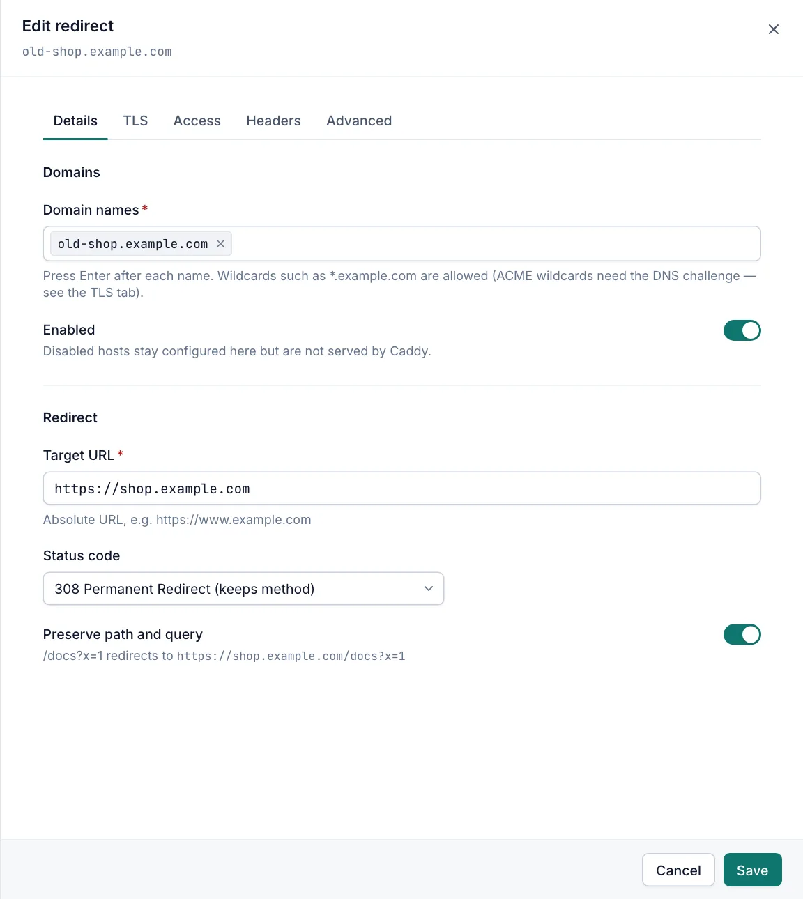

# Redirects

A redirect host answers every request for its domains with an HTTP redirect to another URL, for example `example.org` to `https://example.com`. Viewers can open redirects read-only. Creating, changing and deleting them needs the Operator or Admin role.

## The Redirects page

Open **Sites › Redirects**. The page works like the [Proxy Hosts page](proxy-hosts.md#the-proxy-hosts-page), with one difference: the **Redirects to** column shows the status code and the target URL.

The search box also matches the target URL.

## Add a redirect

1. Open **Sites › Redirects** and select **Add redirect**.
2. On the **Details** tab, add the old or alternative names in **Domain names**. See [Domain names](proxy-hosts.md#domain-names).
3. Enter the **Target URL**, for example `https://www.example.com`.
4. Choose the **Status code**.
5. Leave **Preserve path and query** on to keep the rest of the address, or turn it off to send everyone to the same URL.
6. Check the **TLS** tab. With **Automatic (ACME)** the old names also get certificates, so `https://` links to them keep working.
7. Select **Create**.

## Redirect settings

| Field | Default | Description |
|---|---|---|
| Target URL | empty | Required. An absolute URL that starts with `http://` or `https://`. |
| Status code | 301 Moved Permanently | The redirect status, see below. |
| Preserve path and query | on | Adds the requested path and query string to the target. |

### Status codes

| Option | Use it when |
|---|---|
| 301 Moved Permanently | The move is permanent. Browsers and search engines remember it. |
| 302 Found (temporary) | The move is temporary. |
| 303 See Other | The client should fetch the target with GET. |
| 307 Temporary Redirect (keeps method) | Temporary, and the client repeats the same method and body (for example POST). |
| 308 Permanent Redirect (keeps method) | Permanent, and the client repeats the same method and body. |

> [!TIP]
> Browsers cache 301 and 308 redirects. Test with 302 or 307 first, then switch to a permanent code.

### How the target is built

- **Preserve path and query** off: every request goes to the **Target URL** exactly.
- On, and the target has no query string: the requested path and query are added. With target `https://www.example.com`, a request for `/docs?x=1` goes to `https://www.example.com/docs?x=1`. A trailing `/` on the target is ignored.
- On, and the target has its own query string: the requested path goes before the target's query, and the request's query is added after it with `&`. With target `https://example.com/p?src=old`, a request for `/docs?x=1` goes to `https://example.com/p/docs?src=old&x=1`.
- The path is passed on exactly as the client sent it, including encoded characters.
- Braces in the target, such as `{id}`, are sent literally. Caddy placeholders that start with `http.`, `env.`, `system.`, `time.` or `file.` are replaced.

## Things to know

- A redirect host has no **Performance** section.
- **Force HTTPS** on the **TLS** tab still applies. A plain `http://` request is first sent to `https://` on the same name, then to the target.
- The **Access** tab works on redirects too. An access list or **Block common exploits** is checked before the redirect is sent.
- Only **Response headers** are available on the **Headers** tab.

## Related

- [Host options](host-options.md)
- [Proxy hosts](proxy-hosts.md)
- [Custom responses](custom-responses.md)
