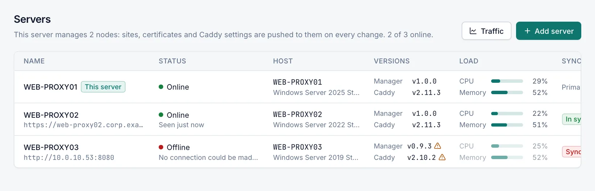
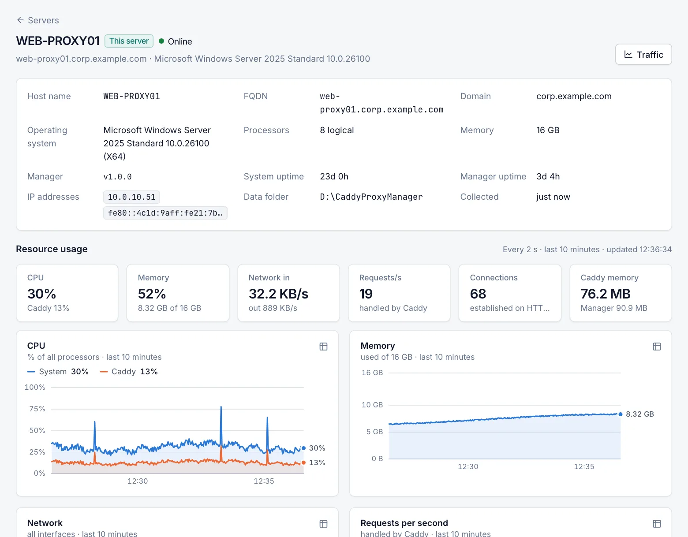

# Servers

The **Servers** page lists this server and any cluster nodes it manages, with their status, versions and current load. Select a server to see its details, live resource charts, Caddy state and traffic. Every role can view these pages; some actions need the **Operator** or **Admin** role. Adding, removing and joining servers is described in [Cluster](cluster.md).

## Servers list

Open **Overview › Servers**. This server is always listed first and carries the **This server** badge. The list refreshes every 10 seconds. If a refresh fails, the page keeps showing the last values and retries automatically.

| Column | Description |
|---|---|
| Name | The server's name and management URL. A **Key rotation pending** badge appears when a node could not be reached while its key was rotated. |
| Status | **Online**, **Offline**, **Waiting to join** or **Error**, with the last error or when the server was last seen. |
| Host | The computer's host name and Windows version. |
| Versions | The Caddy Proxy Manager and Caddy versions. A warning icon marks a version that differs from this server's. |
| Load | CPU and memory use from the most recent sample. The values are dimmed when the server is not online. |
| Sync | For nodes: **In sync**, **Out of date**, **Sync failed** or **Not joined**. For this server: **Primary** when it manages nodes. |

Each row has a menu with **Open** and, for nodes, the cluster actions (**Sync now**, key and join token actions, **Edit**, **Remove**). See [Cluster](cluster.md).

Select **Traffic** in the page header to open the [Traffic](traffic-statistics.md) page.

## Server details

Select a server's name to open its details page. The header shows the name, the status and the host name with the Windows version.

| Button | Role | What it does |
|---|---|---|
| Traffic | Viewer | Opens the Traffic page for this server. |
| Sync now | Operator | Nodes only. Pushes the current configuration to the node now. |

On a node that does not respond, a notice explains that it keeps serving its last applied configuration and that the values shown are from its last heartbeat.

### Server facts

| Field | Description |
|---|---|
| Host name | The computer name. |
| FQDN | The fully qualified domain name, when there is one. |
| Domain | The Active Directory domain, or **Workgroup**. |
| Operating system | The Windows version and architecture. |
| Processors | The number of logical processors. |
| Memory | Installed physical memory. |
| Manager | The Caddy Proxy Manager version. |
| System uptime | How long Windows has been running. |
| Manager uptime | How long the Caddy Proxy Manager service has been running. |
| IP addresses | Addresses of the connected network adapters (IPv4 first; loopback and IPv6 link-local addresses are left out). |
| Data folder | Where the manager keeps its data. |
| Collected | When these facts were gathered. They are refreshed at most every 30 seconds. |

On a node the card also shows the **Management URL**, the **Pinned certificate**, when the join token was issued and when the server was added.

## Resource usage

The **Resource usage** section shows live measurements. The manager takes a sample every 2 seconds and keeps the last 10 minutes in memory. Samples are not stored, so the charts start empty after the service restarts. The page asks for new samples every 2 seconds while it is visible.

### Tiles

| Tile | Shows |
|---|---|
| CPU | Whole-machine CPU use, with Caddy's share underneath (or **Caddy not running**). |
| Memory | Physical memory in use, as a percentage and as used of total. |
| Network in | Bytes per second received, with bytes per second sent underneath. |
| Requests/s | HTTP requests per second handled by Caddy. |
| Connections | Established connections to Caddy's HTTP and HTTPS ports. |
| Caddy memory | Memory used by the Caddy process, with the manager's underneath. |

### Charts

Each chart covers the last 10 minutes. Point at a chart to see the values at that moment. Each chart also has a table view of its data.

| Chart | What it measures |
|---|---|
| CPU | Whole-machine CPU use (**System**) and the Caddy process (**Caddy**), as a percentage of all processors. |
| Memory | Physical memory in use (total minus available). |
| Network | Bytes per second **Received** and **Sent** over all connected network adapters, except loopback. |
| Requests per second | Requests handled by Caddy, by the time Caddy logged them. |
| Active connections | Established TCP connections to Caddy's HTTP and HTTPS ports. |
| Process memory | Working set of the **Caddy** and **Manager** processes. |

How to read the numbers:

- **Process CPU is a share of the whole machine.** 100 % means every processor is busy.
- **Network counts all traffic on the server**, not only Caddy's.
  - An adapter that has just come up (for example a VPN connecting) is counted from its second sample, so it does not show one large spike.
- **Connections count TCP only.** HTTP/3 uses UDP and is not included.
  - The chart shows **Not available while Caddy is stopped** when there is no data.
- **Requests per second comes from the traffic statistics log.** It lags about 2 seconds behind real time.
  - It reads 0 when **Traffic statistics** is turned off in **Settings › Caddy**. See [Traffic statistics](traffic-statistics.md).

### Disks

The **Disks** card shows two volumes: the one that holds the data folder, and the Windows system volume. When both are the same volume, it shows one row.

For each volume you see the percentage used and the free space. The bar turns amber at 85 % and red at 95 %.

## Caddy card

The **Caddy** card shows:

- **State**. For a server that is not online, the state is the last known one.
- **Version**, with a note when it differs from this server's.
- **Running for**, while Caddy is running.
- **Plugins**, or **Standard build** when Caddy has no plugins.

| Button | Role | What it does |
|---|---|---|
| Restart | Operator | Restarts Caddy on that server after you confirm. Open connections are closed during the restart, which usually takes under a second. |
| Update Caddy | Admin | Downloads the latest Caddy release (with that server's plugins), validates the configuration with it and restarts Caddy. The previous version is kept for rollback. A progress window shows the job's log. On a node you can close the window and the job keeps running. |

Both buttons are unavailable while the server is not online. For this server, service control, rollback and plugins are on [Caddy service](caddy-service.md).

## Configuration sync card

Nodes also show a **Configuration sync** card with the sync state, the desired and applied revisions, the last sync time, the last error and any warnings from the node. See [Cluster](cluster.md).

## Traffic section

At the bottom of the details page, the **Traffic** section shows the traffic statistics of that server. It uses the same time ranges, host filter, charts and tables as the [Traffic](traffic-statistics.md) page.

## Related

- [Cluster](cluster.md)
- [Traffic statistics](traffic-statistics.md)
- [Caddy service](caddy-service.md)
- [Dashboard](dashboard.md)
