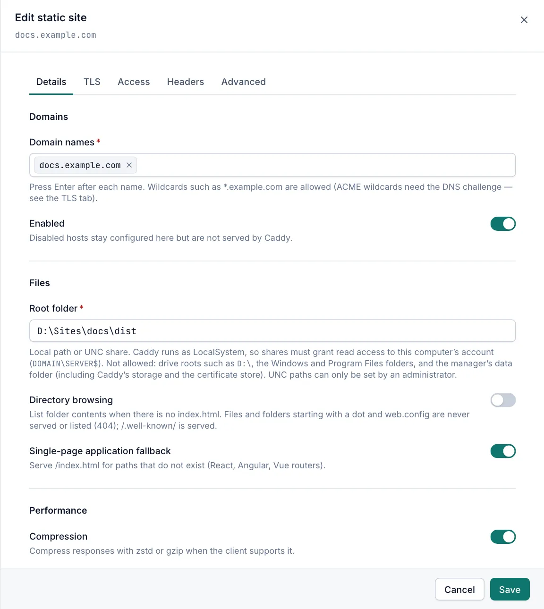

# Static sites

A static site serves files from a folder on the server or on a network share, including single-page applications built with React, Angular or Vue. Viewers can open static sites read-only. Creating and changing them needs the Operator or Admin role, and a network share (UNC path) as the root folder needs the Admin role.

## The Static Sites page

Open **Sites › Static Sites**. The page works like the [Proxy Hosts page](proxy-hosts.md#the-proxy-hosts-page). The **Folder** column shows the root folder, with a **SPA** badge when the single-page application fallback is on and a **Browse** badge when directory browsing is on.

The search box also matches the root folder.

## Add a static site

1. Copy the site's files into a dedicated folder, for example `D:\Sites\intranet`.
2. Open **Sites › Static Sites** and select **Add static site**.
3. On the **Details** tab, add the names in **Domain names**. See [Domain names](proxy-hosts.md#domain-names).
4. Enter the **Root folder**.
5. Turn on **Single-page application fallback** if the site is a single-page application with client-side routes.
6. Select **Create**.

## Files settings

| Field | Default | Description |
|---|---|---|
| Root folder | empty | Required. An absolute local path or UNC share that holds the site's files. |
| Directory browsing | off | Lists the folder contents when a folder has no index file. |
| Single-page application fallback | off | Serves `/index.html` for paths that do not exist, so client-side routes work. |
| Compression | on | Compresses responses with zstd or gzip when the client supports it. |

- For a folder, Caddy serves `index.html` (or `index.txt`) when it exists.
- With the single-page application fallback on, an existing file or folder is still served as usual. Only paths that do not exist get `/index.html`.

## Folders you can use

Caddy runs as the LocalSystem account, so it reads the folder as the computer.

- For a share, enter the UNC path, such as `\\fileserver\web\intranet`, and grant read access to the computer account (`DOMAIN\SERVER$`).
- Only admins can set a UNC path. An operator can edit a static site whose UNC root an admin set, as long as the root stays the same.

These roots are refused for everyone:

- a drive root such as `D:\`;
- an administrative share such as `\\server\C$`;
- the Windows folder, the Program Files folders and the Caddy Proxy Manager program folder;
- the Caddy Proxy Manager data folder, Caddy's storage folder, the certificate store and the shared Caddy storage folder of a cluster;
- any folder inside or above one of those folders;
- relative paths, paths with `..`, short names such as `PROGRA~1`, and device paths that start with `\\?\` or `\\.\`.

Symbolic links and junctions on local drives are resolved before the check.

> [!NOTE]
> If a root becomes one of these folders later, for example after the certificate store moves, the site answers `403` with "403 Forbidden - this folder may not be served" until you change the root folder.

## Hidden files

Caddy never serves some files, whether or not directory browsing is on:

- files and folders whose names start with a dot, such as `.git`, `.env` or `.htpasswd`, get `404`;
- `web.config` gets `404`;
- dotfiles are left out of directory listings.

The `/.well-known/` folder is served, so files such as `security.txt` work. Dotfiles and `web.config` inside it are still hidden, and it is never listed.

## Related

- [Host options](host-options.md)
- [Proxy hosts](proxy-hosts.md)
- [Security](security.md)
