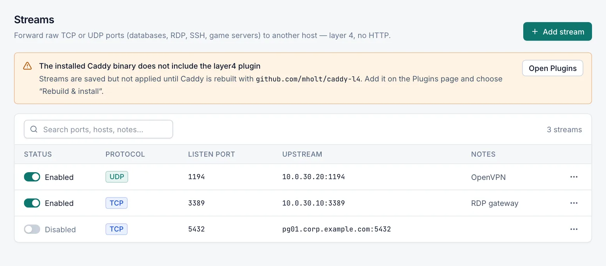
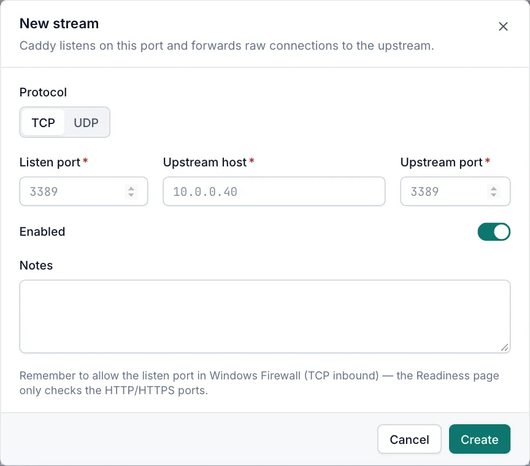

# Streams

A stream forwards a raw TCP or UDP port to another host, for example TCP 3389 to an internal RDP server or UDP 1194 to a VPN server. Streams work at layer 4: Caddy passes the connection on without reading it, so there is no HTTP, TLS, access list or load balancing. Viewers can see streams. Creating, changing and deleting them needs the Operator or Admin role.

## Plugin required

Streams need the Caddy plugin `github.com/mholt/caddy-l4`. When the installed Caddy does not include it, the Streams page shows **The installed Caddy binary does not include the layer4 plugin** with an **Open Plugins** button.

1. Select **Open Plugins**, or open **Caddy › Plugins**.
2. Add `github.com/mholt/caddy-l4`.
3. Choose **Rebuild & install**.

Until then you can still create streams. They are saved but not applied, and the save message reads **Stream saved but not active**. See [Plugins](plugins.md).

## The Streams page

Open **Sites › Streams**. Streams are sorted by listen port.

| Column | What it shows |
|---|---|
| Status | A switch and **Enabled** or **Disabled**. |
| Protocol | **TCP** or **UDP**. |
| Listen port | The port Caddy listens on. |
| Upstream | The target as `host:port`. |
| Notes | Your notes. |

- The search box (**Search ports, hosts, notes…**) matches the listen port, the upstream, the notes and the protocol.
- Operators and admins click a row, or choose **Edit** in the **…** menu, to change a stream. The menu also has **Disable** or **Enable**, and **Delete**.
- On a managed cluster node the page is read-only. See [Cluster](cluster.md).

## Add a stream

1. Open **Sites › Streams** and select **Add stream**.
2. Choose **TCP** or **UDP** under **Protocol**.
3. Enter the **Listen port**, **Upstream host** and **Upstream port**.
4. Select **Create**.
5. Allow the listen port in Windows Firewall (inbound, same protocol). The [Readiness](readiness.md) page checks only the HTTP and HTTPS ports, not stream ports.

## Stream settings

| Field | Default | Description |
|---|---|---|
| Protocol | TCP | **TCP** or **UDP**. |
| Listen port | empty | Required, 1–65535. The port clients connect to on this server. |
| Upstream host | empty | Required. Host name or IP address of the target. |
| Upstream port | empty | Required, 1–65535. |
| Enabled | on | A disabled stream keeps its settings but is not forwarded. |
| Notes | empty | Free text for your team. |

Caddy listens on all network interfaces, or on the bind addresses set in [Caddy settings](caddy-settings.md).

## Ports and targets that are refused

For an enabled stream, the listen port is refused when:

- it is a TCP port used by Caddy's HTTP or HTTPS listener;
- it is a TCP port used by the Caddy admin API or the Caddy Proxy Manager web UI;
- it is the UDP HTTPS port while HTTP/3 is on;
- another enabled stream already uses the same protocol and port.

For every stream, the upstream is refused when it points at the Caddy admin API or the manager web UI on this server. This applies to admins too. "This server" means `localhost`, loopback addresses, any address of a local network adapter, and the server's own host name.

## Delete a stream

Choose **Delete** in the row menu and confirm. Caddy stops forwarding the port straight away.

Saving, enabling, disabling and deleting a stream apply the Caddy configuration in the same way as hosts. See [Saving and applying changes](host-options.md#saving-and-applying-changes).

## Related

- [Plugins](plugins.md)
- [Installation](installation.md)
- [Readiness](readiness.md)
- [Traffic statistics](traffic-statistics.md)
