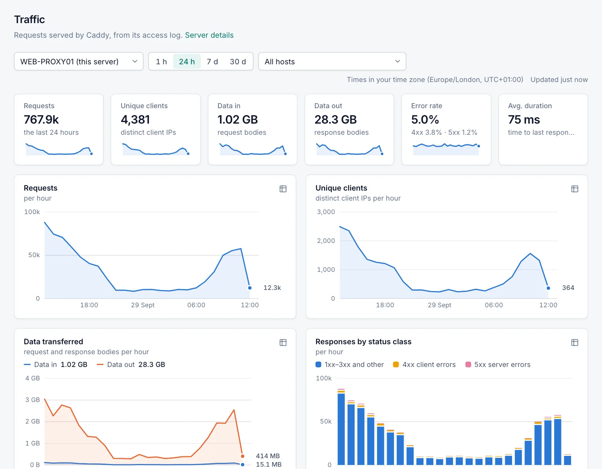

# Traffic statistics

The **Traffic** page shows what Caddy served: requests, unique clients, data transferred, status codes, and the busiest hosts and clients. The manager builds these statistics on each server from Caddy's own log, so no external monitoring system is needed. Every role can view the page, including the **Viewer** role.

## Turn statistics on or off

Traffic statistics are controlled by **Settings › Caddy › Traffic statistics**. The setting is on by default.

- **On:** Caddy writes one line per HTTP request to a local statistics log, and the manager counts it.
- **Off:** Caddy stops writing that log and nothing new is counted. Statistics you already collected stay until they expire (see [Retention](#retention)).

You do not need to turn on the per-host **Access log** option for a host to be counted. The statistics log records requests for every site.

Statistics are collected only when the configuration is in managed mode. In Caddyfile mode, nothing is collected. On a cluster node the setting comes from the primary, so it cannot be changed there. See [Caddy settings](caddy-settings.md).

When statistics are not collected, the Traffic page shows **Traffic statistics are disabled** with an **Open Caddy settings** button.

## Open the Traffic page

1. Open **Overview › Traffic**. You can also select **Traffic** on the **Servers** page or on a server's details page.
2. If you manage cluster nodes, choose the server in the server selector.
3. Choose a time range: **1 h**, **24 h**, **7 d** or **30 d**. The default is **24 h**.
4. Optionally choose a host in the host selector, or select a host name in **Top hosts**. Every chart and table then shows only that host. Select **Show all hosts** or choose **All hosts** to clear the filter.

The server, range and host are kept in the page address, so you can bookmark or share a view.

The page refreshes every 10 seconds for **1 h**, and every minute for the other ranges. **Updated** shows when the manager last read new lines from the log.

## What the page shows

### Summary tiles

| Tile | Description |
|---|---|
| Requests | HTTP requests in the chosen range. |
| Unique clients | Distinct client IP addresses in the range. |
| Data in | Request body bytes received. |
| Data out | Response body bytes sent. |
| Error rate | 4xx and 5xx responses as a share of all requests, with each class shown separately. |
| Avg. duration | Average time until the last byte of the response was sent. |

### Charts

| Chart | Description |
|---|---|
| Requests | Requests per time bucket. |
| Unique clients | Distinct client IPs within each bucket. |
| Data transferred | **Data in** and **Data out** per bucket. |
| Responses by status class | Requests per bucket, split into 4xx, 5xx and everything else. A bar underneath shows the share of 2xx, 3xx, 4xx, 5xx and **Other (aborted, 1xx)** over the whole range. |

Each chart has a table view of its data.

### Top hosts

**Top hosts** lists up to 20 hosts, ordered by requests. For each host it shows **Requests**, **Clients**, **In**, **Out**, **4xx** and **5xx**.

The error counts are highlighted when they are high for that host:

- **4xx** from 5 % of the host's requests
- **5xx** from 1 %

### Top clients

**Top clients** lists up to 20 client IP addresses, ordered by requests. For each address it shows **Requests**, **Out** and **Last seen**.

### Status codes

**Status codes** lists every status code with its name (or its class, for less common codes) and count. A dash with **Aborted by the client** means that no response was written.

### About these numbers

The **About these numbers** card repeats the main counting rules. It also reports log lines that could not be read, and log files that were lost before they were read.

## Time ranges and time zones

| Range | Points | Bucket size |
|---|---|---|
| 1 h | 60 | 1 minute |
| 24 h | 24 | 1 hour |
| 7 d | 168 | 1 hour |
| 30 d | 30 | 1 day (UTC) |

The newest point is the bucket that is still filling. For example, **24 h** covers the current hour and the 23 before it. Buckets without traffic show as zero.

- **Minute and hour buckets** are shown in your browser's time zone. The zone is named next to the range selector, for example *Times in your time zone (Europe/London, UTC+01:00)*.
- **Day buckets** are UTC calendar days, from 00:00 to 24:00 UTC. They are labelled with their UTC date, for example *Fri, Sep 25 (UTC)*.
  - West of UTC, a day bucket therefore starts on the previous local evening.

## What is counted

| Number | Meaning |
|---|---|
| Requests | Every HTTP request Caddy handled and logged. This includes redirects to HTTPS and ACME HTTP-01 challenge requests. |
| Data in | Request body bytes. Headers are not included. |
| Data out | Response body bytes after compression. Headers and TLS overhead are not included. |
| Status classes | By the final status code. **Other** means a request without a status (aborted before a response was written) or a 1xx status. A request to a proxy host that the client cancels before the response starts has status `499` and counts as 4xx; with Caddy older than `v2.11.6` it has no status and counts as **Other**. |
| Unique clients | Distinct client IP addresses. When a request comes through a proxy listed in **Settings › Caddy › Trusted proxies**, the client is the address that proxy reports. Otherwise it is the connecting address. |
| Avg. duration | Mean time from Caddy receiving the request to finishing the response, in milliseconds. |

### Which host a request belongs to

Statistics are kept only for the names configured on **enabled** hosts. The request's `Host` header is compared without its port and ignoring case, the same way Caddy matches it.

- An exact name has its own row.
- A wildcard host is one row, for example `*.example.com`. As in Caddy, `*` matches exactly one label: `a.example.com`, but not `example.com` or `a.b.example.com`.
- Requests for any other name, and requests without a `Host` header, are counted under **Other hosts (not configured)**.
  - This means a client that sends random `Host` headers cannot create new rows or make the statistics grow.
- When you add or remove hosts, the new host list is used from the next configuration change, or within 30 seconds.
  - A new host is counted from then on.
  - A removed host keeps its old statistics until they expire.

### What is not counted

- Layer-4 [streams](streams.md) (TCP and UDP proxying), because they are not HTTP requests.
- Connections that never became an HTTP request. These include TLS handshake failures, requests rejected before Caddy parsed them, and HTTP/2 or HTTP/3 protocol errors.
- Requests while **Traffic statistics** is off, or while the configuration is in Caddyfile mode.
- Log lines that cannot be read. They are skipped and reported in **About these numbers**.

## Accuracy

- **Exact:** requests, data in and out, status counts and durations.
- **Unique clients** are exact up to 1,024 different addresses per bucket. Above that, the count is an estimate with a typical error of about ±1.6 %.
  - For the whole range, the buckets are combined so that a client seen in many buckets is still counted once.
  - Each point in the chart counts the unique clients of that bucket only.
- **Top clients are approximate.** The manager keeps a summary of the 200 busiest clients per UTC day, for the server and for each host.
  - Any client that made more than 1/200 of a day's requests is guaranteed to be in the summary.
  - Its count can be too high, but never too low, when many different clients were seen.
  - Ranges of several days combine the daily summaries.
  - The **1 h** range shows the top clients of the whole UTC day or days that the hour falls in.

## How collection works

- **The statistics log.** Caddy writes the log to `C:\ProgramData\CaddyProxyManager\logs\stats\requests.log`.
  - Request and response headers and TLS details are removed from these lines.
  - Caddy starts a new file at 10 MB and keeps 5 old files, uncompressed.
- **Reading the log.** The manager reads the log every second and follows Caddy's file rotation without losing or repeating lines.
- **Where statistics are stored.** They are kept in a separate database, `C:\ProgramData\CaddyProxyManager\db\telemetry.db`, so they do not slow down configuration changes.
  - Counters are saved at least every 5 seconds.
  - Unique-client and top-client data are saved at least once a minute.
  - The page always includes data that has not been saved yet.
- **After a restart or crash,** the manager continues from its saved position in the log. Requests are neither lost nor counted twice.
- **If saving fails** (for example because the disk is full), the manager drops what it has not saved and reads it again from the log once saving works.
  - After three failed attempts it raises the event **Traffic statistics cannot be saved**.
- **If the manager is stopped for a long time,** Caddy may delete old log files before they are read. With 5 files of 10 MB each, this happens after about 50 MB of log.
  - Those requests are then missing, the page notes it, and the event **Some traffic statistics were lost** is raised.

## Retention

| Bucket | Server total | Per host |
|---|---|---|
| Minute | 48 hours | 2 hours |
| Hour | 35 days | 35 days |
| Day | 400 days | 400 days |

The manager deletes expired buckets every hour. Because per-host minute buckets are kept for 2 hours, the **1 h** range works for a single host too.

## Privacy

Client IP addresses are personal data in many jurisdictions, for example under the GDPR. Decide whether you may keep them before you leave traffic statistics on.

> [!IMPORTANT]
> The top-clients summary stores up to 200 client IP addresses per day for the server and up to 200 per host, in plain text, with their request counts and last-seen time. It keeps them for 400 days. Everyone who can sign in, including the **Viewer** role, can see them in **Top clients** on the Traffic page.

- **The statistics log** contains, per request:
  - the time, client IP, host, method, and URI (with the query string)
  - the protocol, status, sizes and duration
  - the user name, when the request was authenticated with a user name and password
  - no headers, cookies or authorisation data

  It is stored in the manager's data folder, which the service restricts to SYSTEM and Administrators. Caddy deletes old files as it rotates the log.
- **Unique-client counts store no IP addresses.** They store only keyed 64-bit hashes (HMAC-SHA256 with a random key for this installation) or estimate registers.
  - The key is kept in `C:\ProgramData\CaddyProxyManager\db\telemetry.key`, outside the statistics database, and encrypted with Windows DPAPI for this machine.
  - A copy of the statistics database alone cannot be turned back into addresses.
  - If the key is lost, for example because the data folder was moved to another computer, a new key is created. Clients seen before and after that moment are then not recognised as the same clients.
- **Backups do not include the statistics database.**
- **To stop keeping client IP addresses,** turn **Traffic statistics** off. Existing statistics remain until they expire.

## Related

- [Servers](servers.md)
- [Dashboard](dashboard.md)
- [Caddy settings](caddy-settings.md)
- [Logs](logs.md)
- [Events](events.md)
