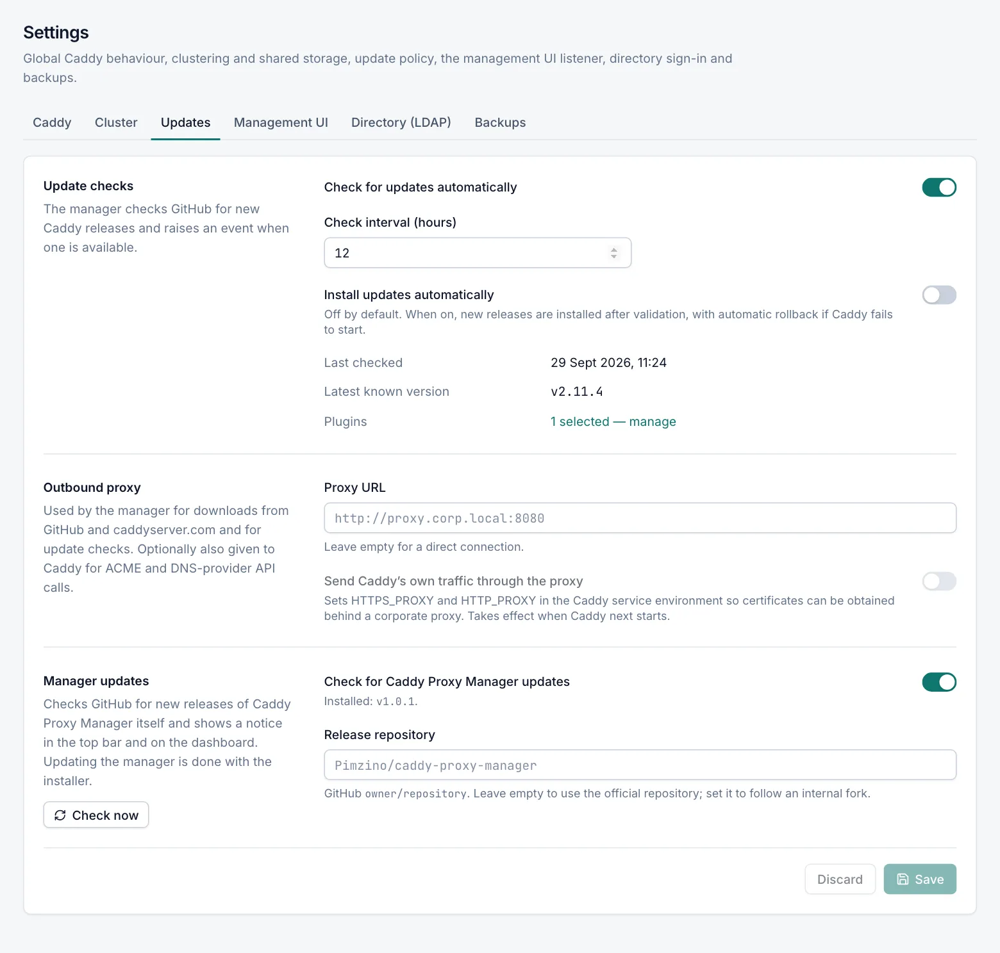

# Updates

**Settings › Updates** controls how the manager looks for new versions of Caddy and of Caddy Proxy Manager itself, whether Caddy updates install automatically, and the outbound proxy for downloads. Every role can open the tab; only the **Admin** role can change it. Operators can start an update check.

## Update checks for Caddy

The manager asks GitHub for the latest Caddy release in the background. When it finds a version newer than the installed one, it raises an *update available* event once for that version. With the alert rule **Caddy update available** on, the event also sends a notification (see [Notifications](notifications.md)). Whenever a newer release is known, the Caddy status in the top bar, the Dashboard and **Caddy › Service & Updates** show **Update available**.

The first background check runs 2 minutes after the manager starts. After that the manager looks every 15 minutes whether a check is due, based on **Check interval (hours)** and the time of the last check.

To check at once, select **Check now** on [Service & Updates](caddy-service.md#check-for-a-new-caddy-version).

### Update check fields

| Field | Default | Description |
|---|---|---|
| Check for updates automatically | on | Turns the background checks on or off. It also controls the background check for new manager versions and their events. |
| Check interval (hours) | `12` | How often the background check runs. 1–168 hours. |
| Install updates automatically | off | Installs a new Caddy release as soon as the background check finds it. Needs **Check for updates automatically**. |

The section also shows **Last checked**, **Latest known version** and **Plugins** (the number of selected plugins, or **Standard build**, with a link to the [Plugins](plugins.md) page).

## Automatic Caddy updates

**Install updates automatically** is off by default so that you decide when Caddy changes. When it is on, each new release is installed once, through the same checked steps as a manual update:

- the new program must validate your current configuration, or nothing is changed;
- Caddy restarts, which means a few seconds without service;
- if the new version does not start, the previous one is restored automatically and an event reports it.

With plugins selected, the automatic update is a custom build of the latest Caddy with your plugins. If another install or update job is running, the automatic update waits for the next check. See [What happens during an install or update](caddy-service.md#what-happens-during-an-install-or-update).

> [!WARNING]
> Automatic updates install every newer Caddy release, not only the release this version of Caddy Proxy Manager was verified with. Leave the option off on servers where you want to read the release notes first.

## Outbound proxy

The manager connects to the Internet for Caddy downloads and plugin builds (github.com, caddyserver.com) and for update checks (api.github.com). Behind a corporate proxy, enter it here.

| Field | Default | Description |
|---|---|---|
| Proxy URL | empty | The proxy, for example `http://proxy.corp.local:8080`. Empty means a direct connection. A user name and password can be part of the URL. |
| Send Caddy’s own traffic through the proxy | off | Also gives the proxy to Caddy, so that Caddy can obtain certificates and call DNS provider APIs behind the proxy. Available once a proxy URL is entered. |
| Bypass the proxy for (NO_PROXY) | `localhost,127.0.0.1,::1,10.0.0.0/8,172.16.0.0/12,192.168.0.0/16,.local` | Shown when Caddy uses the proxy. Addresses Caddy reaches directly. |

The password in the proxy URL is never shown again; the tab shows `********` in its place and keeps the stored password when you save.

Webhook notifications and the Microsoft 365 token request for e-mail also use this proxy. SMTP mail does not: the mail server is always reached directly. See [Notifications](notifications.md).

### Give Caddy the proxy

Caddy needs Internet access for ACME certificates (to reach your certificate authority) and for DNS provider APIs. When **Send Caddy’s own traffic through the proxy** is on, the manager sets `HTTPS_PROXY`, `HTTP_PROXY` and `NO_PROXY` in the environment of the Windows service `Caddy`.

> [!IMPORTANT]
> When you save a change to these settings and Caddy is running, the manager updates the Caddy service and **restarts Caddy at once**, so that it uses the new environment. Expect a few seconds without service. If Caddy is stopped, it uses the new settings when it next starts. If a Caddy update is running, the update's restart applies them.

Caddy then sends its outgoing HTTP connections through the proxy unless the destination matches **Bypass the proxy for (NO_PROXY)**. That includes the connections to your backends. Every upstream of your proxy hosts must therefore match an entry, or its traffic goes through the proxy too. Entries are separated by commas and can be:

- host names, for example `app01`;
- domain suffixes, for example `.corp.local` (also written `*.corp.local`);
- IP addresses and CIDR ranges, for example `10.0.0.0/8`;
- any of these with a port, for example `app01:8080`;
- `*` for everything.

The list can have up to 2,000 characters.

## Manager updates

Caddy Proxy Manager itself is not updated from the console. The manager tells you when a new version is published on GitHub; you install it with the installer on the server. See [Installation](installation.md).

### Where you see a new version

When a newer stable release exists, every signed-in user sees:

- **Update available**, with the new version, in the top bar. Select it to open the update details.
- A notice that a new Caddy Proxy Manager version is available, on the Dashboard and on **Caddy › Service & Updates**, with **What’s new** and **Download installer**. On the Dashboard you can hide the notice until the next version; this is remembered in your browser only.
- The new version, marked **available**, next to the manager version on the Dashboard's **System** card and on the **Caddy binary** card of **Caddy › Service & Updates**.

### Update details

The update window shows the installed and the new version, when the new one was published, and:

- **Download installer (.msi)** with its size (or **Download from GitHub** when the release has no MSI), **Download .zip**, and **View on GitHub**;
- **How to upgrade**: run the MSI on this server. Settings, hosts and certificates are kept, and Caddy keeps serving while the manager restarts;
- **MSI SHA-256**, when GitHub reports it, with a copy button, so you can check the download;
- **What’s changed since**, followed by your version: the release notes of every newer release, up to 20, newest first.

The footer shows when the manager last checked and which repository it checked. **Check now** asks GitHub again; it needs the **Operator** role.

If the check is off, the window shows **Update check is off**. If GitHub could not be reached, it shows **Could not check for updates** or **The last check for updates failed** with the reason.

### Manager update fields

| Field | Default | Description |
|---|---|---|
| Check for Caddy Proxy Manager updates | on | Look for new manager versions on GitHub. Shows the installed version. |
| Release repository | empty | The GitHub repository to check, as `owner/repository`, for example `contoso/caddy-proxy-manager`. Empty means the official repository `Pimzino/caddy-proxy-manager`. Set it to follow an internal fork. |

The **Check now** button next to the section opens the update window and checks at once (Operator role, when checks are on). Otherwise it is called **View update status**.

The manager considers only published stable releases; drafts and pre-releases are ignored. It remembers GitHub's answer for an hour. A new manager version also raises an event once per version, with the link to the installer, when **Check for updates automatically** is on. It uses the same **Caddy update available** alert rule. New manager versions are never installed automatically.

## GitHub limits

The manager asks GitHub without signing in, which GitHub limits to 60 requests per hour per public IP address. Many servers behind one public address can reach that limit; the checks then report when the limit resets. To raise it, set the environment variable `CM_GITHUB_TOKEN` to a GitHub token for the Caddy Proxy Manager service and restart the service.

## Related

- [Caddy service and updates](caddy-service.md)
- [Plugins](plugins.md)
- [Installation](installation.md)
- [Notifications](notifications.md)
- [Events](events.md)
