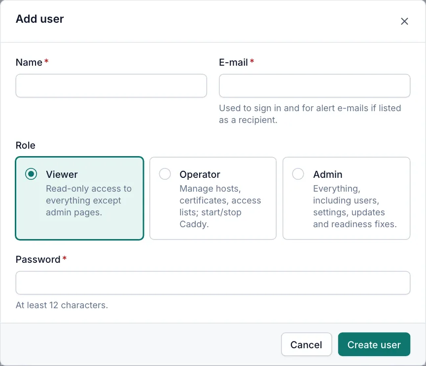
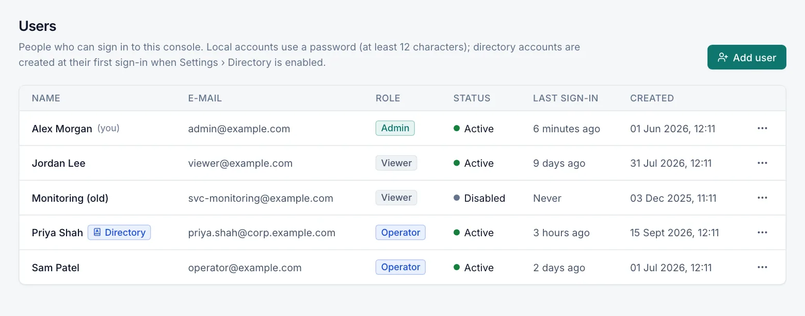

# Users and roles

Everyone who signs in to the console has a user account with one of three roles: Viewer, Operator or Admin. Only
admins can open **Administration › Users** to add, change or remove accounts. Every user with a local account can
change their own password.

## Roles

| Role | In short |
|---|---|
| Viewer | Read-only access to everything except the admin pages and secrets. |
| Operator | Everything a viewer can do, plus managing hosts, streams, access lists and uploaded certificates, applying the configuration, starting, stopping and restarting Caddy, and running readiness checks. |
| Admin | Everything, including users, settings, notifications, backups, Caddy binary and plugins, readiness fixes, raw Caddy routes and server-side certificate sources. |

Accounts come from two sources:

- **Local accounts** have a password stored in Caddy Proxy Manager. Admins create them on the Users page.
- **Directory accounts** sign in with Active Directory (LDAP). They are created at their first sign-in and their role
  comes from group membership. See [Directory sign-in](directory-sign-in.md).

## Permission matrix

| Area | Viewer | Operator | Admin |
|---|---|---|---|
| Dashboard, Servers (metrics), Traffic, Events | View | View | View |
| Proxy hosts, redirects, static sites, custom responses | View | Add, edit, enable, disable, duplicate, delete | Same as operator |
| Advanced routes (raw Caddy JSON) on a host | View, secrets masked | View, secrets masked | View and edit |
| Static site root on a network share (UNC path) | – | Keep an existing one unchanged | Set and change |
| Proxy host that forwards to this console | – | – | Allowed (to publish the console through Caddy) |
| Streams | View | Add, edit, delete | Same as operator |
| Access lists | View | Add, edit, delete | Same as operator |
| Certificates: **Upload PEM**, **Upload PFX**, **Paste PEM**, replace by upload, sync, delete | View | Yes | Yes |
| Certificates: **File path**, **PFX on disk/share**, **Windows store** | – | – | Yes |
| **Caddy › Service & Updates**: **Start**, **Stop**, **Restart**, **Check now** | View | Yes | Yes |
| Caddy Windows service install, repair, uninstall; install a specific Caddy version, upload a binary, roll back | – | – | Yes |
| **Caddy › Plugins** | View | View | Change |
| **Caddy › Configuration** | View, secrets masked | View, secrets masked; **Apply now** | Full view; **Import Caddyfile**; Caddyfile mode |
| **Server › Readiness** | View results and the GPO script | **Run checks** | **Run checks** and **Fix** |
| **Server › Logs** | **Caddy**, **Access logs** | **Caddy**, **Access logs** | Also **Manager** |
| **Settings › Caddy**, **Settings › Cluster**, **Settings › Updates** | Read-only | Read-only; can check for manager updates | Edit |
| **Settings › Management UI**, **Settings › Directory (LDAP)**, **Settings › Backups** | – | – | Yes |
| Servers in a cluster | View | **Sync now**, **Restart** Caddy on a server | Also add, edit, remove servers, rotate keys, **Update Caddy**, join or leave a cluster |
| **Administration › Notifications**, **Users**, **Audit Log** | – | – | Yes |
| Restart the management service | – | – | Yes |
| Change your own password | Yes (local accounts) | Yes (local accounts) | Yes (local accounts) |

Notes:

- The sidebar hides pages your role cannot open. Opening such a page by its address shows **Access denied**.
- Settings tabs you can only read show "Only administrators can change these settings."
- Non-admins see the generated Caddy configuration and raw routes with secrets replaced by `***`.
- No role can point a host or stream at the Caddy admin API, and no role can serve a static site from a drive root,
  an administrative share, the Windows or Program Files folders, or the Caddy Proxy Manager data and program folders.
- On a managed cluster node, replicated items are read-only for every role. See [Cluster](cluster.md).

## Add a user

Role: Admin.



1. Open **Administration › Users**.
2. Click **Add user**.
3. Enter **Name** and **E-mail**. Users sign in with this e-mail address.
4. Choose a **Role**: **Viewer**, **Operator** or **Admin**. The default is Viewer.
5. Enter a **Password** of at least 12 characters.
6. Click **Create user**.

The e-mail address is stored in lower case and must be unique. The e-mail is also used for alert e-mails when the
address is listed as a notification recipient.

## The Users page

The table lists every account, sorted by name.



| Column | Description |
|---|---|
| Name | The display name. Your own account shows "(you)". Directory accounts show a **Directory** badge. |
| E-mail | The sign-in name of a local account, or the address taken from the directory. |
| Role | Viewer, Operator or Admin. |
| Status | **Active** or **Disabled**. |
| Last sign-in | Time of the last successful sign-in, or **Never**. |
| Created | When the account was created. |

Click a row, or **Edit** in the row menu, to change an account. **Delete** removes it.

## Edit, disable or delete a user

Role: Admin.

In **Edit user** you can change:

| Field | Description |
|---|---|
| Name | Display name. |
| E-mail | Sign-in name for local accounts. |
| Role | The account's role. |
| New password | Leave empty to keep the current password. Setting one signs the user out everywhere. |
| Disabled | Disabled users cannot sign in, and their active sessions end immediately. |

Deleting a user ends their access immediately. Audit entries keep their name.

### Protected accounts

- You cannot disable or delete your own account, or remove the admin role from yourself.
- The last enabled **local** admin cannot be disabled, demoted or deleted. Directory admins do not count, because a
  local admin is the break-glass account when the directory is unavailable. Create or enable another local admin
  first.

### Directory accounts

Directory accounts have no local password. Their name, e-mail and role are taken from the directory at every sign-in,
so you cannot change them here. To block a directory user, turn on **Disabled**.

## Passwords

Local passwords must:

- be 12 to 256 characters long;
- not consist of spaces only;
- not be the same as the account's e-mail address.

There are no complexity, history or expiry rules. Passwords are stored as bcrypt hashes (work factor 12).

## Change your own password

Any role, local accounts only.

1. Open the user menu (your name, top right).
2. Click **Change password**.
3. Enter **Current password**, **New password** and **Confirm new password**.
4. Click **Change password**.

The new password must differ from the current one. Your other sessions (other browsers or devices) are signed out;
this one stays signed in.

Directory users change their password in the directory, for example with Ctrl+Alt+Del and "Change a password" on a
domain-joined PC.

## Reset a forgotten password

If no admin can sign in, reset a local account on the server. The command needs the management service to be stopped.
Run it in an elevated PowerShell:

```powershell
Stop-Service CaddyProxyManager
& 'C:\Program Files\Caddy Proxy Manager\CaddyManager.exe' reset-password --email admin@contoso.com
Start-Service CaddyProxyManager
```

- Without `--password`, a random 20-character password is generated and printed.
- `--password <password>` sets a password of your choice (it must meet the password rules).
- `--enable` also re-enables a disabled account.
- Existing sessions of that user are signed out.
- The reset is recorded in the audit log as `passwordReset` by `cli:<your Windows user name>`.
- Directory accounts cannot be reset this way; reset them in the directory.

`CaddyManager.exe list-users` lists all accounts with their role, status, source (`local` or `ldap`) and last sign-in.
It also needs the service to be stopped. See [Command line](cli.md).

## Sessions

- Signing in creates a session cookie. It is sent only to this console, cannot be read by scripts, and is not sent
  with requests started from other sites.
- The session lasts for the **Session length (hours)** set in **Settings › Management UI** (default 12 hours,
  1–720). It is extended while you keep using the console, and it survives closing the browser.
- A new session length applies to sign-ins after the change.
- **Sign out** in the user menu ends the session on the server too, so a copied cookie stops working.
- A password change, a password reset, disabling or deleting the user ends that user's sessions.
- A role change takes effect on the user's open sessions without signing them out.

There is no page that lists or ends individual sessions of other users. To sign a user out everywhere, reset their
password or disable the account.

## Sign-in limits

- Each client address can make 10 sign-in attempts per minute. Further attempts get "Too many sign-in attempts. Wait a
  minute before trying again." For IPv6, the limit applies to the whole /64 network.
- The same limit covers first-run setup and **Test sign-in…** on the Directory (LDAP) tab.
- Caddy Proxy Manager does not lock accounts. Directory accounts are still subject to the directory's own lockout
  policy.

Local accounts are always checked before the directory. A disabled account cannot sign in; the sign-in page shows
"The user name or password is incorrect."

## Related

- [Directory sign-in](directory-sign-in.md)
- [Audit log](audit-log.md)
- [Management UI settings](management-ui.md)
- [Security](security.md)
- [Getting started](getting-started.md)
